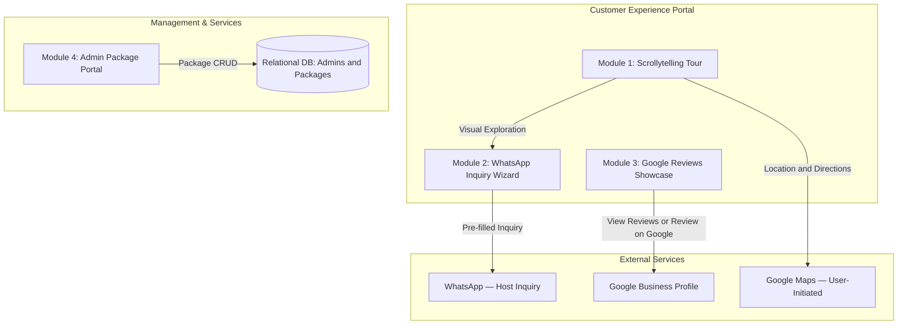

# Villa Cinnamoon Castle — Property Specifications & Master Content Guide

> Comprehensive reference document compiling property specifications, architectural spaces, amenities and contact information gathered from **Airbnb**, **Google Business Profile**, **Facebook**, and official management records. It is the source for verified property facts; the Decision Log, SRS and page-specific IA documents control Phase 1 scope, public presentation and interaction behaviour.

**Related Project Documentation:**
* [`SRS.md`](../02%20Requirements/SRS.md) — Software Requirements Specification & Technical Architecture
* [`package_details.md`](package_details.md) — Complete Package Catalog, Calculation Engine & Database Seeds
* [`Original Requirements.md`](Original%20Requirements.md) — Client Original Specification

---

## 1. Brand Identity & Overview

* **Property Name:** Villa Cinnamoon Castle
* **Property Type:** Entire Private Holiday Villa / Vacation Rental
* **Tagline / Slogan:** *"Find your own peacefulness"*
* **Brand Tone:** Serene, welcoming, family- and group-oriented, nature-embracing, affordable luxury.
* **Logo & Visual Identity:** Golden circular emblem featuring an architected villa icon crowned with cinnamon leaves, tied cinnamon quills, and traditional floral motifs.
* **Establishment Date:** Active since September 2024.

---

## 2. Location & Neighborhood

* **Address:** Arachchikanda, Hikkaduwa, Southern Province, Sri Lanka
* **Postal Code:** 80240
* **GPS Coordinates:** `6.1405° N, 80.1325° E`
* **Geographic Setting:** Located 3.5 km inland from the lively Hikkaduwa coastal strip, surrounded by lush cinnamon groves, coconut palms, and tropical fruit trees. Offers complete peace and privacy away from crowds while remaining minutes from the ocean.

### Distances & Transit
* **Hikkaduwa Town & Commercial Center:** ~5 minutes (approx. 3.5 km)
* **Hikkaduwa Coral Reef & Surfing Beach:** ~5 minutes
* **Galle Fort / Galle City Center:** ~20 minutes via coastal expressway / Galle Road
* **Access:** Easily accessible by car, tuk-tuk, or van; secure gated driveway with ample parking.

---

## 3. Accommodation & Capacity

* **Guest Capacity:**
  * **Standard Listing Capacity:** 10 guests
  * **Maximum Group / Event Capacity:** Up to 15 guests (ideal for extended families, reunions, birthdays, wellness retreats)
* **Property Structure:** Two-story detached luxury villa with private gated grounds
* **Bedrooms:** 5 spacious, elegantly appointed bedrooms
  * **Master Bedroom 1:** Super King-sized wooden bed, Air Conditioning (A/C), dedicated work desk and chair, wardrobe, bedside tables, warm pendant lighting.
  * **Bedroom 2:** Super King-sized wooden bed, Air Conditioning (A/C), expansive garden-facing windows, natural daylight, storage wardrobe.
  * **Bedroom 3:** King-sized wooden bed, high-efficiency stand fan, peaceful garden orientation, breezy natural ventilation.
  * **Bedroom 4:** Super King-sized wooden bed, distinctive Vaulted Attic/Timber Roof architectural aesthetic, high-efficiency stand fan.
  * **Bedroom 5:** Queen-sized wooden bed, high-efficiency stand fan, tranquil ambient light and garden views.
* **Bathrooms:** 2 full modern bathrooms
  * Instant hot water shower systems
  * Pedestal washbasins with vanities and vanity mirrors
  * Hand bidet sprayers and modern sanitation fixtures
  * Louvered wooden ventilation windows

---

## 4. Property Description & Copy

### Short Tagline
> *"Your private tropical sanctuary just minutes from Hikkaduwa's golden shores."*

### Full Description
> *"Welcome to Villa Cinnamoon Castle! Situated in peaceful Arachchikanda just 3.5 km (5 minutes) from Hikkaduwa town and beach, our spacious two-story sanctuary comfortably accommodates 10 to 15 guests.
>
> The villa features 5 beautifully appointed bedrooms (including Super King and King wooden beds; 2 with Air Conditioning and the rest with high-efficiency stand fans) and 2 full bathrooms with hot water. Guests have exclusive, 100% private use of the entire property—including a fully equipped granite kitchen with gas stove and cookware, an airy ground living room with carved wooden armchairs and TV, an expansive upstairs mezzanine lounge overlooking high-vaulted ceilings, high-speed Wi-Fi, and a dedicated workspace.
>
> Outside, step into a secluded tropical gravel courtyard enclosed by rustic timber fencing and verdant foliage. Whether you're planning a lively family holiday, a relaxing group retreat, or an unforgettable weekend by the beach with BBQ and boat safaris, Villa Cinnamoon Castle is your home away from home."*

---

## 5. Comprehensive Amenities & Facilities

### Kitchen & Dining
* Fully equipped open-concept kitchen with granite countertop
* Double-burner gas stove with gas supply
* Electric rice cooker & electric kettle
* Cookware, frying pans, pots, and cooking utensils
* Dish drying rack, dinner plates, glassware, and cups
* Large formal dining table with seating for the entire group
* Refrigerator and freezer food storage
* In-house private chef service available upon prior arrangement

### Living & Entertainment
* Ground-floor living hall with traditional hand-carved wooden armchairs and caned seating
* High-definition television (TV) with satellite entertainment
* Upstairs open-concept mezzanine lounge with high-pitched exposed beam timber roof and breeze corridors
* Elegant drapery and warm ambient pendant lighting throughout

### Connectivity & Comfort
* High-speed wireless Internet (Wi-Fi) covering common areas, bedrooms, and courtyard
* Dedicated workstation / desk space for remote work in Master Bedroom 1
* Air conditioning in 2 premier bedrooms
* Stand fans provided in all non-A/C bedrooms and living spaces
* Washing machine on premises for guest laundry
* Iron and laundry drying area

### Grounds, Outdoor & Security
* 100% private detached property with no shared spaces
* Free secure gated parking on-site (capacity for multiple cars, vans, or tuk-tuks)
* Landscaped gravel courtyard with shade trees and tropical greenery
* Rustic timber perimeter fencing providing privacy and natural charm
* Front porch veranda with columns and sit-out area
* Upstairs viewing balcony overlooking gardens and palm canopy

---

## 6. Curated Activities & Experiences

Guests can book the following curated activities directly through the villa host:
1. **Private BBQ Setup & Grill:** Full barbecue equipment and setup provided for evening garden dinners.
2. **Lagoon & River Boat Safaris:** Scenic guided boat excursions exploring nearby inland lagoons, mangrove forests, and wildlife.
3. **Kayaking:** Calm water paddling adventures along Hikkaduwa's scenic inland waterways.
4. **Beach & Snorkeling Excursions:** 5-minute trip to famous Hikkaduwa coral gardens, sea turtle points, and surf breaks.
5. **Underwater Photography & Photoshoots:** Professional photo session coordination for vacation memories.

---

## 7. Pricing Tiers, Packages & Calendar Rules

*Currency: Sri Lankan Rupees (LKR / Rs.)*

### 7.1 Calendar Classification Rules
* **Weekend Nights (Friday, Saturday, Sunday):** Check-in on Friday, Saturday, or Sunday is charged at official **Weekend Buyout Rates**.
* **Weekday Nights (Monday to Thursday):** Check-in on Monday, Tuesday, Wednesday, or Thursday is charged at promotional **Weekday Rates** (maximum 4 consecutive weekday nights).
* **Mixed Stays (Combined Weekend + Weekday):** Stays spanning both classifications are calculated using the transparent split pricing formula:
  $$\text{Total Price} = (\text{Weekend Nights} \times \text{Weekend Rate}) + (\text{Weekday Nights} \times \text{Weekday Rate})$$

---

### 7.2 Weekend Rates (Friday, Saturday, Sunday Nights)
Full private 5-bedroom villa buyout with exclusive grounds access:

| Package Name | Rate (Per Night) | A/C Configuration | Inclusions & Value Breakdown |
| :--- | :---: | :---: | :--- |
| **Weekend Standard — Non-A/C** | **Rs. 21,000/=** | Non-A/C | Full private 5-bedroom villa buyout with stand fans throughout. (~Rs. 1,400/person for 15 pax). |
| **Weekend Premium — A/C** | **Rs. 23,000/=** | Air Conditioned | Full private 5-bedroom villa buyout with air-conditioned master bedrooms. (~Rs. 1,533/person for 15 pax). |

---

### 7.3 Weekday Rates (Monday to Thursday Nights — Mon–Thu)
Flexible group, room-based, and family packages:

| Package / Room Option | Max Capacity | Bedrooms | Non-A/C Rate | A/C Rate | Notes |
| :--- | :---: | :---: | :---: | :---: | :--- |
| **Couples Package** | 2 pax | 1 Master | **Rs. 6,500/=** | — | Romantic full-day getaway for couples |
| **Family Package** | 4 pax | 1–2 Rooms | **Rs. 8,500/=** | — | Full-day stay for small nuclear families |
| **2-Room Group** | 4 pax | 2 Rooms | **Rs. 8,500/=** | **Rs. 10,500/=** | 2 dedicated bedrooms + villa amenities |
| **3-Room Group** | 6 pax | 3 Rooms | **Rs. 12,500/=** | **Rs. 14,500/=** | 3 dedicated bedrooms + villa amenities |
| **4-Room Group** | 8 pax | 4 Rooms | **Rs. 15,500/=** | **Rs. 17,500/=** | 4 dedicated bedrooms + villa amenities |
| **5-Room Group** | 10 pax | 5 Rooms | **Rs. 17,900/=** | **Rs. 19,900/=** | Full 5 bedrooms for up to 10 guests |
| **Full Villa Buyout** | 15 pax | Full Villa | **Rs. 17,900/=** | **Rs. 19,900/=** | Entire property exclusivity for large groups |

> 📖 **Comprehensive Package Catalog:** For detailed case study calculations, group auto-suggestion decision matrices, database SQL seed scripts, and admin CRUD policies, refer to [`package_details.md`](package_details.md).

---

## 8. House Rules & Policies

* **Check-in Time:** From **1:00 PM** onwards
* **Check-out Time:** By **10:00 AM**
* **Villa Turnaround & Preparation Window (10:00 AM – 1:00 PM):** A 3-hour window is reserved after 10:00 AM to thoroughly clean, sanitize, change fresh linens, and re-arrange the villa before the next guests arrive at 1:00 PM.
* **Flexible Late Check-out:** If guests request extra time for personal reasons, the host can extend check-out by 1 hour (until 11:00 AM) or up to 1.5 hours (until 11:30 AM). The host completes all remaining cleaning and re-arrangements during the rest of the turnaround window before 1:00 PM.
* **Maximum Occupancy:** 10 guests (standard listing), up to 15 guests upon prior arrangement
* **Parties & Events:** Small group gatherings, family birthdays, and private retreats allowed with prior notice
* **Smoking:** Prohibited inside bedrooms; permitted in designated outdoor courtyard areas
* **Pets:** Inquire with host before booking
* **Care & Respect:** Guests are requested to treat the property and furnishings with care and respect

---

## 9. Host & Contact Information

* **Primary Host:** Dampalla Gamage Devindu
* **Email Address:** `gamagedeshandevindu13@gmail.com`
* **Direct Hotline / WhatsApp:** `+94 76 100 7686` (`076 100 7686`)
* **Secondary Reservation Line:** `070 254 6028`

### Official Online Channels & Social Proof
* **Google Business Profile / Google Reviews:** Official Google listing on Google Maps (Rating: 4.9+ ★, authentic guest feedback and directions)
* **Airbnb Listing:** [airbnb.com/rooms/1651346026185294869](https://www.airbnb.com/rooms/1651346026185294869)
* **Facebook Profile / Page:** [Villa Cinnamoon Castle (ID: 61565740212688)](https://web.facebook.com/people/Villa-Cinnamoon-Castle/61565740212688/)
* **Instagram:** [@villa_cinnamoon_castle_596](https://www.instagram.com/villa_cinnamoon_castle_596)
* **TikTok:** [@villa.cinnamoon.ca](https://www.tiktok.com/@villa.cinnamoon.ca)

---

## 10. Architectural & Visual Presentation Zones

The property visual showcase is organized into distinct functional spaces, highlighting architectural details and guest amenities without reliance on rigid file catalogs:

| Visual Presentation Zone | Functional Space & Key Highlights | Staging & Architectural Features |
| :--- | :--- | :--- |
| **Hero & Exterior Arrival** | Villa facade, gated perimeter entrance, lush surroundings | High-angle daylight vistas, golden hour illumination, tropical foliage context. |
| **Ground-Floor Living Quarters** | Reception hall, family lounge, entertainment | Carved wood armchairs, traditional Sri Lankan canework, TV credenza, open doorway ventilation. |
| **Upstairs Mezzanine Lounge** | High-ceiling breezeway, reading lounge | Exposed timber roof rafters, vaulted ceilings, relaxed sofa configuration, breezy corridor. |
| **Bedrooms Sanctuary (Suites 1–5)** | 5 private bedroom chambers | Master A/C with work desk, secondary A/C bedroom, garden-view fan rooms, and distinctive vaulted attic suite. |
| **Kitchen & Dining Quarters** | Self-catering culinary zone & banquet dining | Polished granite countertops, gas burners, full cookware, formal family dining banquet table. |
| **Bathrooms & Sanitation** | 2 full modern washrooms | Clean tile finishes, hot water shower enclosures, pedestal vanities, modern bidets. |
| **Outdoor Grounds & Courtyard** | Gravel courtyard, barbecue pavilion, porch | Private fenced courtyard, outdoor BBQ dining area, front entrance veranda, balcony overlooking palms. |
| **Curated Nearby Experiences** | Surrounding coastal and nature highlights | Hikkaduwa coral sanctuary, turtle feeding point, surfing beaches, and river safari waterways. |

---

## 11. Web Platform Architecture & Blueprint

The official Phase 1 web application architecture conforms to [`SRS.md`](../02%20Requirements/SRS.md), version 1.3.0 or later:

### Module Breakdown:
1. **Module 1 — Scrollytelling Property Elaboration (§ 3.1):**
   - Immersive narrative scroll through: *Arrival & Hero &rarr; Shared Living &rarr; Collective Sleeping Experience &rarr; Kitchen, Dining & Amenities &rarr; Outdoor Setting &rarr; Nearby Hikkaduwa & Location &rarr; Stay Options, Google Reviews & Inquiry*.
   - Use the approved global navigation and dedicated Gallery page. Do not number bedrooms publicly or require a categorized gallery modal.
2. **Module 2 — WhatsApp Booking Inquiry (§ 3.2):**
   - **Mini-Form 1 (Dates):** Check-in and check-out selection with past dates disabled and automatic date-type detection (Weekend / Weekday / Mixed). Phase 1 does not claim real-time availability or block booked dates.
   - **Mini-Form 2 (Guests):** 1–15 guest stepper with automatic package recommendation engine based on group capacity.
   - **Mini-Form 3 (Package & Contact):**
     - Mode A: Strictly Weekend packages.
     - Mode B: Strictly Weekday packages.
     - Mode C: Mixed Stay dual-selector (Weekend package + Weekday sub-form) with transparent split price math.
     - Sri Lankan and E.164 WhatsApp regex validation.
   - **Submission:** Opens a pre-filled WhatsApp inquiry to the host. It does not create a booking record or confirm availability.
3. **Module 3 — Google Reviews Showcase (§ 3.3.2):**
   - Dedicated **Google Reviews showcase** featuring official Google aggregate rating badge, guest feedback cards, and direct Google Maps review action.
   - No on-site review submission, review database, or admin review moderation is included in Phase 1.
4. **Module 4 — Administrator Package Portal (§ 3.4):**
   - Secure administrator authentication.
   - Full package management CRUD with soft deactivation (`is_active = FALSE`).

> [!NOTE]
> Database-backed bookings, approval/decline workflows, automated calendar blocking, quotation generation, cancellations, and direct-review moderation are deferred to Phase 2.
