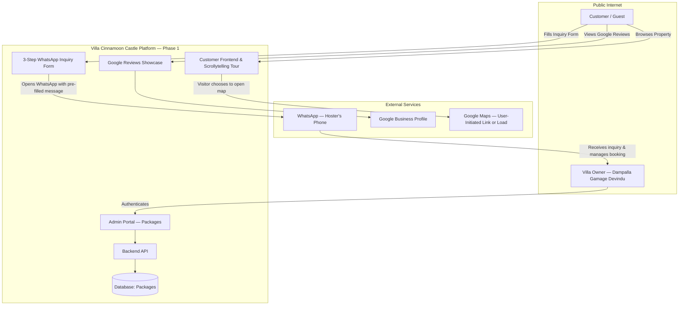
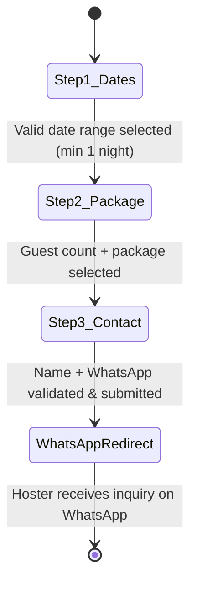
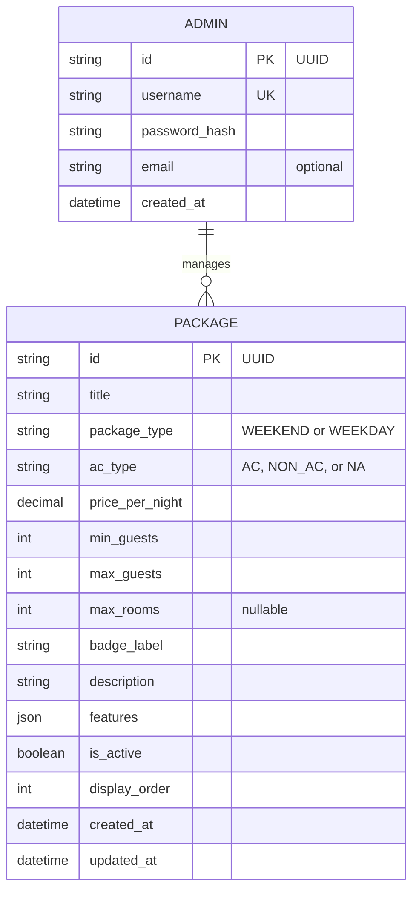

# Software Requirements Specification (SRS)
## Villa Cinnamoon Castle Web Application

**Document Version:** 1.3.0 — Phase 1 Scope Reconciled  
**Status:** Active — Authoritative Phase 1 Requirements  
**Target Platform:** Web (Desktop, Tablet, Mobile)  
**Reference Documents:**
* [`Original Requirements.md`](../01%20Source%20Information/Original%20Requirements.md)
* [`property_details.md`](../01%20Source%20Information/property_details.md)
* [`package_details.md`](../01%20Source%20Information/package_details.md)

> [!NOTE]
> **📋 Phase 1 Scope — Host Requirements Clarification (2026-09-20)**
> Following a direct requirements session with the villa hoster (Dampalla Gamage Devindu), the system scope has been revised:
> - **Booking Engine:** Simplified to a **WhatsApp Inquiry Form** only. No backend database, status machine, or date-blocking system in Phase 1. All business workflow (advance payment, confirmation, calendar management) is handled directly by the hoster via WhatsApp.
> - **On-Site Review System:** Deferred to a future phase. Only the **Google Reviews showcase** (§ 3.3.2) is active in Phase 1.
> - **Package Pricing:** Current prices and packages used as-is for Phase 1 development.
> - **Admin Package Management (§ 3.4.2):** Create, Read, Update and Soft Deactivate are **in scope for Phase 1**. Hard deletion is not provided.
> - **Backend booking records, admin approval/decline workflows, quotation generation, automated date blocking, direct-review submission and review moderation** are deferred to Phase 2 and are not implementation requirements in this active SRS.

---

## 1. Introduction

### 1.1 Purpose
This Software Requirements Specification (SRS) establishes the complete functional and non-functional requirements for the official web platform of **Villa Cinnamoon Castle**, an affordable private 5-bedroom holiday villa for families and groups located in Arachchikanda, Hikkaduwa, Sri Lanka. This document defines the Phase 1 system architecture: customer scrollytelling journey, WhatsApp-based booking inquiry form, dedicated Google Reviews showcase, and the administrative portal for package management.

### 1.2 Scope

#### Phase 1 (Current Implementation Scope)
The web application encompasses two primary subsystems:
1. **Customer Experience Portal (Public, Zero-Auth):**
   - High-fidelity visual property presentation adhering to luxury villa standards.
   - Narrative **"Scrollytelling Property Elaboration"** presenting the shared living areas, collective sleeping experience, grounds and amenities without numbering or marketing the bedrooms individually.
   - **3-step WhatsApp Inquiry Form:** date range selection (check-in + check-out calendars), guest count & package selection, contact details — culminating in a pre-formatted WhatsApp message directly to the hoster.
   - Dedicated **Google Reviews showcase** displaying authentic Google ratings, guest testimonials, and direct review action.
   - Transparent showcase of package pricing, location, and curated experiences.
2. **Admin Operations Portal (Private, Authenticated):**
   - Secure authentication for property management.
   - Full package management (Create, Read, Update and Soft Deactivate; no hard deletion in Phase 1).

#### Phase 2 (Deferred — Pending Further Requirements)
> [!CAUTION]
> The following features are **explicitly out of scope for Phase 1** and must not be implemented until Phase 2 requirements are confirmed with the hoster:
> - Complex booking engine with status lifecycle (`PENDING` / `APPROVED` / `DECLINED` / `CANCELLED`)
> - Admin booking inquiry pipeline (approve/decline/quotation/WhatsApp dispatch)
> - Automated calendar date-blocking system
> - On-site verified guest review submission system (check-in date gated)
> - Direct-review moderation (pin/hide) and its supporting review database
> - Database-driven booking records and availability API

### 1.3 Definitions, Acronyms, and Abbreviations
* **SRS:** Software Requirements Specification
* **PDP:** Property Detail Page
* **CRUD:** Create, Read, Update and Soft Deactivate for Phase 1 package management
* **LKR / Rs.:** Sri Lankan Rupee
* **WA:** WhatsApp Messenger
* **E.164:** International public telecommunication numbering plan format
* **NFR:** Non-Functional Requirement
* **LCP:** Largest Contentful Paint (Core Web Vital)

---

## 2. Overall Description

### 2.1 Product Perspective
The system is an independent, responsive web application operating in modern desktop and mobile browsers. It connects prospective travelers directly with the villa owner (*Dampalla Gamage Devindu*), bypassing third-party online travel agency (OTA) booking fees while preserving the trust, aesthetics, and clarity of platforms like Airbnb.



### 2.2 User Classes and Characteristics
1. **Public Visitor / Prospective Guest:**
   - No login or registration required.
   - Browses property details, explores rooms via interactive scroll, and submits WhatsApp booking inquiries.
2. **Villa Administrator (Property Owner/Manager):**
   - Authenticated via secure administrative credentials.
   - Manages the package catalog (CRUD).
   - Receives all booking inquiries directly on WhatsApp and manages the full booking workflow independently.

> [!NOTE]
> **Phase 2 Only:** A "Verified Guest" user class (for on-site review submission) will be introduced in Phase 2 once the on-site review system is implemented.

### 2.3 Operating Environment
* **Client Side:** Modern browsers (Chrome, Safari, Firefox, Edge) across iOS, Android, macOS, and Windows devices.
* **Server Side:** Node.js runtime environment (LTS).
* **Database:** SQLite (local persistent) / PostgreSQL (production scalable).

### 2.4 Design & Implementation Constraints
1. **Zero-Friction Customer Access:** No customer accounts or passwords required.
2. **Visual Fidelity:** Must match the warm cinnamon villa design aesthetic. Reference: luxury villa websites (not apartment or large hotel websites) for design inspiration.
3. **Strict Phone Validation:** Customer WhatsApp numbers must be validated via Regex before the inquiry form can be submitted.
4. **WhatsApp-First Inquiry:** All booking inquiries are routed directly to the hoster's WhatsApp. No server-side booking storage in Phase 1.
5. **A/C Transparency & Public Presentation Policy:**
   - The villa has **2 air-conditioned bedrooms** and **3 bedrooms with stand fans**.
   - **A/C Packages:** Air conditioning is enabled in the two A/C-equipped bedrooms; the other sleeping spaces use stand fans.
   - **Non-A/C Packages:** Air conditioning remains switched off and stand fans are provided.
   - Public content must communicate this distinction clearly but must not label, number or market the five bedrooms as individually selectable units. Any room allocation remains an internal host decision.
6. **Google Reviews Phase 1 Rule:** Phase 1 only displays curated, authentic Google Reviews and links users to the official Google Business Profile. The administrator cannot edit, pin, hide, or otherwise moderate Google Reviews through this website. Direct-review moderation is deferred to Phase 2.
7. **Check-in / Check-out & Turnaround Window:** Standard check-in is at **1:00 PM** and standard check-out is at **10:00 AM**. A dedicated 3-hour turnaround window (10:00 AM – 1:00 PM) is reserved for deep cleaning, sanitation, linen changes, and villa re-arrangements before incoming guests arrive. If requested by the guest due to personal circumstances, the hoster may flexibly grant an additional 1 hour (until 11:00 AM) or up to 1.5 hours (until 11:30 AM) for check-out, completing the re-arrangements in the remaining buffer before 1:00 PM.

---

## 3. Detailed Functional Requirements

### 3.1 Module 1: Customer Property Elaboration & Scrollytelling Tour
*Requirement Traceability: Original Requirements.md § Customer (1, 4, 5)*

#### 3.1.1 Architectural Standards & Flow
The Home-page experience must guide visitors through the villa as one coherent private stay rather than as a catalogue of separately marketed rooms:
1. **Hero Arrival & Overview:**
   - Curated exterior or arrival imagery, the villa name, a concise value proposition and the primary **Send Inquiry** action.
   - Essential facts may include private-villa use, capacity up to 15 guests, 5 bedrooms and 2 bathrooms.
2. **The Villa — Shared Living:**
   - Present the ground-floor living area and upstairs lounge as connected communal spaces for families and groups.
3. **Sleeping Experience:**
   - Present all five bedrooms collectively through selected imagery and concise comfort/capacity information.
   - Do not use public labels such as `Bedroom 1`, `Bedroom 2` or individual bedroom-selection cards.
4. **Kitchen, Dining & Amenities:**
   - Explain the self-catering kitchen, shared dining, Wi-Fi, hot water, BBQ facilities and other verified inclusions.
5. **Outdoor Setting:**
   - Present the courtyard, veranda, garden and BBQ setting as parts of the same private-villa experience.
6. **Nearby Hikkaduwa & Location:**
   - Introduce selected nearby experiences and provide a visitor-initiated action for the verified Google location.
7. **Stay Options, Google Reviews & Inquiry:**
   - Provide clear onward routes to Stay Options, the dedicated Gallery and the three-step Send Inquiry flow.

#### 3.1.2 Scrollytelling Interaction Requirements
* **FR-TOUR-01:** As the user scrolls vertically, visual scenes shall transition smoothly using opacity/scale easing with pinned descriptive story cards.
* **FR-TOUR-02:** The global navigation shall expose Home, The Villa, Stay Options, Gallery, Location and a prominent Send Inquiry action. `The Villa` and `Location` lead to their Home-page sections in Phase 1.
* **FR-TOUR-03:** A dedicated Gallery page shall provide a curated visual overview. The gallery must not require room-by-room categories and must not publish every supplied image or video.

### 3.2 Module 2: WhatsApp Booking Inquiry Form (Phase 1)
*Requirement Traceability: Original Requirements.md § Customer (2)*

> [!NOTE]
> **Phase 1 Simplification:** This section replaces the previously planned complex booking engine. The inquiry form collects all necessary booking details and routes them as a pre-formatted WhatsApp message directly to the hoster. All booking confirmation, advance payment, and date management is handled by the hoster independently.

The inquiry form is a sequential **3-step wizard**. Progression to each next step is disabled until the current step is validated.



#### 3.2.1 Step 1: Date Range Selection
* **FR-INQ-01 (Labelled Date-Range Selection):** The system shall display two clearly labelled fields (Check-In and Check-Out) backed by one shared date-range calendar model. Suitable desktop widths may show two calendar months, while mobile shows one month at a time. The check-out date must be at least 1 day after the check-in date (minimum 1-night stay). **1-day stays (1 night) are explicitly supported** (e.g., check-in Friday → check-out Saturday is valid).
* **FR-INQ-02 (Past Date Blocking):** All dates prior to today must be disabled and visually muted in gray on both calendars. No backend date-blocking in Phase 1.
* **FR-INQ-03 (Date Type Detection):** Upon valid date range selection, the system automatically classifies the stay by day-of-week:

  | Night Falls On | Classification |
  | :--- | :---: |
  | **Friday, Saturday, Sunday** | 🟡 Weekend Night |
  | **Monday, Tuesday, Wednesday, Thursday** | 🔵 Weekday Night |

  A **Date Type Badge** is displayed beneath the calendars:
  - 🟡 **Weekend Stay** — all selected nights fall on Fri/Sat/Sun.
  - 🔵 **Weekday Stay** — all selected nights fall on Mon–Thu.
  - 🟠 **Mixed Stay** — range contains both Weekend and Weekday nights (e.g., "2 Weekend nights + 3 Weekday nights").

* **FR-INQ-04:** Total nights count and date type badge are displayed immediately after selection. The **"Continue"** button activates upon valid selection.

#### 3.2.2 Step 2: Guest Count & Package Selection
* **FR-INQ-05 (Guest Stepper):** Stepper component allowing selection from **1 to 15 guests** (default: 2).
* **FR-INQ-06 (Auto-Suggestion Engine):** Based on guest count and date type, the system highlights the most suitable package with a ⭐ *"Recommended for your group"* badge:
  - 1–2 guests / Weekday → Couples Package (Rs. 6,500/night)
  - 3–4 guests / Weekday → Family Package (Rs. 8,500/night)
  - 1–4 guests / Weekday → 2-Room Group (Non-A/C Rs. 8,500 / A/C Rs. 10,500)
  - 5–6 guests / Weekday → 3-Room Group (Non-A/C Rs. 12,500 / A/C Rs. 14,500)
  - 7–8 guests / Weekday → 4-Room Group (Non-A/C Rs. 15,500 / A/C Rs. 17,500)
  - 9–10 guests / Weekday → 5-Room Group (Non-A/C Rs. 17,900 / A/C Rs. 19,900)
  - 11–15 guests / Weekday → Full Villa (Non-A/C Rs. 17,900 / A/C Rs. 19,900)
  - Any guest count / Weekend → Weekend Standard Non-A/C (Rs. 21,000) or Weekend Premium A/C (Rs. 23,000)
  - *Auto-suggestion is assistive only — the customer may select any active package that accommodates the chosen guest count, including a larger eligible option.*
* **FR-INQ-07 (Package Display — Date-Type Driven):**
  - **Weekend stays:** Display only Weekend packages.
  - **Weekday stays:** Display only Weekday packages.
  - **Mixed stays:** Display Weekend packages first (primary) + a sub-selector for the Weekday portion (secondary) with the transparent split calculation:
    $$\text{Total Price} = (\text{Weekend Nights} \times \text{Weekend Rate}) + (\text{Weekday Nights} \times \text{Weekday Rate})$$
* **FR-INQ-08 (A/C Room Information Note):** All packages offering an A/C option must display the following transparency note:
  > *"This villa features 2 air-conditioned master bedrooms and 3 bedrooms with stand fans. When you select an A/C package, the 2 master bedrooms with air conditioning are included. Stand fans are provided in all other bedrooms."*
* **FR-INQ-09 (Live Price Summary Card):** An interactive summary card displays: check-in and check-out dates, total nights (with split if Mixed), guest count, selected package(s) and rate(s), and the total estimated amount. Phase 1 does not display a per-person estimate.

#### 3.2.3 Step 3: Contact Details & Submission
* **FR-INQ-10 (Contact Fields):**
  - **Full Name:** Mandatory, minimum 3 characters.
  - **WhatsApp Number:** Mandatory, validated against Sri Lankan format `^(?:0|94|\+94)?(7[01245678]\d{7})$` or international E.164 `^\+?[1-9]\d{6,14}$`. Inline error on invalid input.
* **FR-INQ-11 (Optional Special Requests):** Multiline text area for special requests (e.g., BBQ setup, dietary needs, arrival time).
* **FR-INQ-12 (Consent Checkbox):** *"I understand this is a booking inquiry. The hoster will confirm dates and advance payment details via WhatsApp."*
* **FR-INQ-13 (Submit Action):** The primary CTA label is exactly **"Send Inquiry"**. Activation prepares and opens the WhatsApp deep-link, enters a short loading state while the link is prepared, and prevents repeated activation.

#### 3.2.4 WhatsApp Redirect & Message Format
* **FR-INQ-14:** Upon submission, the system opens WhatsApp via deep-link (`https://wa.me/94761007686?text=...`) with the following pre-formatted message:

```
🏰 *Villa Cinnamoon Castle — Booking Inquiry*

📅 Check-in:  {check_in_date}  (From 1:00 PM)
📅 Check-out: {check_out_date} (Until 10:00 AM)
🌙 Total Nights: {total_nights} ({date_type_label})

👥 Guests: {guest_count}
📦 Package: {package_name} — Rs. {rate}/night
💰 Estimated Total: Rs. {total_estimate}/=
   {split_breakdown_if_mixed}

👤 Name: {customer_name}
📱 WhatsApp: {whatsapp_number}

📝 Special Requests:
{special_requests_or_"None"}

_(Sent via Villa Cinnamoon Castle website)_
```

* **FR-INQ-15:** Opening a WhatsApp deep-link does not prove that the visitor sent the prepared message. When the visitor returns to the browser, the page shall display **"WhatsApp opened"** and instruct the visitor to review the prepared message and tap Send in WhatsApp. Fallback actions shall be **"Open WhatsApp again"** and **"Copy inquiry details"**. The form state must remain available during the current session.

---


### 3.3 Module 3: Reviews
*Requirement Traceability: Original Requirements.md § Customer (3)*

#### 3.3.1 Phase 2 Review Boundary
The website does not accept, store or moderate direct guest reviews in Phase 1. Booking-ID verification, review eligibility, direct-review submission, pinning and hiding are outside this SRS and require separately approved Phase 2 requirements.

#### 3.3.2 Google Reviews Integration & Showcase ✅ (Phase 1 — Active)
* **FR-GREV-01 (Google Reviews Section & Aggregate Rating Badge):**
  The website shall feature a dedicated Google Reviews section displaying:
  - Official Google aggregate rating score (e.g., 4.9 ★ / 5.0 ★) and total review count.
  - Authentic Google brand icon / emblem and verified business badge.
  - Direct clickable link to Villa Cinnamoon Castle's live Google Business Profile on Google Maps.
* **FR-GREV-02 (Curated Google Reviews Carousel / Grid):**
  The section shall display authentic Google guest reviews in an interactive card grid or carousel, each card featuring:
  - Reviewer's Google display name and profile avatar/initial.
  - Google verification badge icon.
  - Star rating (1 to 5 stars).
  - Relative publication date (e.g., "3 weeks ago", "2 months ago").
  - Review commentary snippet.
* **FR-GREV-03 (Phase 1 — Google Reviews Only):**
  In Phase 1, the Reviews section displays Google Reviews only. The dual-source tab navigation (*"Google Reviews" / "Verified Direct Guests"*) is deferred to Phase 2 when the on-site review system is implemented.
* **FR-GREV-04 (Direct 'Review Us on Google' CTA):**
  A prominent Call-to-Action button (*"Review Us on Google ⭐"*) directing past guests to leave a review on Google Maps / Google Business Profile.

---

### 3.4 Module 4: Administrator Package Management Portal
*Requirement Traceability: Original Requirements.md § Admin (1, 4)*

#### 3.4.1 Admin Authentication & Session Management
* **FR-ADM-01:** The admin login page shall be located at `/admin/login`.
* **FR-ADM-02:** Authentication shall require a username and password validated against securely hashed credentials (`bcrypt` or `argon2`).
* **FR-ADM-03:** Protected API routes and admin dashboard views shall require a valid signed session token or secure cookie.
* **FR-ADM-04:** The portal shall provide secure logout that invalidates the active session.

#### 3.4.2 Package Management
* **FR-ADM-05 (Create):** The administrator can add a package with title, package type (`WEEKEND` / `WEEKDAY`), A/C classification (`AC` / `NON_AC` / `NA`), nightly rate, suitable guest range, applicable room-count metadata where required by the official package, badge, description, feature list and display order.
* **FR-ADM-06 (Read):** The administrator can view active and inactive packages grouped by package type.
* **FR-ADM-07 (Update):** The administrator can update prices, classifications, capacities, descriptions, labels, features and display order.
* **FR-ADM-08 (Soft Deactivate):** The administrator can deactivate and later review a package without physically deleting its record. The action shall be labelled **Deactivate**, set `is_active = FALSE`, hide the package from the public Stay Options and inquiry interfaces, and keep it visible in the admin archive.

#### 3.4.3 Explicit Phase 1 Exclusions
The admin portal shall not display or implement booking inquiries, booking history, approval or decline actions, quotation generation, cancellation, calendar date blocking, availability management, Google Review editing or direct-review moderation in Phase 1.

---

## 4. Customer Page Structure & Information Architecture

*Requirement Traceability: Original Requirements.md § Customer (4); current authority: Phase 1 Sitemap and page-specific IA documents*

| Route / destination | Title / role | Primary contents |
| :--- | :--- | :--- |
| **`/`** | **Home** | Hero/arrival, The Villa overview, shared living and sleeping experience, amenities, nearby Hikkaduwa, Stay Options preview, Location, Google Reviews and closing Send Inquiry action |
| **`/stay-options`** | **Stay Options** | Package choices, estimated pricing, shared inclusions, stay information and Send Inquiry action |
| **`/gallery`** | **Gallery** | Curated featured strip, selected full gallery and closing inquiry action; no requirement to publish every asset or categorize bedrooms individually |
| **`/inquiry`** | **Send Inquiry** | Canonical accessible three-step inquiry page used by every inquiry entry point; the full form is not duplicated in a conventional modal |
| **`/privacy`** | **Privacy** | Concise explanation of inquiry data, temporary session state, WhatsApp handoff, external services and visitor choices |
| **`/admin/login`** | **Admin Login** | Secure administrator authentication |
| **`/admin`** | **Package Management** | Authenticated package CRUD using soft deactivation; no booking or review-management interface in Phase 1 |

Navigation labels are **Home**, **The Villa**, **Stay Options**, **Gallery**, **Location** and **Send Inquiry**. `The Villa` and `Location` target Home-page sections rather than separate Phase 1 pages.

---

## 5. System Architecture & Data Models

### 5.1 Phase 1 Entity Relationship Diagram (ERD)



### 5.2 Relational Schema Specifications (DDL Equivalent)

#### 1. `admins` Table
```sql
CREATE TABLE admins (
    id VARCHAR(36) PRIMARY KEY,
    username VARCHAR(50) UNIQUE NOT NULL,
    password_hash VARCHAR(255) NOT NULL,
    email VARCHAR(100),
    created_at TIMESTAMP DEFAULT CURRENT_TIMESTAMP
);
```

#### 2. `packages` Table
```sql
CREATE TABLE packages (
    id VARCHAR(36) PRIMARY KEY,
    title VARCHAR(100) NOT NULL,

    -- Date-type classification: drives which packages appear in the booking wizard
    package_type VARCHAR(10) NOT NULL CHECK (package_type IN ('WEEKEND', 'WEEKDAY')),

    -- A/C classification: 'AC', 'NON_AC', or 'NA' (for flat-rate packages like Couples/Family)
    ac_type VARCHAR(10) NOT NULL DEFAULT 'NA' CHECK (ac_type IN ('AC', 'NON_AC', 'NA')),

    price_per_night DECIMAL(10, 2) NOT NULL,

    -- Guest range for auto-suggest in Step 2 (min/max guests this package suits)
    min_guests INT NOT NULL DEFAULT 1,
    max_guests INT NOT NULL DEFAULT 15,

    -- Room count for group packages (NULL = full villa buyout)
    max_rooms INT,

    badge_label VARCHAR(50),
    description TEXT,
    features JSON,
    is_active BOOLEAN DEFAULT TRUE,
    display_order INT DEFAULT 0,
    created_at TIMESTAMP DEFAULT CURRENT_TIMESTAMP,
    updated_at TIMESTAMP DEFAULT CURRENT_TIMESTAMP
);

-- Seed: Default packages (Admin can edit/add more via CRUD)
-- Weekend packages
INSERT INTO packages (id, title, package_type, ac_type, price_per_night, min_guests, max_guests, max_rooms, badge_label, display_order) VALUES
  (uuid(), 'Weekend Standard — Non-A/C', 'WEEKEND', 'NON_AC', 21000.00, 1, 15, NULL, 'Full Villa', 1),
  (uuid(), 'Weekend Premium — A/C',      'WEEKEND', 'AC',     23000.00, 1, 15, NULL, 'Full Villa · A/C', 2);
-- Weekday packages
INSERT INTO packages (id, title, package_type, ac_type, price_per_night, min_guests, max_guests, max_rooms, badge_label, display_order) VALUES
  (uuid(), 'Couples Package',           'WEEKDAY', 'NA',    6500.00,  1,  2, NULL, 'Couples · Full Day', 3),
  (uuid(), 'Family Package',            'WEEKDAY', 'NA',    8500.00,  3,  4, NULL, 'Family · Full Day',  4),
  (uuid(), '2-Room Group — Non-A/C',    'WEEKDAY', 'NON_AC', 8500.00,  1,  4, 2,   '2 Rooms · 4 pax',    5),
  (uuid(), '2-Room Group — A/C',        'WEEKDAY', 'AC',    10500.00,  1,  4, 2,   '2 Rooms · A/C',      6),
  (uuid(), '3-Room Group — Non-A/C',    'WEEKDAY', 'NON_AC',12500.00,  5,  6, 3,   '3 Rooms · 6 pax',    7),
  (uuid(), '3-Room Group — A/C',        'WEEKDAY', 'AC',    14500.00,  5,  6, 3,   '3 Rooms · A/C',      8),
  (uuid(), '4-Room Group — Non-A/C',    'WEEKDAY', 'NON_AC',15500.00,  7,  8, 4,   '4 Rooms · 8 pax',    9),
  (uuid(), '4-Room Group — A/C',        'WEEKDAY', 'AC',    17500.00,  7,  8, 4,   '4 Rooms · A/C',      10),
  (uuid(), '5-Room Group — Non-A/C',    'WEEKDAY', 'NON_AC',17900.00,  9, 10, 5,   '5 Rooms · 10 pax',   11),
  (uuid(), '5-Room Group — A/C',        'WEEKDAY', 'AC',    19900.00,  9, 10, 5,   '5 Rooms · A/C',      12),
  (uuid(), 'Full Villa — Non-A/C',      'WEEKDAY', 'NON_AC',17900.00, 11, 15, NULL,'Full Villa · 15 pax', 13),
  (uuid(), 'Full Villa — A/C',          'WEEKDAY', 'AC',    19900.00, 11, 15, NULL,'Full Villa · A/C',    14);
```

### 5.3 Phase 2 Data Boundary

The Phase 1 database contains administrator authentication data and package data only. It shall not contain `booking_requests`, `blocked_dates` or direct-review tables. Their schemas and relationships are intentionally excluded from this active SRS and must be defined only after Phase 2 requirements are approved.

---

## 6. External Interfaces & Integration Requirements

### 6.1 WhatsApp Inquiry Handoff
1. The destination shall be the official host number `94761007686` using `https://wa.me/94761007686?text={url_encoded_message}`.
2. The encoded message shall contain the selected dates, night count, guest count, selected package information, estimated amount, visitor name, visitor WhatsApp number and optional special requests.
3. The website shall open WhatsApp with the prepared message; the visitor must intentionally tap **Send** in WhatsApp.
4. The handoff shall not create a server-side booking or claim that availability is confirmed.

### 6.2 Package Management Interface
1. Public package reads shall return active packages only.
2. Authenticated admin operations shall support create, read, update and soft deactivate actions.
3. The server shall validate package type, A/C classification, positive pricing, guest ranges and required fields before saving.
4. No Phase 1 endpoint shall create booking records, return blocked dates or verify direct-review eligibility.

### 6.3 Google Reviews and Maps
1. Google Reviews actions shall open the verified official Google Business Profile or review destination once supplied.
2. Google Maps shall open through a visitor-initiated link or load only after the visitor requests it.
3. Phase 1 shall not store or moderate Google Reviews in the application database.
4. An unverified or invented Google destination shall not be published.

---

## 7. Non-Functional Requirements (NFRs)

### 7.1 Usability & Responsive Design
* **NFR-USE-01 (Mobile-First Responsiveness):** Flawless presentation from mobile devices (320px width) through 4K displays.
* **NFR-USE-02 (Touch Targets):** All buttons and interactive elements must have minimum touch targets of $44 \times 44$ pixels on mobile.
* **NFR-USE-03 (Visual Feedback):** Interactive buttons must indicate loading states during submission.

### 7.2 Performance & Core Web Vitals
* **NFR-PERF-01 (LCP):** Largest Contentful Paint must be under 2.0 seconds on standard 4G connections.
* **NFR-PERF-02 (Asset Optimization):** Images must be served with responsive `srcset`, modern formats (WebP/AVIF where supported), and explicit width/height to avoid cumulative layout shift (CLS < 0.1).
* **NFR-PERF-03 (Scrollytelling FPS):** Scroll animations must sustain 60 FPS using hardware-accelerated CSS `transform` and `opacity`.

### 7.3 Security
* **NFR-SEC-01 (Authentication):** Passwords stored using industry-standard salted hashing (`bcrypt` with cost factor $\ge 10$).
* **NFR-SEC-02 (Injection Protection):** Parameterized queries or ORM used exclusively to eliminate SQL injection vulnerabilities.
* **NFR-SEC-03 (Input Safety):** All public form text shall be validated and safely encoded before it is shown in the on-page summary or inserted into the WhatsApp deep-link.
* **NFR-SEC-04 (Rate Limiting):** The admin login and authenticated mutation endpoints shall be rate-limited. The Phase 1 public inquiry is a client-side WhatsApp handoff and has no booking-submission endpoint.

### 7.4 Data Integrity
* **NFR-INT-01 (Phase 1 — No Backend Booking Storage):** In Phase 1, inquiry data is sent directly to the hoster's WhatsApp. No server-side booking storage or transactional date-locking is required. *Phase 2 Note: Transactional date-locking will be required when booking approval workflow is implemented.*

### 7.5 Privacy & Data Minimisation
* **NFR-PRV-01 (Privacy Notice):** A public `/privacy` page shall explain the personal information used by the inquiry flow, its purpose, temporary browser-session state, WhatsApp handoff, technical hosting logs, external links, retention criteria, visitor choices and the privacy contact route.
* **NFR-PRV-02 (Session-Scoped Form State):** Inquiry progress may be retained in session-scoped browser storage to prevent accidental loss while navigating the form. Phase 1 shall not persist inquiry details in a backend booking database.
* **NFR-PRV-03 (No Non-Essential Tracking by Default):** The initial release shall not enable advertising cookies or behavioural analytics. Any later addition requires an updated Privacy Notice and any consent controls required by applicable law before activation.
* **NFR-PRV-04 (User-Initiated Third-Party Maps):** Google Maps shall open through a visitor-initiated action or load only after the visitor chooses to activate it. The initial page load shall not automatically transmit visitor data through an interactive third-party map embed.
* **NFR-PRV-05 (No Sensitive Transaction Data):** The public website shall not request or collect payment-card details, bank-account details or passport information. Visitors shall be advised not to place unnecessary sensitive or medical information in `Special requests`.
* **NFR-PRV-06 (Policy Accuracy):** The Privacy Notice shall show a last-updated date and must be reviewed before launch and whenever hosting, analytics, maps, inquiry storage, payment collection or third-party integrations change.

---

## 8. Requirement Traceability Matrix (RTM)

| Req ID | Requirement Description | SRS Section | Phase 1 Implementation |
| :--- | :--- | :--- | :--- |
| **Cust 0** | No customer authorization required | § 1.2, § 2.2 | Public form with no account; temporary progress may remain session-scoped |
| **Cust 1** | Scrollytelling property elaboration | § 3.1 | Scroll-driven narrative + visual space-by-space walkthrough |
| **Cust 2** | WhatsApp booking inquiry with date & package selection | § 3.2 | 3-step form → WhatsApp deep-link with pre-formatted message |
| **Cust 4** | Clear public information architecture | § 4.0 | Home plus dedicated Stay Options, Gallery, Inquiry and Privacy routes |
| **Cust 5** | Fully responsive and mobile-friendly | § 7.1 | CSS Flexbox/Grid, mobile-first layout, touch targets |
| **Google Reviews** | Google Reviews showcase with aggregate badge & cards | § 3.3.2 | Google Business Profile badge + curated reviews carousel + Review CTA |
| **INQ 1** | Labelled check-in and check-out fields, 1-night min, past dates disabled | § 3.2.1 | Shared responsive date-range calendar model + client-side validation |
| **INQ 2** | Guest count (1–15) + date-type-driven auto-suggestion | § 3.2.2 | Stepper + auto-suggest engine (Weekend/Weekday/Mixed) |
| **INQ 3** | Adaptive Package Selection (Weekend/Weekday/Mixed) + A/C note | § 3.2.2 | Date-type mode switching, split pricing, A/C transparency note |
| **INQ 4** | WhatsApp redirect with structured pre-formatted message | § 3.2.4 | `wa.me` deep-link with URL-encoded message template |
| **Privacy** | Transparent, data-minimising Phase 1 inquiry flow | § 7.5 | Privacy Notice, session-scoped form state, no backend inquiry storage or non-essential tracking |
| **Admin 1** | Admin authentication required | § 3.4.1 | Bcrypt hashed login + protected session |
| **Admin 4** | Manage package details | § 3.4.2 | Create, read, update and soft deactivate (`is_active=FALSE`); no hard delete |

> [!NOTE]
> **Phase 2 RTM entries** (Admin booking pipeline, date-blocking, on-site review gate, direct-review moderation, and cancellation) will be added when Phase 2 requirements are confirmed.

---

## 9. Verification & Acceptance Testing Plan

### 9.1 Phase 1 Automated Test Suites
1. **WhatsApp Message Format Test:** Verify that submitted form data correctly encodes into the WhatsApp deep-link message template (dates, nights, package name, price, guest count, name, number, special requests).
2. **Regex Validation Tests:** Unit test customer WhatsApp input against valid Sri Lankan formats (`0761007686`, `+94761007686`), international numbers (`+447911123456`), and invalid patterns (alphabetic, incomplete strings).
3. **Date Validation Tests:** Verify check-out ≥ check-in + 1 day; past dates disabled; 1-night stays accepted.
4. **Date Type Detection Tests:** Verify weekend/weekday/mixed classification across edge cases (Friday only → Weekend; Monday only → Weekday; Friday to Monday → Mixed: 2 Weekend + 1 Weekday).
5. **Package Management Tests:** Verify authentication, validation, create/read/update operations and soft deactivation; confirm inactive packages disappear from public interfaces without being deleted.
6. **Phase 1 Boundary Test:** Verify that no booking-record, blocked-date, direct-review or review-moderation endpoint or admin screen is present.

### 9.2 Phase 1 Manual End-to-End Walkthrough
1. **Visitor Journey (Mixed Stay):** Visitor browses scrollytelling tour → views Google Reviews → selects check-in Friday + check-out Tuesday → system detects 3 Weekend nights + 1 Weekday night → enters 8 guests → wizard auto-suggests 4-Room package → visitor selects Weekend Premium A/C + Weekday 4-Room A/C → sees live split price → enters name + WhatsApp → submits → WhatsApp opens with pre-filled message.
2. **1-Night Inquiry:** Visitor selects check-in Saturday + check-out Sunday → system accepts (1 night, Weekend) → Weekend packages shown → visitor selects and continues to WhatsApp.
3. **Admin Package Management:** Admin logs in → creates new weekday package → updates pricing → soft-deactivates old package → verifies deactivated package hidden from customer inquiry form.
4. **Google Reviews Section:** Visitor views Google Reviews section → sees aggregate rating badge → browses curated Google review cards → clicks "Review Us on Google" CTA → Google Maps opens to Villa Cinnamoon Castle listing.

> [!CAUTION]
> **Phase 2 walkthroughs** (Admin booking approval, calendar date-blocking, on-site review submission) are deferred pending Phase 2 implementation.
