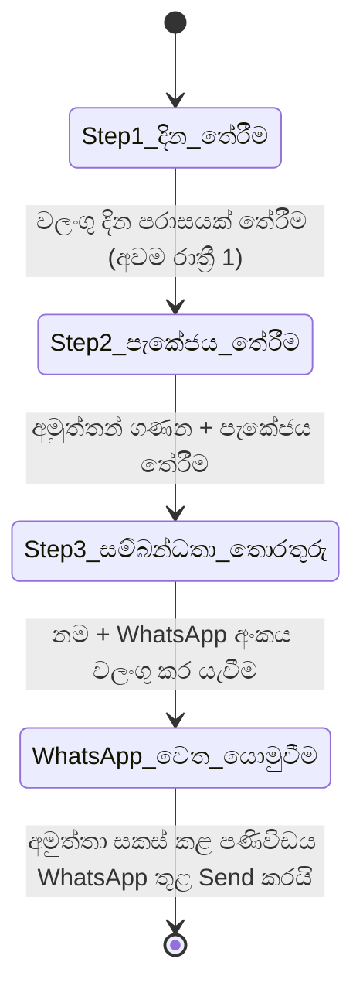
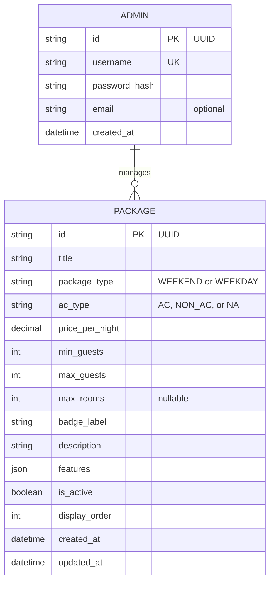

# මෘදුකාංග අවශ්‍යතා පිරිවිතරය (Software Requirements Specification - SRS)
## Villa Cinnamoon Castle වෙබ් යෙදුම (Web Application)

**ලේඛන අනුවාදය:** 1.3.0 — පළමු අදියරේ විෂය පථය සමගාමී කළ සංස්කරණය  
**තත්ත්වය:** සක්‍රීයයි — පළමු අදියර සඳහා නිල අවශ්‍යතා ලේඛනය  
**ඉලක්කගත වේදිකාව:** Web (Desktop, Tablet, Mobile)  
**ආශ්‍රිත ලේඛන:**
* [`Original Requirements.md`](../01%20Source%20Information/Original%20Requirements.md)
* [`property_details_Sinhala.md`](property_details_Sinhala.md) / [`property_details.md`](../01%20Source%20Information/property_details.md)
* [`package_details.md`](../01%20Source%20Information/package_details.md)

> [!NOTE]
> **📋 පළමු අදියරේ විෂය පථය (Phase 1 Scope) — විලා සත්කාරකගේ අවශ්‍යතා පැහැදිලි කර ගැනීම (2026-09-20)**  
> විලා සත්කාරක (දම්පල්ල ගමගේ දෙවිඳු) සමඟ පැවති සෘජු සාකච්ඡාවෙන් පසු, පද්ධතියේ විෂය පථය පහත පරිදි සංශෝධනය කර ඇත:
> - **වෙන්කිරීමේ පද්ධතිය (Booking Engine):** පළමු අදියර සඳහා **WhatsApp විමසුම් පෝරමයක් (WhatsApp Inquiry Form)** පමණක් ක්‍රියාත්මක කෙරේ. Backend database එකක් තුළ booking තැන්පත් කිරීම, status lifecycle කළමනාකරණය හෝ දින අවහිර කිරීමේ (date-blocking) පද්ධතියක් පළමු අදියරට ඇතුළත් නොවේ. සියලුම ව්‍යාපාරික කටයුතු (අත්තිකාරම් මුදල් ලබා ගැනීම, දින තහවුරු කිරීම සහ දින දර්ශනය කළමනාකරණය) සත්කාරක විසින් WhatsApp ඔස්සේ සෘජුවම සිදු කරනු ඇත.
> - **අඩවියේ සෘජු විචාර පද්ධතිය (On-Site Review System):** අනාගත අදියරක් (Phase 2) දක්වා කල් තබා ඇත. පළමු අදියරේදී **Google Reviews සංදර්ශකය (§ 3.3.2)** පමණක් සක්‍රීයව පවතී.
> - **පැකේජ මිල ගණන් (Package Pricing):** පවතින මිල ගණන් සහ පැකේජ එලෙසම පළමු අදියර සංවර්ධනය සඳහා යොදා ගැනේ.
> - **පරිපාලක පැකේජ කළමනාකරණය (Admin Package Management - § 3.4.2):** Create, Read, Update සහ Soft-Deactivate හැකියාවන් **පළමු අදියරේදී ක්‍රියාත්මක කළ යුතු** අංගයකි. Hard delete ක්‍රියාවක් නොතිබිය යුතුය.
> - **Backend booking records, admin approval/decline workflows, quotation generation, automated date blocking, direct-review submission සහ review moderation දෙවන අදියර සඳහා කල් දමා ඇත. ඒවා මෙම සක්‍රීය SRS එකේ ක්‍රියාත්මක කිරීමේ අවශ්‍යතා නොවේ.**

---

## 1. හැඳින්වීම (Introduction)

### 1.1 අරමුණ (Purpose)
මෙම මෘදුකාංග අවශ්‍යතා පිරිවිතරයේ (SRS) අරමුණ වන්නේ ශ්‍රී ලංකාවේ හික්කඩුව, ආරච්චිකන්ද ප්‍රදේශයේ පිහිටි පවුල් සහ කණ්ඩායම් සඳහා දැරිය හැකි මිලකට ලබාගත හැකි නිදන කාමර 5ක පෞද්ගලික නිවාඩු විලා එකක් වන **Villa Cinnamoon Castle** හි නිල වෙබ් වේදිකාව සඳහා වන පළමු අදියරේ (Phase 1) සම්පූර්ණ ක්‍රියාකාරී (Functional) සහ ක්‍රියාකාරී නොවන (Non-Functional) අවශ්‍යතා නිර්වචනය කිරීමයි. මෙම ලේඛනය මගින් පද්ධති ගෘහ නිර්මාණ ශිල්පය (Architecture), පාරිභෝගික Scrollytelling අත්දැකීම, පියවර 3කින් යුත් WhatsApp වෙන්කිරීමේ විමසුම් පෝරමය, කැපවූ Google Reviews සංදර්ශකය, සහ පැකේජ කළමනාකරණය සඳහා වන පරිපාලන පාලක පුවරුව (Admin Portal) විස්තර කෙරේ.

### 1.2 විෂය පථය (Scope)

#### පළමු අදියර (Phase 1 - වත්මන් ක්‍රියාත්මක කිරීමේ විෂය පථය)
මෙම වෙබ් යෙදුම ප්‍රධාන උප පද්ධති දෙකකින් සමන්විත වේ:
1. **පාරිභෝගික අත්දැකීම් ද්වාරය (Customer Experience Portal - පොදු, ගිණුම් අවශ්‍ය නැත):**
   - පෞද්ගලික විලා අත්දැකීම පැහැදිලි කරන උසස් තත්ත්වයේ, වෘත්තීය දෘශ්‍ය ඉදිරිපත් කිරීම.
   - සියලුම කාමර, පරිශ්‍රය සහ පහසුකම් ආවරණය වන පරිදි සකස් කළ **"Scrollytelling Property Elaboration"** කතාන්දර චාරිකාව.
   - **පියවර 3කින් යුත් WhatsApp විමසුම් පෝරමය (Inquiry Form):** Check-in සහ Check-out සඳහා ලේබල් කළ fields දෙකකට සම්බන්ධ shared date-range calendar model එකක් භාවිතයෙන් දින පරාසය තේරීම, අමුත්තන් ගණන සහ පැකේජය තේරීම, සම්බන්ධතා තොරතුරු ඇතුළත් කිරීම — අවසානයේ සත්කාරකගේ WhatsApp වෙත යැවීම සඳහා සකස් කළ පණිවිඩයක් ජනනය වීම.
   - සත්‍යාපිත Google ශ්‍රේණිගත කිරීම්, අමුත්තන්ගේ සැබෑ ප්‍රතිචාර සහ සෘජු Google review සබැඳිය ඇතුළත් කැපවූ **Google Reviews සංදර්ශකය**.
   - පැකේජ මිල ගණන්, පිහිටීම සහ විශේෂිත අත්දැකීම් විනිවිදභාවයෙන් යුතුව ප්‍රදර්ශනය කිරීම.
2. **පරිපාලන මෙහෙයුම් ද්වාරය (Admin Operations Portal - පුද්ගලික, මුරපද සහිතයි):**
   - දේපළ කළමනාකරණය සඳහා ආරක්ෂිත පරිපාලක පිවිසුම (Secure Authentication).
   - සම්පූර්ණ පැකේජ කළමනාකරණය (Create, Read, Update සහ Soft Deactivate; පළමු අදියරේ Hard Delete නොමැත).

#### දෙවන අදියර (Phase 2 - කල් දැමූ අංග — වැඩිදුර අවශ්‍යතා තහවුරු වන තෙක්)
> [!CAUTION]
> පහත විශේෂාංග **පළමු අදියරෙන් (Phase 1) පැහැදිලිවම බැහැර කර ඇති අතර**, සත්කාරක සමඟ දෙවන අදියරේ අවශ්‍යතා තහවුරු වන තෙක් ක්‍රියාත්මක නොකළ යුතුය:
> - `PENDING` / `APPROVED` / `DECLINED` / `CANCELLED` තත්ත්වයන් සහිත සංකීර්ණ වෙන්කිරීමේ එන්ජිම (Complex booking lifecycle).
> - පරිපාලක වෙන්කිරීම් කළමනාකරණ කාර්ය ප්‍රවාහය (අනුමත කිරීම / ප්‍රතික්ෂේප කිරීම / Quotation image සෑදීම).
> - ස්වයංක්‍රීය දින අවහිර කිරීමේ දින දර්ශන පද්ධතිය (Automated calendar date-blocking).
> - Check-in දිනය පදනම් කරගත් අඩවියේ සෘජු විචාර ඉදිරිපත් කිරීමේ පද්ධතිය (On-site verified review gate).
> - සෘජු විචාර පාලනය (Pin/Hide) සහ ඒ සඳහා අවශ්‍ය review database එක.
> - Database මගින් ක්‍රියාත්මක වන වෙන්කිරීම් වාර්තා සහ availability API.

### 1.3 නිර්වචන, කෙටි යෙදුම් සහ සංක්ෂිප්ත (Definitions, Acronyms, and Abbreviations)
* **SRS:** Software Requirements Specification (මෘදුකාංග අවශ්‍යතා පිරිවිතරය)
* **PDP:** Property Detail Page (දේපළ විස්තර පිටුව)
* **CRUD:** Create, Read, Update, Delete (දත්ත සෑදීම, කියවීම, යාවත්කාලීන කිරීම සහ අක්‍රිය කිරීම)
* **LKR / Rs.:** ශ්‍රී ලංකා රුපියල් (Sri Lankan Rupee)
* **WA:** WhatsApp Messenger
* **E.164:** ජාත්‍යන්තර විදුලි සංදේශ දුරකථන අංක ආකෘතිය
* **NFR:** Non-Functional Requirement (ක්‍රියාකාරී නොවන අවශ්‍යතා)
* **LCP:** Largest Contentful Paint (Core Web Vital කාර්යසාධන මිම්මක්)

---

## 2. සමස්ත විස්තරය (Overall Description)

### 2.1 නිෂ්පාදන ඉදිරිදර්ශනය (Product Perspective)
මෙම පද්ධතිය පරිගණක (Desktop) සහ ජංගම දුරකථන (Mobile) බ්‍රවුසර තුළ ක්‍රියාත්මක වන ස්වාධීන, Responsive වෙබ් යෙදුමකි. එය Airbnb වැනි වේදිකාවල ඇති විශ්වාසය, අලංකාරය සහ පැහැදිලි බව රැකගනිමින්, තෙවන පාර්ශ්ව Online Travel Agency (OTA) කොමිස් ගාස්තු මඟහරිමින්, අනාගත සංචාරකයින් සෘජුවම විලා හිමිකරු (*දම්පල්ල ගමගේ දෙවිඳු*) සමග WhatsApp ඔස්සේ සම්බන්ධ කරයි.

```mermaid
graph TB
    subgraph Public Internet
        Customer[පාරිභෝගිකයා / අමුත්තා]
        AdminUser[විලා හිමිකරු — දම්පල්ල ගමගේ දෙවිඳු]
    end

    subgraph "Villa Cinnamoon Castle Platform — Phase 1"
        WebFront[පාරිභෝගික Frontend සහ Scrollytelling සංචාරය]
        InquiryForm[පියවර 3කින් යුත් WhatsApp විමසුම් පෝරමය]
        GoogleReviews[Google Reviews සංදර්ශකය]
        AdminDashboard[පරිපාලක පුවරුව — Packages]
        APIServer[Backend API]
        Database[(Database: Packages)]
    end

    subgraph External Services
        WhatsAppApp[WhatsApp — සත්කාරකගේ දුරකථනය]
        GoogleBiz[Google Business Profile]
        MapService[Google Maps — අමුත්තා ක්‍රියාත්මක කරන Link හෝ Load]
    end

    Customer -->|දේපළ ගවේෂණය කරයි| WebFront
    Customer -->|විමසුම් පෝරමය පුරවයි| InquiryForm
    InquiryForm -->|සකස් කළ පණිවිඩය සමඟ WhatsApp විවෘත වේ| WhatsAppApp
    WhatsAppApp -->|විමසුම ලබාගෙන වෙන්කිරීම කළමනාකරණය කරයි| AdminUser
    Customer -->|Google Reviews බලයි| GoogleReviews
    GoogleReviews --> GoogleBiz
    AdminUser -->|පිවිසෙයි (Authenticates)| AdminDashboard
    AdminDashboard --> APIServer
    APIServer --> Database
    WebFront -->|අමුත්තා Map එක විවෘත කිරීමට තෝරයි| MapService
```

### 2.2 පරිශීලක පන්ති සහ ලක්ෂණ (User Classes and Characteristics)
1. **පොදු නරඹන්නා / අනාගත අමුත්තා (Public Visitor / Prospective Guest):**
   - ලොගින් වීම හෝ ලියාපදිංචි වීම අවශ්‍ය නොවේ (Zero-auth).
   - දේපළ තොරතුරු පරීක්ෂා කිරීම, Scroll හරහා කාමර ගවේෂණය කිරීම සහ WhatsApp වෙන්කිරීමේ විමසුම් යොමු කිරීම සිදු කරයි.
2. **විලා පරිපාලක (Villa Administrator — හිමිකරු/කළමනාකරු):**
   - ආරක්ෂිත පරිපාලක මුරපද මගින් පිවිසේ.
   - පැකේජ නාමාවලිය (CRUD) කළමනාකරණය කරයි.
   - සියලුම වෙන්කිරීමේ විමසීම් සෘජුවම WhatsApp හරහා ලබා ගන්නා අතර, සම්පූර්ණ වෙන්කිරීමේ ක්‍රියාවලිය ස්වාධීනව කළමනාකරණය කරයි.

> [!NOTE]
> **දෙවන අදියර පමණි:** අඩවියේ සෘජු විචාර පද්ධතිය ක්‍රියාත්මක වූ පසු "තහවුරු කළ අමුත්තා (Verified Guest)" පරිශීලක පන්තිය දෙවන අදියරේදී හඳුන්වා දෙනු ලැබේ.

### 2.3 මෙහෙයුම් පරිසරය (Operating Environment)
* **පාරිභෝගික පාර්ශ්වය (Client Side):** iOS, Android, macOS, සහ Windows උපාංග හරහා ක්‍රියාත්මක වන නවීන බ්‍රවුසර (Chrome, Safari, Firefox, Edge).
* **සේවාදායක පාර්ශ්වය (Server Side):** Node.js runtime පරිසරය (LTS).
* **දත්ත සමුදාය (Database):** SQLite (දේශීය ගබඩාව) / PostgreSQL (නිෂ්පාදන පරිසරය).

### 2.4 සැලසුම් සහ ක්‍රියාත්මක කිරීමේ සීමාවන් (Design & Implementation Constraints)
1. **බාධාවකින් තොර ප්‍රවේශය (Zero-Friction Customer Access):** පාරිභෝගිකයන්ට ගිණුම් හෝ මුරපද අවශ්‍ය නොවේ.
2. **දෘශ්‍ය ආකර්ෂණය සහ සෞන්දර්යය (Visual Fidelity):** උණුසුම් කුරුඳු පැහැති (warm cinnamon) සුඛෝපභෝගී විලා සැලසුම් සෞන්දර්යයට අනුකූල විය යුතුය. නිර්මාණ ආශ්වාදය සඳහා සුඛෝපභෝගී විලා වෙබ් අඩවි (luxury villa websites) ආශ්‍රය කළ යුතුය (සාමාන්‍ය හෝටල් හෝ මහල් නිවාස අඩවි නොවේ).
3. **දැඩි දුරකථන අංක වලංගුකරණය (Strict Phone Validation):** විමසුම් පෝරමය යැවීමට පෙර පාරිභෝගිකයාගේ WhatsApp අංකය Regex මගින් දැඩි ලෙස වලංගු කළ යුතුය.
4. **WhatsApp මූලික කරගත් විමසුම් ක්‍රමය (WhatsApp-First Inquiry):** සියලුම වෙන්කිරීමේ විමසීම් සෘජුවම සත්කාරකගේ WhatsApp වෙත යොමු කෙරේ. පළමු අදියරේදී සේවාදායකයේ (server-side) booking ගබඩා නොකෙරේ.
5. **A/C විනිවිදභාවය සහ Public Presentation ප්‍රතිපත්තිය:**
   - විලා එකේ **A/C සහිත නිදන කාමර 2ක්** සහ **Stand Fans සහිත නිදන කාමර 3ක්** ඇත.
   - **A/C Package:** A/C පහසුකම ඇති නිදන කාමර දෙකේ A/C ක්‍රියාත්මක වන අතර අනෙක් sleeping spaces සඳහා Stand Fans භාවිත වේ.
   - **Non-A/C Package:** A/C ක්‍රියාත්මක නොවන අතර Stand Fans ලබා දේ.
   - Public website එකේ නිදන කාමර `Bedroom 1`, `Bedroom 2` ලෙස අංක කර හෝ වෙන වෙනම තෝරාගත හැකි ඒකක ලෙස market නොකළ යුතුය. නිශ්චිත කාමර බෙදාදීම සත්කාරකගේ අභ්‍යන්තර තීරණයකි.
6. **පළමු අදියරේ Google Reviews රීතිය:** පළමු අදියරේදී සත්‍ය Google Reviews තෝරා ප්‍රදර්ශනය කිරීම සහ නිල Google Business Profile එකට පරිශීලකයන් යොමු කිරීම පමණක් සිදු වේ. මෙම වෙබ් අඩවියේ Admin Portal එක හරහා Google Reviews සංස්කරණය, Pin කිරීම, සැඟවීම හෝ වෙනත් පාලනයක් සිදු කළ නොහැක. සෘජු විචාර පාලනය දෙවන අදියරට කල් දමා ඇත.
7. **පැමිණීම (Check-in), පිටවීම (Check-out) සහ විලාව නැවත පිළියෙල කිරීමේ කාලය:** සාමාන්‍යයෙන් අමුත්තන් පැමිණීමේ වේලාව (Check-in) පස්වරු **1:00** වන අතර, පිටවීමේ වේලාව (Check-out) පෙරවරු **10:00** වේ. පෙරවරු 10:00 සිට පස්වරු 1:00 දක්වා වන පැය 3ක කාලය, ඊළඟ අමුත්තන් පැමිණීමට පෙර විලාව හොඳින් පිරිසිදු කිරීමට, ඇඳ ඇතිරිලි අලුතින් යෙදීමට සහ සියලු කටයුතු පිළියෙල කිරීමට සත්කාරක විසින් වෙන් කර ඇත. අමුත්තන්ගේ පෞද්ගලික අවශ්‍යතාවයක් මත ඉල්ලා සිටියහොත්, පිටවීමේ වේලාව තවත් පැයක් (පෙරවරු 11:00 දක්වා) හෝ පැය එකහමාරක් (පෙරවරු 11:30 දක්වා) ලබා දීමට සත්කාරක කටයුතු කරයි. ඉන්පසු ඉතිරි වන කාලය තුළ සත්කාරක විසින් විලාව පිරිසිදු කර ඊළඟ අමුත්තන් සඳහා සූදානම් කරනු ලැබේ.

---

## 3. සවිස්තරාත්මක ක්‍රියාකාරී අවශ්‍යතා (Detailed Functional Requirements)

### 3.1 මොඩියුලය 1: පාරිභෝගික දේපළ විස්තරය සහ Scrollytelling චාරිකාව
*අවශ්‍යතා සොයා ගැනීමේ හැකියාව: Original Requirements.md § Customer (1, 4, 5)*

#### 3.1.1 ගෘහ නිර්මාණ ප්‍රමිතීන් සහ ගලායාම (Architectural Standards & Flow)
මුල් පිටුව, වෙන වෙනම කාමර අලෙවි කරන catalogue එකක් ලෙස නොව, එකම පෞද්ගලික විලා අත්දැකීමක් ලෙස visitor ට හඳුන්වා දිය යුතුය:
1. **Hero Arrival & Overview:**
   - තෝරාගත් arrival/exterior දෘශ්‍යයක්, villa name, කෙටි value proposition එක සහ ප්‍රධාන **Send Inquiry** action එක.
   - Private villa use, උපරිම අමුත්තන් 15ක්, නිදන කාමර 5ක් සහ නාන කාමර 2ක් වැනි අත්‍යවශ්‍ය කරුණු සංක්ෂිප්තව පෙන්විය හැක.
2. **The Villa — Shared Living:**
   - පහත මාලයේ living area සහ උඩුමහලේ lounge එක පවුල් සහ කණ්ඩායම් සඳහා සම්බන්ධ shared spaces ලෙස ඉදිරිපත් කළ යුතුය.
3. **Sleeping Experience:**
   - නිදන කාමර පහම තෝරාගත් imagery සහ සංක්ෂිප්ත comfort/capacity information මගින් සමස්තයක් ලෙස පෙන්විය යුතුය.
   - `Bedroom 1`, `Bedroom 2` වැනි public labels හෝ වෙන වෙනම bedroom selection cards භාවිත නොකළ යුතුය.
4. **Kitchen, Dining & Amenities:**
   - Self-catering kitchen, shared dining, Wi-Fi, hot water, BBQ සහ අනෙකුත් තහවුරු කළ පහසුකම් පැහැදිලි කළ යුතුය.
5. **Outdoor Setting:**
   - Courtyard, veranda, garden සහ BBQ setting එක එකම private-villa experience එකේ කොටස් ලෙස පෙන්විය යුතුය.
6. **Nearby Hikkaduwa & Location:**
   - තෝරාගත් අවට අත්දැකීම් සහ visitor විසින් ක්‍රියාත්මක කරන verified Google location action එකක් ලබා දිය යුතුය.
7. **Stay Options, Google Reviews & Inquiry:**
   - Stay Options, dedicated Gallery සහ පියවර තුනක Send Inquiry flow වෙත පැහැදිලි ඉදිරි මාර්ග ලබා දිය යුතුය.

#### 3.1.2 Scrollytelling අන්තර්ක්‍රියාකාරී අවශ්‍යතා (Interaction Requirements)
* **FR-TOUR-01:** පරිශීලකයා පහළට scroll කරන විට, දෘශ්‍ය රූපරාමු opacity/scale සුමට සංක්‍රාන්ති (smooth transitions) මගින් විස්තර කාඩ්පත් සමඟ මාරු විය යුතුය.
* **FR-TOUR-02:** Global navigation එකේ Home, The Villa, Stay Options, Gallery, Location සහ prominent Send Inquiry action එක තිබිය යුතුය. පළමු අදියරේ `The Villa` සහ `Location` Home page sections වෙත යොමු වේ.
* **FR-TOUR-03:** තෝරාගත් media පමණක් පෙන්වන dedicated Gallery page එකක් තිබිය යුතුය. සියලු supplied images/videos පළ කිරීම හෝ bedrooms අනුව gallery categories සෑදීම අනිවාර්ය නොවේ.

---

### 3.2 මොඩියුලය 2: WhatsApp වෙන්කිරීමේ විමසුම් පෝරමය (Phase 1)
*අවශ්‍යතා සොයා ගැනීමේ හැකියාව: Original Requirements.md § Customer (2)*

> [!NOTE]
> **පළමු අදියරේ සරල කිරීම:** මෙම කොටස මගින් මීට පෙර සැලසුම් කර තිබූ සංකීර්ණ booking engine එක ප්‍රතිස්ථාපනය කරයි. මෙම විමසුම් පෝරමය මගින් අවශ්‍ය සියලුම තොරතුරු එක්රැස් කර, මනාව සකස් කළ WhatsApp පණිවිඩයක් ලෙස සෘජුවම සත්කාරක වෙත යවනු ලැබේ. වෙන්කිරීම් තහවුරු කිරීම, අත්තිකාරම් ලබා ගැනීම සහ දින කළමනාකරණය සත්කාරක විසින් සිදු කරයි.

විමසුම් පෝරමය අනුක්‍රමික **පියවර 3ක Wizard එකක්** ලෙස ක්‍රියා කරයි. වත්මන් පියවර නිවැරදිව සම්පූර්ණ කරන තෙක් ඊළඟ පියවරට යාම අක්‍රිය කර ඇත.



#### 3.2.1 පියවර 1: දින පරාසය තේරීම (Date Range Selection)
* **FR-INQ-01 (ලේබල් කළ දින පරාසය තේරීම):** පද්ධතිය Check-In සහ Check-Out සඳහා පැහැදිලිව ලේබල් කළ fields දෙකක් සහ ඒ දෙකටම සම්බන්ධ එක් shared date-range calendar model එකක් භාවිත කළ යුතුය. ප්‍රමාණවත් desktop ඉඩක calendar මාස දෙකක්ද, mobile එකේ වරකට එක් මාසයක්ද පෙන්විය හැක. Check-out දිනය Check-in දිනයට වඩා අවම වශයෙන් දින 1ක් ඉදිරියෙන් විය යුතුය. **රාත්‍රී 1ක නවාතැන් සඳහා පූර්ණ සහාය දක්වයි** (උදා: සිකුරාදා Check-in වී සෙනසුරාදා Check-out වීම වලංගු වේ).
* **FR-INQ-02 (පසුගිය දින අවහිර කිරීම):** අද දිනට පෙර සියලු දින දෙදින දර්ශනයෙන්ම අක්‍රිය (disabled) කර අළු පැහැයෙන් පෙන්විය යුතුය. පළමු අදියරේදී backend date-blocking නොමැත.
* **FR-INQ-03 (දින වර්ගය ස්වයංක්‍රීයව හඳුනාගැනීම):** දින පරාසය තෝරාගත් පසු, සතියේ දින අනුව නවාතැන ස්වයංක්‍රීයව වර්ගීකරණය වේ:

  | රාත්‍රිය යෙදෙන දිනය | වර්ගීකරණය |
  | :--- | :---: |
  | **සිකුරාදා, සෙනසුරාදා, ඉරිදා** | 🟡 Weekend Night (සති අන්ත රාත්‍රිය) |
  | **සඳුදා, අඟහරුවාදා, බදාදා, බ්‍රහස්පතින්දා** | 🔵 Weekday Night (සතියේ දින රාත්‍රිය) |

  දින දර්ශනයට පහළින් **Date Type Badge** එකක් දිස්වේ:
  - 🟡 **Weekend Stay** — තෝරාගත් සියලුම රාත්‍රී සිකුරාදා/සෙනසුරාදා/ඉරිදා වේ.
  - 🔵 **Weekday Stay** — තෝරාගත් සියලුම රාත්‍රී සඳුදා සිට බ්‍රහස්පතින්දා දක්වා වේ.
  - 🟠 **Mixed Stay** — සති අන්ත සහ සතියේ දින දෙවර්ගයම ඇතුළත් වේ (උදා: "සති අන්ත රාත්‍රී 2ක් + සතියේ දින රාත්‍රී 3ක්").

* **FR-INQ-04:** මුළු රාත්‍රී ගණන සහ දින වර්ගයේ ලාංඡනය ක්ෂණිකව පෙන්වනු ලැබේ. නිවැරදි තේරීමකින් පසු **"Continue"** බොත්තම සක්‍රීය වේ.

#### 3.2.2 පියවර 2: අමුත්තන් ගණන සහ පැකේජය තේරීම (Guest Count & Package Selection)
* **FR-INQ-05 (අමුත්තන් ගණක Stepper):** **අමුත්තන් 1 සිට 15 දක්වා** තෝරාගත හැකි Stepper සංරචකයක් (පෙරනිමිය: 2).
* **FR-INQ-06 (ස්වයංක්‍රීය පැකේජ නිර්දේශය - Auto-Suggestion Engine):** අමුත්තන් ගණන සහ දින වර්ගය අනුව වඩාත්ම ගැලපෙන පැකේජය ⭐ *"Recommended for your group"* ලෙස විශේෂණය කර පෙන්වයි:
  - අමුත්තන් 1–2 / සතියේ දින → Couples Package (රු. 6,500/රාත්‍රිය)
  - අමුත්තන් 3–4 / සතියේ දින → Family Package (රු. 8,500/රාත්‍රිය)
  - අමුත්තන් 1–4 / සතියේ දින → 2-Room Group (Non-A/C රු. 8,500 / A/C රු. 10,500)
  - අමුත්තන් 5–6 / සතියේ දින → 3-Room Group (Non-A/C රු. 12,500 / A/C රු. 14,500)
  - අමුත්තන් 7–8 / සතියේ දින → 4-Room Group (Non-A/C රු. 15,500 / A/C රු. 17,500)
  - අමුත්තන් 9–10 / සතියේ දින → 5-Room Group (Non-A/C රු. 17,900 / A/C රු. 19,900)
  - අමුත්තන් 11–15 / සතියේ දින → Full Villa (Non-A/C රු. 17,900 / A/C රු. 19,900)
  - ඕනෑම අමුත්තන් ගණනක් / සති අන්ත → Weekend Standard Non-A/C (රු. 21,000) හෝ Weekend Premium A/C (රු. 23,000)
  - *ස්වයංක්‍රීය නිර්දේශය මඟපෙන්වීමක් පමණි — පාරිභෝගිකයාට කැමති ඕනෑම පැකේජයක් තෝරාගැනීමේ නිදහස ඇත.*
* **FR-INQ-07 (දින වර්ගය අනුව පැකේජ පෙන්වීම):**
  - **Weekend stays:** Weekend පැකේජ පමණක් පෙන්වයි.
  - **Weekday stays:** Weekday පැකේජ පමණක් පෙන්වයි.
  - **Mixed stays:** Weekend පැකේජ ප්‍රධාන තේරීම ලෙසත්, Weekday කොටස සඳහා උප-තේරීමක් ලෙසත් පෙන්වා විනිවිද පෙනෙන බෙදුම් ගණනය කිරීම පෙන්වයි:
    $$\text{Total Price} = (\text{Weekend Nights} \times \text{Weekend Rate}) + (\text{Weekday Nights} \times \text{Weekday Rate})$$
* **FR-INQ-08 (A/C කාමර පිළිබඳ විනිවිද සටහන):** A/C පහසුකම සහිත පැකේජ තෝරාගැනීමේදී පහත සටහන අනිවාර්යයෙන්ම දිස්විය යුතුය:
  > *"මෙම විලා නිවස වායුසමනය කළ නිදන කාමර 2කින් සමන්විත වේ. A/C පැකේජ වෙන්කිරීම් සඳහා, ඔබේ කණ්ඩායමේ කැමැත්ත පරිදි මෙම කාමර භාවිතය බෙදාගත හැක. අනෙකුත් සියලුම නිදන කාමර සඳහා Stand Fans සපයා ඇත."*
* **FR-INQ-09 (සජීවී මිල සාරාංශ කාඩ්පත):** Check-in සහ Check-out දින, මුළු රාත්‍රී ගණන (Mixed stay නම් බෙදීම සමඟ), අමුත්තන් ගණන, තෝරාගත් පැකේජ සහ ගාස්තු සහ මුළු ඇස්තමේන්තුගත මුදල පෙන්වන සජීවී සාරාංශයක්. පළමු අදියරේදී කෙනෙකුට වැයවන මුදල නොපෙන්වයි.

#### 3.2.3 පියවර 3: සම්බන්ධතා තොරතුරු සහ විමසුම යැවීම (Contact Details & Submission)
* **FR-INQ-10 (සම්බන්ධතා ක්ෂේත්‍ර):**
  - **සම්පූර්ණ නම (Full Name):** අනිවාර්ය වේ, අවම වශයෙන් අකුරු 3ක්.
  - **WhatsApp දුරකථන අංකය:** අනිවාර්ය වේ, ශ්‍රී ලාංකික ආකෘතිය `^(?:0|94|\+94)?(7[01245678]\d{7})$` හෝ ජාත්‍යන්තර E.164 `^\+?[1-9]\d{6,14}$` අනුව වලංගු කෙරේ. වැරදි ඇතුළත් කිරීම් සඳහා පණිවිඩයක් දිස්වේ.
* **FR-INQ-11 (අමතර ඉල්ලීම් - Optional Special Requests):** විශේෂ අවශ්‍යතා සඳහා බහු-පේළි පෙළ කොටුවක් (උදා: BBQ සූදානම් කිරීම, පැමිණෙන වේලාව).
* **FR-INQ-12 (එකඟතා කොටුව - Consent Checkbox):** *"මෙය වෙන්කිරීමේ විමසුමක් පමණක් බවත්, සත්කාරක විසින් WhatsApp හරහා දින තහවුරු කර අත්තිකාරම් ගෙවීම් විස්තර ලබා දෙන බවත් මම තේරුම් ගතිමි."*
* **FR-INQ-13 (යැවීමේ බොත්තම):** ප්‍රධාන ක්‍රියාකාරී බොත්තමේ label එක හරියටම **"Send Inquiry"** විය යුතුය. එය WhatsApp deep-link එක සකස් කර විවෘත කරන අතර, link එක සකස් වන කෙටි කාලයේ loading state එකක් පෙන්වා නැවත නැවත ක්‍රියාත්මක කිරීම වළක්වයි.

#### 3.2.4 WhatsApp වෙත යොමුවීම සහ පණිවිඩ ආකෘතිය (Message Format)
* **FR-INQ-14:** පෝරමය Submit කළ විට, පහත දැක්වෙන ආකෘතියෙන් යුත් පණිවිඩයක් සමඟ deep-link එකක් මගින් WhatsApp විවෘත වේ (`https://wa.me/94761007686?text=...`):

```text
🏰 *Villa Cinnamoon Castle — Booking Inquiry*

📅 Check-in:  {check_in_date}  (From 1:00 PM)
📅 Check-out: {check_out_date} (Until 10:00 AM)
🌙 Total Nights: {total_nights} ({date_type_label})

👥 Guests: {guest_count}
📦 Package: {package_name} — Rs. {rate}/night
💰 Estimated Total: Rs. {total_estimate}/=
   {split_breakdown_if_mixed}

👤 Name: {customer_name}
📱 WhatsApp: {whatsapp_number}

📝 Special Requests:
{special_requests_or_"None"}

_(Sent via Villa Cinnamoon Castle website)_
```

* **FR-INQ-15:** WhatsApp deep-link එක විවෘත කිරීමෙන් අමුත්තා පණිවිඩය Send කළ බව තහවුරු නොවේ. අමුත්තා browser එකට නැවත පැමිණි විට **"WhatsApp opened"** යන heading එක සහ WhatsApp තුළ සකස් කළ පණිවිඩය පරීක්ෂා කර Send කරන ලෙස උපදෙස් පෙන්විය යුතුය. Fallback actions ලෙස **"Open WhatsApp again"** සහ **"Copy inquiry details"** ලබා දිය යුතු අතර current session එක තුළ form state එක ආරක්ෂා කළ යුතුය.

---

### 3.3 මොඩියුලය 3: පාරිභෝගික විචාර (Reviews)
*අවශ්‍යතා සොයා ගැනීමේ හැකියාව: Original Requirements.md § Customer (3)*

#### 3.3.1 දෙවන අදියරේ Review සීමාව
පළමු අදියරේදී website එක direct guest reviews ලබාගැනීම, ගබඩා කිරීම හෝ moderate කිරීම නොකරයි. Booking-ID verification, review eligibility, direct-review submission, pinning සහ hiding මෙම SRS එකෙන් බැහැර වන අතර ඒවා සඳහා වෙනම අනුමත Phase 2 requirements අවශ්‍ය වේ.

#### 3.3.2 Google Reviews ඒකාබද්ධ කිරීම සහ සංදර්ශකය ✅ (Phase 1 — සක්‍රීයයි)
* **FR-GREV-01 (Google Reviews කොටස සහ සමස්ත ශ්‍රේණිගත කිරීමේ ලාංඡනය):**
  වෙබ් අඩවියේ විශේෂිත Google Reviews කොටසක් තිබිය යුතු අතර එහි පහත දෑ ඇතුළත් විය යුතුය:
  - නිල Google සමස්ත ශ්‍රේණිගත කිරීම් ලකුණ (උදා: 4.9 ★ / 5.0 ★) සහ මුළු විචාර සංඛ්‍යාව.
  - නිල Google සන්නාම ලාංඡනය සහ සත්‍යාපිත ව්‍යාපාරික ලාංඡනය (Verified Business Badge).
  - Google Maps හි Villa Cinnamoon Castle හි සජීවී Google Business Profile වෙත සෘජු ක්ලික් කළ හැකි සබැඳිය.
* **FR-GREV-02 (තෝරාගත් Google Reviews Carousel / Grid):**
  මෙම කොටස මගින් සත්‍ය Google අමුත්තන්ගේ ප්‍රතිචාර කාඩ්පත් ආකාරයෙන් හෝ Carousel එකක් ලෙස පෙන්විය යුතුය:
  - විචාරකයාගේ Google නම සහ Profile avatar/initial.
  - Google verification badge icon.
  - තරු ශ්‍රේණිගත කිරීම (තරු 1 සිට 5 දක්වා).
  - පළ කළ කාලය (උදා: "සති 3කට පෙර", "මාස 2කට පෙර").
  - විචාර පාඨය (Review commentary).
* **FR-GREV-03 (පළමු අදියර — Google Reviews පමණි):**
  පළමු අදියරේදී විචාර අංශයේ Google Reviews පමණක් ප්‍රදර්ශනය කෙරේ. Tab දෙකකින් යුත් සංචාලනය (*"Google Reviews" / "Verified Direct Guests"*) දෙවන අදියරේදී සෘජු විචාර පද්ධතිය ක්‍රියාත්මක වන විට එක් කෙරේ.
* **FR-GREV-04 (සෘජු 'Review Us on Google' CTA):**
  පෙර අමුත්තන්ට Google Maps / Google Business Profile වෙත ගොස් විචාරයක් එක් කිරීම සඳහා පැහැදිලි බොත්තමක් (*"Review Us on Google ⭐"*).

---

### 3.4 මොඩියුලය 4: පරිපාලක පැකේජ කළමනාකරණ ද්වාරය
*අවශ්‍යතා සොයා ගැනීමේ හැකියාව: Original Requirements.md § Admin (1, 4)*

#### 3.4.1 පරිපාලක සත්‍යාපනය සහ Session කළමනාකරණය
* **FR-ADM-01:** පරිපාලක login page එක `/admin/login` හි තිබිය යුතුය.
* **FR-ADM-02:** Username සහ password එක securely hashed credentials (`bcrypt` හෝ `argon2`) සමඟ validate කළ යුතුය.
* **FR-ADM-03:** Protected API routes සහ admin dashboard සඳහා valid signed session token හෝ secure cookie එකක් අවශ්‍ය වේ.
* **FR-ADM-04:** Active session එක invalidate කරන secure logout එකක් තිබිය යුතුය.

#### 3.4.2 පැකේජ කළමනාකරණය
* **FR-ADM-05 (Create):** Title, package type (`WEEKEND` / `WEEKDAY`), A/C classification (`AC` / `NON_AC` / `NA`), nightly rate, suitable guest range, නිල package එකට අවශ්‍ය room-count metadata, badge, description, feature list සහ display order සමඟ package එකක් එක් කළ හැක.
* **FR-ADM-06 (Read):** Active සහ inactive packages package type අනුව බැලිය හැක.
* **FR-ADM-07 (Update):** Prices, classifications, capacities, descriptions, labels, features සහ display order යාවත්කාලීන කළ හැක.
* **FR-ADM-08 (Soft Deactivate):** Package record එක භෞතිකව මකා නොදමා deactivate කළ හැක. Action එක **Deactivate** ලෙස label කර `is_active = FALSE` සකස් කළ යුතුය; එය public Stay Options සහ inquiry interfaces වලින් සැඟවී admin archive එකේ පෙන්විය යුතුය.

#### 3.4.3 පළමු අදියරෙන් පැහැදිලිව බැහැර කළ අංග
පළමු අදියරේ Admin portal එක booking inquiries, booking history, approve/decline actions, quotation generation, cancellation, calendar date blocking, availability management, Google Review editing හෝ direct-review moderation පෙන්වීම හෝ ක්‍රියාත්මක කිරීම නොකළ යුතුය.

---

## 4. පාරිභෝගික පිටු ව්‍යුහය සහ තොරතුරු ගෘහ නිර්මාණ ශිල්පය (Information Architecture)

*අවශ්‍යතා සොයා ගැනීමේ හැකියාව: Original Requirements.md § Customer (4); වත්මන් authority: Phase 1 Sitemap සහ page-specific IA documents*

| Route / ගමනාන්තය | නම / භූමිකාව | ප්‍රධාන අන්තර්ගතය |
| :--- | :--- | :--- |
| **`/`** | **Home** | Hero/arrival, The Villa overview, shared living සහ sleeping experience, amenities, Nearby Hikkaduwa, Stay Options preview, Location, Google Reviews සහ closing Send Inquiry action |
| **`/stay-options`** | **Stay Options** | Package choices, estimated pricing, shared inclusions, stay information සහ Send Inquiry action |
| **`/gallery`** | **Gallery** | Curated featured strip, selected full gallery සහ closing inquiry action; සියලු media පළ කිරීම හෝ bedrooms වෙන වෙනම categorize කිරීම අවශ්‍ය නොවේ |
| **`/inquiry`** | **Send Inquiry** | සියලු inquiry entry points භාවිත කරන canonical accessible three-step page එක; සම්පූර්ණ form එක conventional modal එකක නැවත නොතබයි |
| **`/privacy`** | **Privacy** | Inquiry data, temporary session state, WhatsApp handoff, external services සහ visitor choices පිළිබඳ සංක්ෂිප්ත පැහැදිලි කිරීම |
| **`/admin/login`** | **Admin Login** | Secure administrator authentication |
| **`/admin`** | **Package Management** | Soft deactivation සහිත authenticated package management; පළමු අදියරේ booking හෝ review-management interface නොමැත |

Navigation labels: **Home**, **The Villa**, **Stay Options**, **Gallery**, **Location** සහ **Send Inquiry**. `The Villa` සහ `Location` වෙනම Phase 1 pages නොව Home-page sections වෙත යොමු වේ.

---

## 5. පද්ධති ගෘහ නිර්මාණ ශිල්පය සහ දත්ත ආකෘති (System Architecture & Data Models)

### 5.1 පළමු අදියරේ වස්තු සබඳතා රූප සටහන (Entity Relationship Diagram - ERD)



### 5.2 දත්ත සමුදා වගු පිරිවිතර (Relational Schema Specifications)

#### 1. `admins` වගුව
```sql
CREATE TABLE admins (
    id VARCHAR(36) PRIMARY KEY,
    username VARCHAR(50) UNIQUE NOT NULL,
    password_hash VARCHAR(255) NOT NULL,
    email VARCHAR(100),
    created_at TIMESTAMP DEFAULT CURRENT_TIMESTAMP
);
```

#### 2. `packages` වගුව
```sql
CREATE TABLE packages (
    id VARCHAR(36) PRIMARY KEY,
    title VARCHAR(100) NOT NULL,
    package_type VARCHAR(10) NOT NULL CHECK (package_type IN ('WEEKEND', 'WEEKDAY')),
    ac_type VARCHAR(10) NOT NULL DEFAULT 'NA' CHECK (ac_type IN ('AC', 'NON_AC', 'NA')),
    price_per_night DECIMAL(10, 2) NOT NULL,
    min_guests INT NOT NULL DEFAULT 1,
    max_guests INT NOT NULL DEFAULT 15,
    max_rooms INT,
    badge_label VARCHAR(50),
    description TEXT,
    features JSON,
    is_active BOOLEAN DEFAULT TRUE,
    display_order INT DEFAULT 0,
    created_at TIMESTAMP DEFAULT CURRENT_TIMESTAMP,
    updated_at TIMESTAMP DEFAULT CURRENT_TIMESTAMP
);

-- පෙරනිමි පැකේජ දත්ත (Seed Data)
-- Weekend packages
INSERT INTO packages (id, title, package_type, ac_type, price_per_night, min_guests, max_guests, max_rooms, badge_label, display_order) VALUES
  (uuid(), 'Weekend Standard — Non-A/C', 'WEEKEND', 'NON_AC', 21000.00, 1, 15, NULL, 'Full Villa', 1),
  (uuid(), 'Weekend Premium — A/C',      'WEEKEND', 'AC',     23000.00, 1, 15, NULL, 'Full Villa · A/C', 2);
-- Weekday packages
INSERT INTO packages (id, title, package_type, ac_type, price_per_night, min_guests, max_guests, max_rooms, badge_label, display_order) VALUES
  (uuid(), 'Couples Package',           'WEEKDAY', 'NA',    6500.00,  1,  2, NULL, 'Couples · Full Day', 3),
  (uuid(), 'Family Package',            'WEEKDAY', 'NA',    8500.00,  3,  4, NULL, 'Family · Full Day',  4),
  (uuid(), '2-Room Group — Non-A/C',    'WEEKDAY', 'NON_AC', 8500.00,  1,  4, 2,   '2 Rooms · 4 pax',    5),
  (uuid(), '2-Room Group — A/C',        'WEEKDAY', 'AC',    10500.00,  1,  4, 2,   '2 Rooms · A/C',      6),
  (uuid(), '3-Room Group — Non-A/C',    'WEEKDAY', 'NON_AC',12500.00,  5,  6, 3,   '3 Rooms · 6 pax',    7),
  (uuid(), '3-Room Group — A/C',        'WEEKDAY', 'AC',    14500.00,  5,  6, 3,   '3 Rooms · A/C',      8),
  (uuid(), '4-Room Group — Non-A/C',    'WEEKDAY', 'NON_AC',15500.00,  7,  8, 4,   '4 Rooms · 8 pax',    9),
  (uuid(), '4-Room Group — A/C',        'WEEKDAY', 'AC',    17500.00,  7,  8, 4,   '4 Rooms · A/C',      10),
  (uuid(), '5-Room Group — Non-A/C',    'WEEKDAY', 'NON_AC',17900.00,  9, 10, 5,   '5 Rooms · 10 pax',   11),
  (uuid(), '5-Room Group — A/C',        'WEEKDAY', 'AC',    19900.00,  9, 10, 5,   '5 Rooms · A/C',      12),
  (uuid(), 'Full Villa — Non-A/C',      'WEEKDAY', 'NON_AC',17900.00, 11, 15, NULL,'Full Villa · 15 pax', 13),
  (uuid(), 'Full Villa — A/C',          'WEEKDAY', 'AC',    19900.00, 11, 15, NULL,'Full Villa · A/C',    14);
```

### 5.3 දෙවන අදියරේ දත්ත සීමාව

පළමු අදියරේ database එකේ administrator authentication data සහ package data පමණක් තිබිය යුතුය. `booking_requests`, `blocked_dates` හෝ direct-review tables නොතිබිය යුතුය. ඒවායේ schemas සහ relationships මෙම active SRS එකෙන් හිතාමතා ඉවත් කර ඇති අතර, Phase 2 requirements අනුමත වූ පසු පමණක් නිර්වචනය කළ යුතුය.

---

## 6. බාහිර අතුරුමුහුණත් සහ ඒකාබද්ධ කිරීමේ අවශ්‍යතා (External Interfaces)

### 6.1 WhatsApp විමසුම් Handoff එක
1. Destination එක නිල host number `94761007686` විය යුතු අතර `https://wa.me/94761007686?text={url_encoded_message}` භාවිත කළ යුතුය.
2. Encoded message එකේ තෝරාගත් dates, night count, guest count, package information, estimated amount, visitor name, visitor WhatsApp number සහ optional special requests ඇතුළත් විය යුතුය.
3. Website එක prepared message එක සමඟ WhatsApp විවෘත කළ යුතු අතර visitor විසින් WhatsApp තුළ **Send** කිරීම අනිවාර්ය වේ.
4. Handoff එක server-side booking එකක් නිර්මාණය නොකළ යුතු අතර availability confirmed බව නොපෙන්විය යුතුය.

### 6.2 පැකේජ කළමනාකරණ Interface එක
1. Public package reads active packages පමණක් ලබා දිය යුතුය.
2. Authenticated admin operations create, read, update සහ soft deactivate සඳහා සහාය විය යුතුය.
3. Save කිරීමට පෙර package type, A/C classification, positive price, guest range සහ required fields server එකෙන් validate කළ යුතුය.
4. පළමු අදියරේ කිසිදු endpoint එකක් booking records සෑදීම, blocked dates ලබාදීම හෝ direct-review eligibility පරීක්ෂා කිරීම නොකළ යුතුය.

### 6.3 Google Reviews සහ Maps
1. Google Reviews actions, exact destination එක ලැබුණු පසු verified official Google Business Profile හෝ review destination වෙත යොමු විය යුතුය.
2. Google Maps visitor ක්‍රියාත්මක කරන link එකකින් විවෘත විය යුතු අතර interactive map එක visitor ඉල්ලූ පසු පමණක් load කළ හැක.
3. පළමු අදියරේ application database එක Google Reviews ගබඩා හෝ moderate නොකළ යුතුය.
4. Verify නොකළ හෝ අනුමාන කළ Google destination එකක් publish නොකළ යුතුය.

---

## 7. ක්‍රියාකාරී නොවන අවශ්‍යතා (Non-Functional Requirements - NFRs)

### 7.1 භාවිතයේ පහසුව සහ Responsive නිර්මාණය (Usability & Responsive Design)
* **NFR-USE-01 (ජංගම උපාංග ප්‍රමුඛතාවය - Mobile-First):** කුඩා ජංගම තිර (320px) සිට 4K පරිගණක තිර දක්වා දෝෂ රහිතව අන්තර්ගතය දිස්විය යුතුය.
* **NFR-USE-02 (Touch ඉලක්ක):** ජංගම දුරකථනවල සියලුම බොත්තම් සහ ක්ලික් කළ හැකි අංග අවම වශයෙන් $44 \times 44$ pixels ප්‍රමාණයෙන් යුක්ත විය යුතුය.
* **NFR-USE-03 (දෘශ්‍ය ප්‍රතිචාර):** පෝරමය යැවීමේදී බොත්තම් Loading තත්ත්වයට පත්වී ක්‍රියාවලිය පෙන්විය යුතුය.

### 7.2 කාර්යසාධනය සහ Core Web Vitals (Performance)
* **NFR-PERF-01 (LCP):** සාමාන්‍ය 4G ජාලයකදී Largest Contentful Paint තත්පර 2.0ට අඩු විය යුතුය.
* **NFR-PERF-02 (රූප ප්‍රශස්තකරණය):** පින්තූර නවීන ආකෘතිවලින් (WebP/AVIF) සහ පැහැදිලි width/height සහිතව ලබා දිය යුතුය (CLS < 0.1).
* **NFR-PERF-03 (සුමට Scrollytelling):** Scroll සජීවිකරණ දෘඩාංග-ත්වරණය (Hardware-accelerated CSS `transform`, `opacity`) භාවිතයෙන් 60 FPS මට්ටමේ පැවතිය යුතුය.

### 7.3 ආරක්ෂාව (Security)
* **NFR-SEC-01 (සත්‍යාපනය):** පරිපාලක මුරපද කර්මාන්ත ප්‍රමිතියට අනුව ලුණු දැමූ හෑෂ් (`bcrypt`, cost factor $\ge 10$) ලෙස ගබඩා කෙරේ.
* **NFR-SEC-02 (SQL Injection ආරක්ෂාව):** SQL Injection වැළැක්වීම සඳහා Parameterized queries හෝ ORM පමණක් භාවිතා කළ යුතුය.
* **NFR-SEC-03 (Input Safety):** Public form text on-page summary එකේ පෙන්වීමට හෝ WhatsApp deep-link එකට ඇතුළත් කිරීමට පෙර validate කර ආරක්ෂිතව encode කළ යුතුය.
* **NFR-SEC-04 (Rate Limiting):** Admin login සහ authenticated mutation endpoints rate-limit කළ යුතුය. Phase 1 public inquiry එක client-side WhatsApp handoff එකක් වන අතර booking-submission endpoint එකක් නොමැත.

### 7.4 දත්ත අඛණ්ඩතාව (Data Integrity)
* **NFR-INT-01 (පළමු අදියර — Backend Booking ගබඩාවක් නොමැත):** පළමු අදියරේදී, විමසුම් දත්ත සෘජුවම සත්කාරකගේ WhatsApp වෙත යවනු ලැබේ. සේවාදායකයේ booking දත්ත ගබඩා කිරීමක් හෝ transactional date-locking පළමු අදියරට අවශ්‍ය නොවේ. *(දෙවන අදියර සටහන: වෙන්කිරීම් අනුමත කිරීමේ කාර්ය ප්‍රවාහය ක්‍රියාත්මක වන විට දින අගුළු දැමීමේ පද්ධතිය අවශ්‍ය වනු ඇත).*

### 7.5 පෞද්ගලිකත්වය සහ දත්ත අවම කිරීම (Privacy & Data Minimisation)
* **NFR-PRV-01 (Privacy Notice):** Public `/privacy` page එක inquiry flow එක භාවිත කරන පුද්ගලික තොරතුරු, ඒවායේ අරමුණ, browser session state, WhatsApp handoff, hosting technical logs, external links, retention criteria, visitor choices සහ privacy contact route එක පැහැදිලි කළ යුතුය.
* **NFR-PRV-02 (Session-Scoped Form State):** Form එකේ ගමන් කරන අතර valid තොරතුරු අහම්බෙන් අහිමි වීම වැළැක්වීමට inquiry progress එක session-scoped browser storage තුළ තාවකාලිකව තබාගත හැක. පළමු අදියරේදී inquiry details backend booking database එකක ගබඩා නොකළ යුතුය.
* **NFR-PRV-03 (Default Non-Essential Tracking නොමැත):** පළමු release එකේ advertising cookies හෝ behavioural analytics සක්‍රීය නොකළ යුතුය. පසුව ඒවා එක් කළහොත් සක්‍රීය කිරීමට පෙර Privacy Notice එක සහ අදාළ නීතියට අවශ්‍ය consent controls යාවත්කාලීන කළ යුතුය.
* **NFR-PRV-04 (User-Initiated Third-Party Maps):** Google Maps අමුත්තා ක්‍රියාත්මක කරන action එකකින් විවෘත කළ යුතු අතර, visitor තෝරාගත් පසුව පමණක් interactive map එක load කළ හැක. Initial page load එකේ third-party map embed එකක් හරහා visitor data ස්වයංක්‍රීයව යැවිය නොහැක.
* **NFR-PRV-05 (Sensitive Transaction Data නොගැනීම):** Public website එක payment-card, bank-account හෝ passport details ඉල්ලා හෝ එකතු නොකළ යුතුය. `Special requests` field එකට අනවශ්‍ය sensitive හෝ medical information නොදමන ලෙස visitor ට උපදෙස් දිය යුතුය.
* **NFR-PRV-06 (Policy Accuracy):** Privacy Notice එකේ last-updated date එකක් තිබිය යුතු අතර launch කිරීමට පෙර සහ hosting, analytics, maps, inquiry storage, payment collection හෝ third-party integrations වෙනස් වන සෑම අවස්ථාවකම එය නැවත පරීක්ෂා කළ යුතුය.

---

## 8. අවශ්‍යතා සොයා ගැනීමේ න්‍යාසය (Requirement Traceability Matrix - RTM)

| අවශ්‍යතා අංකය | විස්තරය | SRS අංශය | පළමු අදියරේ ක්‍රියාත්මක කිරීම |
| :--- | :--- | :--- | :--- |
| **Cust 0** | පාරිභෝගික ගිණුම් හෝ ලියාපදිංචියක් අවශ්‍ය නොවේ | § 1.2, § 2.2 | Account නොමැති public form එක; progress තාවකාලිකව session-scoped විය හැක |
| **Cust 1** | Scrollytelling දේපළ විස්තරය සහ චාරිකාව | § 3.1 | Scroll මත පදනම් වූ කතාන්දරය සහ කාමරෙන් කාමරයට visual walkthrough |
| **Cust 2** | දින සහ පැකේජ තෝරාගැනීම සහිත WhatsApp විමසුම | § 3.2 | පියවර 3ක පෝරමය &rarr; පෙර සැකසූ පණිවිඩය සහිත WhatsApp deep-link |
| **Cust 4** | පැහැදිලි public Information Architecture | § 4.0 | Home සමඟ dedicated Stay Options, Gallery, Inquiry සහ Privacy routes |
| **Cust 5** | පූර්ණ responsive සහ ජංගම හිතකාමී බව | § 7.1 | Flexbox/Grid, mobile-first සැකසුම, නිසි touch targets |
| **Google Reviews** | Google Reviews සංදර්ශකය සහ aggregate badge | § 3.3.2 | Google Business Profile ලාංඡනය + තෝරාගත් reviews carousel + Review CTA |
| **INQ 1** | ලේබල් කළ Check-in සහ Check-out fields, අවම රාත්‍රී 1, පසුගිය දින අවහිරය | § 3.2.1 | Shared responsive date-range calendar model එක සහ client-side වලංගුකරණය |
| **INQ 2** | අමුත්තන් ගණන (1–15) සහ දින වර්ගය අනුව ස්වයංක්‍රීය නිර්දේශය | § 3.2.2 | Stepper + ස්වයංක්‍රීය නිර්දේශ එන්ජිම (Weekend/Weekday/Mixed) |
| **INQ 3** | අනුකූල පැකේජ තේරීම + A/C විනිවිද සටහන | § 3.2.2 | දින වර්ගය අනුව මාරුවීම, බෙදුම් මිල ගණනය, A/C සටහන (Stand fans සහිත) |
| **INQ 4** | පෙර සැකසූ පණිවිඩය සමඟ WhatsApp වෙත යොමුවීම | § 3.2.4 | URL-encoded පණිවිඩ ආකෘතිය සහිත `wa.me` deep-link |
| **Privacy** | විනිවිද පෙනෙන, අවම දත්ත භාවිත කරන Phase 1 inquiry flow | § 7.5 | Privacy Notice, session-scoped form state, backend inquiry storage සහ non-essential tracking නොමැති වීම |
| **Admin 1** | ආරක්ෂිත පරිපාලක සත්‍යාපනය | § 3.4.1 | Bcrypt hashed login + ආරක්ෂිත session |
| **Admin 4** | පැකේජ කළමනාකරණය | § 3.4.2 | Create, read, update සහ soft deactivate (`is_active=FALSE`); hard delete නොමැත |

> [!NOTE]
> **දෙවන අදියර RTM වාර්තා** (පරිපාලක booking pipeline, date-blocking, අඩවි-අභ්‍යන්තර review gate, සෘජු විචාර පාලනය සහ cancellation) දෙවන අදියරේ අවශ්‍යතා තහවුරු වූ පසු එක් කරනු ලැබේ.

---

## 9. සත්‍යාපනය සහ පිළිගැනීමේ පරීක්ෂණ සැලැස්ම (Verification & Acceptance Testing Plan)

### 9.1 පළමු අදියරේ ස්වයංක්‍රීය පරීක්ෂණ කට්ටල (Automated Test Suites)
1. **WhatsApp පණිවිඩ ආකෘති පරීක්ෂණය:** පෝරමයේ ඇතුළත් කරන දත්ත (දින, රාත්‍රී ගණන, පැකේජය, මිල, අමුත්තන් ගණන, නම, අංකය, විශේෂ ඉල්ලීම්) නිවැරදිව WhatsApp deep-link පණිවිඩය බවට encode වන්නේදැයි පරීක්ෂා කිරීම.
2. **Regex වලංගුකරණ පරීක්ෂණ:** ශ්‍රී ලාංකික අංක ආකෘති (`0761007686`, `+94761007686`), ජාත්‍යන්තර අංක (`+447911123456`) සහ වැරදි අංක සඳහා ඒකක පරීක්ෂණ (unit tests).
3. **දින වලංගුකරණ පරීක්ෂණ:** Check-out ≥ Check-in + දින 1; පසුගිය දින තෝරාගත නොහැකි බව; රාත්‍රී 1ක වෙන්කිරීම් පිළිගන්නා බව.
4. **දින වර්ගය හඳුනාගැනීමේ පරීක්ෂණ:** Weekend, Weekday, සහ Mixed වර්ගීකරණයන් නිවැරදිව හඳුනාගන්නේදැයි පරීක්ෂා කිරීම (උදා: සිකුරාදා පමණක් &rarr; Weekend; සඳුදා පමණක් &rarr; Weekday; සිකුරාදා සිට සඳුදා දක්වා &rarr; Mixed: Weekend 2ක් + Weekday 1ක්).
5. **Package Management Tests:** Authentication, validation, create/read/update සහ soft deactivation පරීක්ෂා කිරීම; inactive package public interfaces වලින් සැඟවී ඇති නමුත් delete වී නොමැති බව තහවුරු කිරීම.
6. **Phase 1 Boundary Test:** Booking-record, blocked-date, direct-review හෝ review-moderation endpoint/admin screen කිසිවක් නොමැති බව තහවුරු කිරීම.

### 9.2 පළමු අදියරේ අතින් සිදුකරන පරික්ෂණ චාරිකාව (Manual End-to-End Walkthrough)
1. **පාරිභෝගික ගමන (Mixed Stay):** පාරිභෝගිකයා Scrollytelling චාරිකාව බලයි &rarr; Google Reviews බලයි &rarr; සිකුරාදා Check-in සහ අඟහරුවාදා Check-out තෝරයි &rarr; පද්ධතිය Weekend රාත්‍රී 3ක් සහ Weekday රාත්‍රී 1ක් හඳුනාගනී &rarr; අමුත්තන් 8ක් ඇතුළත් කරයි &rarr; Wizard එක 4-Room පැකේජය නිර්දේශ කරයි &rarr; Weekend Premium A/C සහ Weekday 4-Room A/C තෝරයි &rarr; සජීවී බෙදුම් මිල දකියි &rarr; නම සහ WhatsApp අංකය ඇතුළත් කරයි &rarr; Submit කරයි &rarr; සියලු දත්ත සහිතව WhatsApp විවෘත වේ.
2. **රාත්‍රී 1ක විමසුම (1-Night Inquiry):** Visitor සෙනසුරාදා Check-in සහ ඉරිදා Check-out තෝරයි &rarr; පද්ධතිය එය රාත්‍රී 1ක Weekend stay ලෙස පිළිගනී &rarr; package එක තෝරා WhatsApp වෙත ඉදිරියට යයි.
3. **පරිපාලක පැකේජ කළමනාකරණය:** පරිපාලක පිවිසේ &rarr; නව Weekday පැකේජයක් සාදයි &rarr; මිල යාවත්කාලීන කරයි &rarr; පැරණි පැකේජයක් අක්‍රිය කරයි &rarr; අක්‍රිය කළ පැකේජය පාරිභෝගික පෝරමයෙන් සැඟවී ඇති බව තහවුරු කරයි.
4. **Google Reviews කොටස:** පාරිභෝගිකයා Google Reviews කොටස බලයි &rarr; සමස්ත ලකුණු දකියි &rarr; Reviews කාඩ්පත් පරීක්ෂා කරයි &rarr; "Review Us on Google" ක්ලික් කරයි &rarr; Google Maps හි Villa Cinnamoon Castle පිටුව විවෘත වේ.

> [!CAUTION]
> **දෙවන අදියරේ පරීක්ෂණ** (Admin booking approval, calendar date-blocking, on-site review submission) දෙවන අදියර ක්‍රියාත්මක වන තෙක් කල් තබා ඇත.
