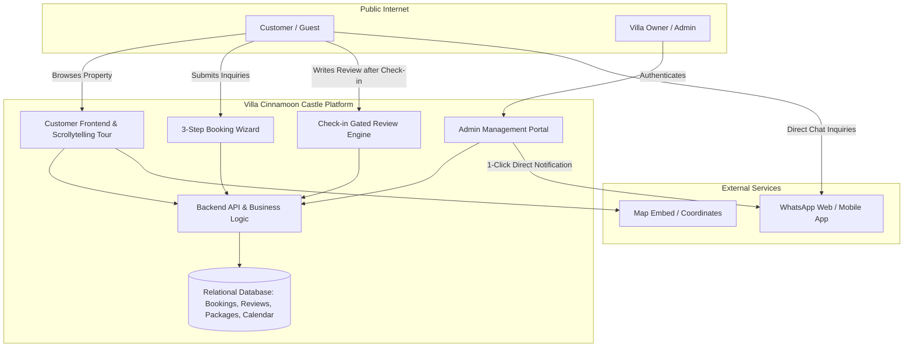
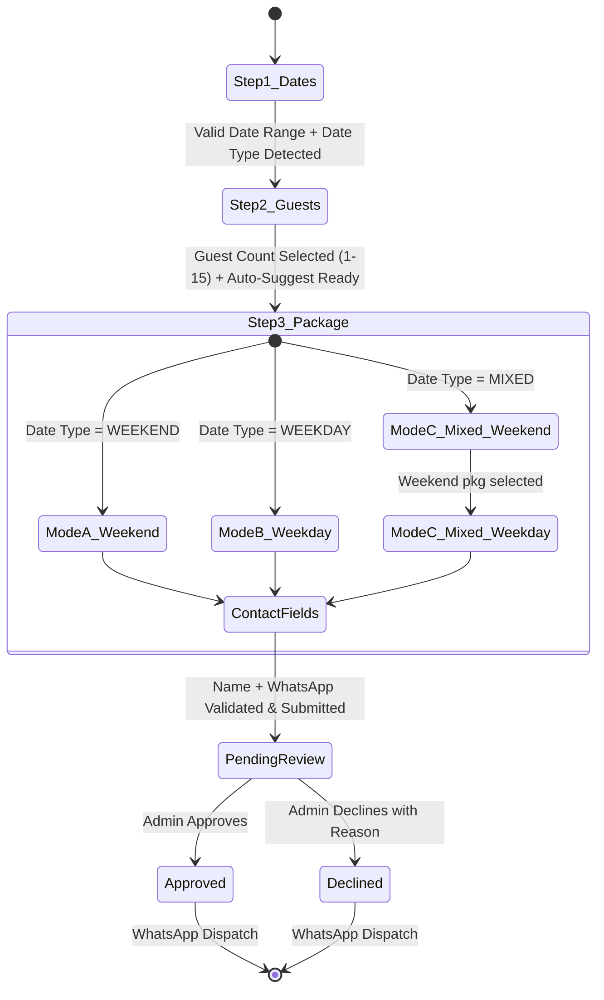
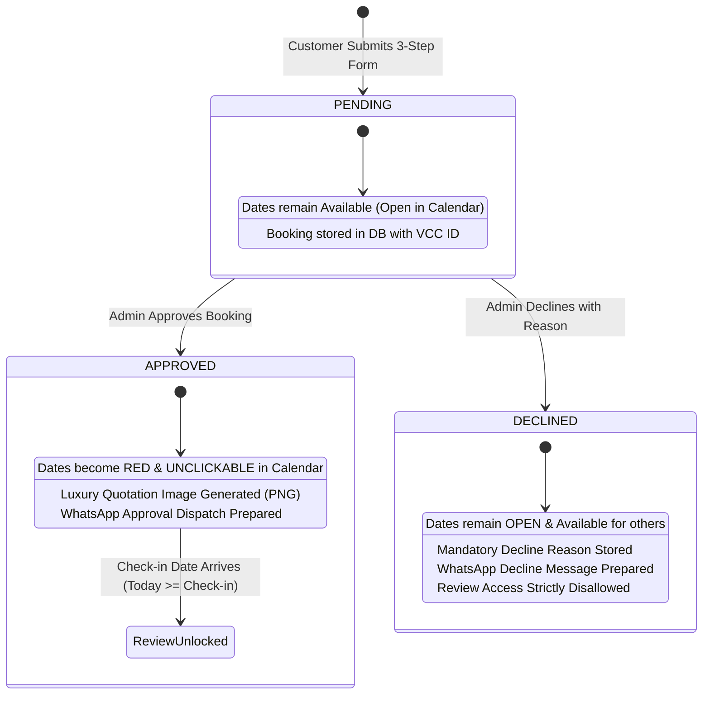

# Software Requirements Specification (SRS)
## Villa Cinnamoon Castle Web Application

**Document Version:** 1.1.0 — Final  
**Status:** Finalized (All Feasibility Issues Resolved)  
**Target Platform:** Web (Desktop, Tablet, Mobile)  
**Reference Documents:**
* [`Requirements file.md`](file:///D:/Villa%20Cinnamoon%20Castle/Requirements%20file.md)
* [`DESIGN.md`](file:///D:/Villa%20Cinnamoon%20Castle/DESIGN.md)
* [`property_details.md`](file:///D:/Villa%20Cinnamoon%20Castle/property_details.md)
* [`package_details.md`](file:///D:/Villa%20Cinnamoon%20Castle/package_details.md)
* [`images_catalog.md`](file:///D:/Villa%20Cinnamoon%20Castle/images_catalog.md)

---

## 1. Introduction

### 1.1 Purpose
This Software Requirements Specification (SRS) establishes the complete functional and non-functional requirements for the official web platform of **Villa Cinnamoon Castle**, an authentic luxury 5-bedroom holiday villa located in Arachchikanda, Hikkaduwa, Sri Lanka. This document defines the system architecture, customer scrollytelling journey, interactive 3-step booking engine, check-in gated review mechanism, administrative control portal, and WhatsApp communication workflows.

### 1.2 Scope
The web application encompasses two primary subsystems:
1. **Customer Experience Portal (Public, Zero-Auth):**
   - High-fidelity visual property presentation adhering to luxury real-estate standards.
   - Narrative **"Scrollytelling Property Elaboration"** covering all rooms, grounds, and amenities.
   - 3-step mini-form booking wizard with automated red-calendar date blocking.
   - Verified guest review system unlocked strictly on/after the customer's check-in date.
   - Transparent showcase of customer reviews, package pricing, location, and curated experiences.
2. **Admin Operations Portal (Private, Authenticated):**
   - Secure authentication for property management.
   - Inbound booking inquiry management (approve/decline with personalized decline reason).
   - Automated WhatsApp message generation and dispatch to customers.
   - Review moderation engine (pin, hide, publish without editing text).
   - Full package management (Create, Read, Update, Delete).
   - Automated calendar date blocking upon booking approval (no manual date blocking by admin).

### 1.3 Definitions, Acronyms, and Abbreviations
* **SRS:** Software Requirements Specification
* **PDP:** Property Detail Page
* **CRUD:** Create, Read, Update, Delete
* **LKR / Rs.:** Sri Lankan Rupee
* **WA:** WhatsApp Messenger
* **E.164:** International public telecommunication numbering plan format
* **NFR:** Non-Functional Requirement
* **LCP:** Largest Contentful Paint (Core Web Vital)

---

## 2. Overall Description

### 2.1 Product Perspective
The system is an independent, responsive web application operating in modern desktop and mobile browsers. It connects prospective travelers directly with the villa owner (*Dampalla Gamage Devindu*), bypassing third-party online travel agency (OTA) booking fees while preserving the trust, aesthetics, and clarity of platforms like Airbnb.



### 2.2 User Classes and Characteristics
1. **Public Visitor / Prospective Guest:**
   - No login or registration required.
   - Browses property details, explores rooms via interactive scroll, checks calendar availability, and submits booking inquiries.
2. **Verified Guest:**
   - Customer with an approved reservation whose check-in date has arrived.
   - Authorized via Booking ID and WhatsApp Number to submit authentic ratings and reviews.
3. **Villa Administrator (Property Owner/Manager):**
   - Authenticated via secure administrative credentials.
   - Oversees inquiry pipeline, reviews, packages, and calendar blackout dates.

### 2.3 Operating Environment
* **Client Side:** Modern browsers (Chrome, Safari, Firefox, Edge) across iOS, Android, macOS, and Windows devices.
* **Server Side:** Node.js runtime environment (LTS).
* **Database:** SQLite (local persistent) / PostgreSQL (production scalable).

### 2.4 Design & Implementation Constraints
1. **Zero-Friction Customer Access:** No customer accounts or passwords allowed; bookings are tracked via unique Booking IDs.
2. **Visual Fidelity:** Must match the warm cinnamon and Airbnb design tokens specified in [`DESIGN.md`](file:///D:/Villa%20Cinnamoon%20Castle/DESIGN.md).
3. **Strict Phone Validation:** Customer WhatsApp numbers must be validated via Regex before form submission.
4. **Availability Rule:** Dates become unavailable solely when customers book them and those bookings are approved. When booked/approved, they must be highlighted in **red** and rendered **unclickable** in the calendar. Admin does not manually block dates.
5. **Review Protection Rule:** Reviews cannot be edited by the administrator; only pinned or hidden.

---

## 3. Detailed Functional Requirements

### 3.1 Module 1: Customer Property Elaboration & Scrollytelling Tour
*Requirement Traceability: Requirements file.md § Customer (1, 4, 5)*

#### 3.1.1 Architectural Standards & Flow
The landing experience must lead with an immersive, scroll-driven visual walkthrough that guides the customer through the estate logically from arrival to intimate spaces:
1. **Hero Arrival & Overview:**
   - High-impact exterior panorama ([`images/photo_1.jpg`](file:///D:/Villa%20Cinnamoon%20Castle/images/photo_1.jpg) / [`images/outdoor_and_garden/exterior/exterior_06.jpg`](file:///D:/Villa%20Cinnamoon%20Castle/images/outdoor_and_garden/exterior/exterior_06.jpg)).
   - Headline: *"Villa Cinnamoon Castle — Find your own peacefulness"*.
   - Key attributes: 10–15 guests, 5 bedrooms, 5 beds, 2 baths, 3.5 km to Hikkaduwa Beach.
2. **The Living Quarters (Step 1 of Tour):**
   - Ground-Floor Living Room: Hand-carved traditional armchairs, caned seating, TV entertainment ([`images/living_rooms/living_room_1`](file:///D:/Villa%20Cinnamoon%20Castle/images/living_rooms/living_room_1)).
   - Upstairs Mezzanine Lounge: Vaulted timber roof, open-concept breeze corridor, relaxed sofa lounging ([`images/living_rooms/living_room_2`](file:///D:/Villa%20Cinnamoon%20Castle/images/living_rooms/living_room_2)).
3. **Bedrooms Sanctuary (Step 2 of Tour):**
   - Total 5 bedrooms, presented with clear bed badges and climate specs:
     - **Bedroom 1 (Master):** Super King Bed, Air Conditioning, desk workspace ([`images/bedrooms/bedroom_1`](file:///D:/Villa%20Cinnamoon%20Castle/images/bedrooms/bedroom_1)).
     - **Bedroom 2:** Super King Bed, Air Conditioning, large windows ([`images/bedrooms/bedroom_2`](file:///D:/Villa%20Cinnamoon%20Castle/images/bedrooms/bedroom_2)).
     - **Bedroom 3:** King Bed, ceiling fan, garden orientation ([`images/bedrooms/bedroom_3`](file:///D:/Villa%20Cinnamoon%20Castle/images/bedrooms/bedroom_3)).
     - **Bedroom 4:** Attic/Timber Roof aesthetic, Super King Bed, ceiling fan ([`images/bedrooms/bedroom_4`](file:///D:/Villa%20Cinnamoon%20Castle/images/bedrooms/bedroom_4)).
     - **Bedroom 5:** Queen Bed, ceiling fan, peaceful natural light.
4. **Kitchen & Dining Experience (Step 3 of Tour):**
   - Full granite kitchen counter, double-burner gas stove, electric rice cooker, cookware ([`images/kitchen_and_dining/full_kitchen`](file:///D:/Villa%20Cinnamoon%20Castle/images/kitchen_and_dining/full_kitchen)).
   - Dining hall table with seating for the entire family/group ([`images/kitchen_and_dining/dining_area`](file:///D:/Villa%20Cinnamoon%20Castle/images/kitchen_and_dining/dining_area)).
5. **Bathrooms & Modern Sanitation (Step 4 of Tour):**
   - 2 full modern bathrooms with instant hot water showers, vanity sinks, hand bidets ([`images/bathrooms`](file:///D:/Villa%20Cinnamoon%20Castle/images/bathrooms)).
6. **Courtyard, Tropical Garden & Veranda (Step 5 of Tour):**
   - Gated gravel courtyard, rustic timber perimeter fencing, private BBQ pavilion, front veranda ([`images/outdoor_and_garden`](file:///D:/Villa%20Cinnamoon%20Castle/images/outdoor_and_garden)).
7. **Curated Nearby Experiences:**
   - Hikkaduwa Beach (5 min), coral reef turtle watching, river boat safaris, kayaking, surfing, Galle Fort ([`images/nearby_attractions_and_activities`](file:///D:/Villa%20Cinnamoon%20Castle/images/nearby_attractions_and_activities)).

#### 3.1.2 Scrollytelling Interaction Requirements
* **FR-TOUR-01:** As the user scrolls vertically, images shall transition smoothly using opacity/scale easing with pinned descriptive story cards.
* **FR-TOUR-02:** Quick navigation anchors (*Overview*, *Living*, *Bedrooms*, *Kitchen*, *Outdoors*, *Amenities*, *Location*) shall remain accessible in a sticky floating sub-header.
* **FR-TOUR-03:** A "Full Gallery Modal" with category filtering must allow direct image browsing for users preferring non-scroll exploration.

### 3.2 Module 2: Adaptive Booking Engine (Date-Type Driven)
*Requirement Traceability: Requirements file.md § Customer (2, 21-37)*

The booking experience is organized as a sequential wizard of up to **4 steps** (Step 3B appears conditionally for Mixed stays). Progression to subsequent steps is disabled until the current step is validated.



#### 3.2.1 Mini-Form 1: Preferred Dates Selection
* **FR-BOOK-01:** The system shall display an interactive monthly calendar allowing check-in/check-out date range selection.
* **FR-BOOK-02 (Red-Block Rule):** The calendar must query the backend for all unavailable dates (dates associated with an `APPROVED` customer booking). Admin does not manually block dates.
* **FR-BOOK-03 (Unclickable State):** All unavailable dates must be visually highlighted in **red** (`#FF4D4F` / `--color-danger`) and set to unclickable (`disabled`, `pointer-events: none`, `cursor: not-allowed`).
* **FR-BOOK-04:** Past dates (prior to today) must be disabled and muted in gray.
* **FR-BOOK-05:** Selection of a range that spans across any red-blocked date must be rejected with an inline warning: *"Selected range contains unavailable dates. Please select continuous open dates."*
* **FR-BOOK-06 (Date Type Detection):** Upon valid date selection, the system automatically classifies each night of the selected range by day-of-week, applying the following business rule:

  | Night Falls On (Check-in Day) | Classification |
  | :--- | :---: |
  | **Friday, Saturday, Sunday** | 🟡 **Weekend Night** |
  | **Monday, Tuesday, Wednesday, Thursday** | 🔵 **Weekday Night** |

  A **Date Type Badge** is displayed beneath the calendar immediately after selection:
  - 🟡 **Weekend Stay** — all selected nights are Weekend nights.
  - 🔵 **Weekday Stay** — all selected nights are Weekday nights (Mon–Thu).
  - 🟠 **Mixed Stay** — selected range contains both Weekend and Weekday nights. Badge shows breakdown: *e.g., "2 Weekend nights + 3 Weekday nights"*.

  > **Business Rule:** The maximum consecutive Weekday Stay is **4 nights (Mon–Thu)**. A booking of 5+ weekday-only nights would carry into the next Friday (Weekend), making it a Mixed Stay automatically.

* **FR-BOOK-07:** Upon valid date selection and Date Type detection, the total nights count and type breakdown are displayed, and the **"Continue to Guests →"** button activates.

#### 3.2.2 Mini-Form 2: Guest Count Selection & Package Recommendation
* **FR-BOOK-08 (Guest Stepper):** The system shall provide an intuitive stepper component allowing guests to select group size from **1 to 15 guests** (standard occupancy: 10, expandable up to 15 pax). Default value is set to 2 guests.
* **FR-BOOK-09 (Dynamic Auto-Suggestion Engine):** Based on the guest count selected in Step 2 and the date classification detected in Step 1, the system computes the recommended package and applies a distinctive visual highlight (*"⭐ Recommended for your group"*) when the user advances to Step 3:
  - **1–2 Guests:**
    - Weekday: Auto-suggests **Couples Package** (Rs. 6,500/night) or **2-Room Group** (Rs. 8,500 Non-A/C / Rs. 10,500 A/C).
    - Weekend: Auto-suggests **Weekend Standard Non-A/C** (Rs. 21,000/night) or **Weekend Premium A/C** (Rs. 23,000/night).
  - **3–4 Guests:**
    - Weekday: Auto-suggests **Family Package** (Rs. 8,500/night) or **2-Room Group** (Rs. 8,500 Non-A/C / Rs. 10,500 A/C).
    - Weekend: Weekend packages.
  - **5–6 Guests:**
    - Weekday: Auto-suggests **3-Room Group** (Rs. 12,500 Non-A/C / Rs. 14,500 A/C).
    - Weekend: Weekend packages.
  - **7–8 Guests:**
    - Weekday: Auto-suggests **4-Room Group** (Rs. 15,500 Non-A/C / Rs. 17,500 A/C).
    - Weekend: Weekend packages.
  - **9–10 Guests:**
    - Weekday: Auto-suggests **5-Room Group** (Rs. 17,900 Non-A/C / Rs. 19,900 A/C).
    - Weekend: Weekend packages.
  - **11–15 Guests:**
    - Weekday: Auto-suggests **Full Villa Buyout** (Rs. 17,900 Non-A/C / Rs. 19,900 A/C).
    - Weekend: Weekend packages.
  - *Note:* The auto-suggestion is purely assistive. Customers retain full freedom to upgrade or select any eligible package.
* **FR-BOOK-09-B:** Upon confirming the guest count, the **"Continue to Package & Details →"** button activates.

#### 3.2.3 Mini-Form 3: Adaptive Package Selection & Contact Information
The package selection interface adapts dynamically based on the Date Type detected in Step 1:

##### Mode A: Weekend Stays (All nights fall on Friday, Saturday, or Sunday)
* **FR-BOOK-10 (Weekend Package Isolation):** When all selected nights are Weekend nights, the wizard **strictly displays ONLY Weekend packages**. All Weekday packages (room-based, couples, family) are completely hidden from selection.
* **FR-BOOK-11 (Available Weekend Options):**
  1. **Weekend Standard — Non-A/C:** Rs. 21,000 / night (Full 5-Bedroom Villa buyout with ceiling fans throughout).
  2. **Weekend Premium — A/C:** Rs. 23,000 / night (Full 5-Bedroom Villa buyout with air-conditioned bedrooms).
* **FR-BOOK-12-A (Weekend Rate Calculation):**
  $$\text{Total Estimate} = \text{Total Weekend Nights} \times \text{Selected Weekend Rate}$$
  Example: 2 Weekend nights @ Rs. 23,000 = **Rs. 46,000/=**

##### Mode B: Weekday Stays (All nights fall on Monday, Tuesday, Wednesday, or Thursday)
* **FR-BOOK-10-B (Weekday Package Isolation):** When all selected nights are Weekday nights (up to 4 consecutive nights Mon–Thu), the wizard **strictly displays ONLY active Weekday packages**. Weekend buyout packages are completely hidden.
* **FR-BOOK-11-B (Available Weekday Options):** The system fetches all active weekday packages from the `packages` table (managed via Admin CRUD):
  - **Full Villa Buyout (11–15 pax):** Non-A/C: Rs. 17,900/night | A/C: Rs. 19,900/night
  - **5-Room Group (9–10 pax):** Non-A/C: Rs. 17,900/night | A/C: Rs. 19,900/night
  - **4-Room Group (7–8 pax):** Non-A/C: Rs. 15,500/night | A/C: Rs. 17,500/night
  - **3-Room Group (5–6 pax):** Non-A/C: Rs. 12,500/night | A/C: Rs. 14,500/night
  - **2-Room Group (1–4 pax):** Non-A/C: Rs. 8,500/night | A/C: Rs. 10,500/night
  - **Couples Package (1–2 pax):** Rs. 6,500/night (flat)
  - **Family Package (3–4 pax):** Rs. 8,500/night (flat)
* The package identified by the Step 2 Auto-Suggestion Engine is pre-selected and highlighted with a recommendation badge.
* **FR-BOOK-12-B (Weekday Rate Calculation):**
  $$\text{Total Estimate} = \text{Total Weekday Nights} \times \text{Selected Weekday Rate}$$
  Example: 3 Weekday nights @ Rs. 14,500 (3-Room A/C) = **Rs. 43,500/=**

##### Mode C: Mixed Stays (Combined Weekend + Weekday Nights)
* **FR-BOOK-10-C (Mixed Stay Adaptive Architecture):** When a selected range encompasses both Weekend nights (Fri, Sat, Sun) and Weekday nights (Mon–Thu), the system activates a dual-selector interface with an explicit sub-form for the weekday portion:
  1. **Primary Package Selection (Weekend Portion):**
     - Customer selects the Weekend package for all weekend nights within the range:
       - **Weekend Standard — Non-A/C** (Rs. 21,000 / night)
       - **Weekend Premium — A/C** (Rs. 23,000 / night)
  2. **Secondary Mini-Form / Sub-Selection (Step 3B - Weekday Portion):**
     - An integrated mini-form appears directly below the weekend selector titled: *"Select Package for your Weekday Nights ([N] nights: Mon–Thu)"*.
     - Customer selects the Weekday package matching their preference:
       - A/C vs Non-A/C preference matching the full villa (e.g. Non-A/C Rs. 17,900 vs A/C Rs. 19,900), or a group room option if applicable.
       - Default pre-selection matches the A/C preference chosen in the Weekend selector for seamless continuity (e.g., if Weekend Premium A/C is chosen, Weekday Full Villa A/C @ Rs. 19,900 is pre-selected).
* **FR-BOOK-12-C (Mixed Stay Split Calculation & Transparent Summary):**
  $$\text{Total Estimate} = (\text{Weekend Nights} \times \text{Weekend Package Rate}) + (\text{Weekday Nights} \times \text{Weekday Package Rate})$$
  The wizard renders a live calculation breakdown card:
  $$\text{e.g., } [2\text{ Weekend Nights} \times \text{Rs. 23,000}] + [2\text{ Weekday Nights} \times \text{Rs. 19,900}] = \text{Rs. 46,000} + \text{Rs. 39,800} = \mathbf{\text{Rs. 85,800/=}}$$

##### Contact & Submission Fields (Common to all Modes)
* **FR-BOOK-13 (Customer Contact & Phone Validation):**
  - **Full Name:** Mandatory text field, minimum 3 characters.
  - **WhatsApp Number:** Mandatory input validated against regex before enabling the submit button:
    - Local Sri Lankan format: `^(?:0|94|\+94)?(7[01245678]\d{7})$`
    - Universal International E.164 format: `^\+?[1-9]\d{6,14}$`
    - Inline error if invalid: *"Please enter a valid WhatsApp phone number (e.g., 076 100 7686 or +94 76 100 7686)"*.
* **FR-BOOK-14 (Optional Special Notes):** An optional multiline text area for special requests (e.g., BBQ setup, boat safari inquiry, check-in arrival time).
* **FR-BOOK-15 (Live Cost Card & Per-Person Estimation):** Throughout Step 3, an interactive summary card displays:
  - Check-in & Check-out dates and total nights (with Weekend/Weekday split).
  - Selected package(s) and nightly rate(s).
  - Total Estimated Amount.
  - Per-Person Nightly Estimate: $\text{Total Estimate} \div (\text{Guest Count} \times \text{Total Nights})$.
* **FR-BOOK-16 (Privacy & Consent):** Checkbox: *"I understand this is a reservation inquiry. Dates will be confirmed upon host approval via WhatsApp."*
* **FR-BOOK-17 (Submit Action):** Primary CTA: **"Submit Reservation Inquiry 🌿"** (enters loading state, disables repeated clicks).

#### 3.2.4 Submission, Record Creation & Confirmation
* **FR-BOOK-18 (Random Booking ID Generation):** Upon form submission, the system generates a cryptographically random, non-sequential Booking ID in the format:  
  `VCC-YYYY-XXXXXX` where `XXXXXX` is a **6-character random alphanumeric string** (uppercase letters + digits, e.g., `VCC-2026-X7K2P9`, `VCC-2026-3BNR8Q`).  
  Sequential numeric IDs are explicitly prohibited to prevent brute-force enumeration attacks on the review verification endpoint.
* **FR-BOOK-19:** A record is inserted into the `booking_requests` table with status `PENDING`. For Mixed stays, both `primary_package_id` (Weekend) and `secondary_package_id` (Weekday) are stored.
* **FR-BOOK-20:** A confirmation screen is rendered displaying:
  - Booking ID (with copy-to-clipboard button).
  - Summary: Date Type (Weekend / Weekday / Mixed), Dates, Nights breakdown, Guests, Selected Package(s), Estimated Total.
  - For Mixed stays — a clear split: *"Weekend: N₁ nights × Rs. X,XXX + Weekday: N₂ nights × Rs. X,XXX = Rs. Total"*.
  - Notice: *"Your inquiry has been forwarded to Villa Cinnamoon Castle management. You will receive an official approval via WhatsApp shortly."*
  - Instant Concierge Button: *"Chat with Host on WhatsApp"* (pre-filled with Booking ID).

#### 3.2.5 Core Booking Statuses & Lifecycle State Machine
The system strictly operates with **three core booking statuses** to manage reservations, calendar availability, quotation generation, and review access:



##### 1. `PENDING` (Under Review / Decision Pending)
* **Trigger:** Customer completes and submits the 3-step booking wizard.
* **System State & Actions:**
  - Unique Booking ID (`VCC-YYYY-XXXX`) generated and stored in `booking_requests`.
  - Selected dates **remain open/available** in the public calendar (they are NOT blocked yet because the admin has not confirmed availability).
  - Notification badge appears in the Admin Dashboard inquiry queue.
* **Allowed Next Transitions:** `APPROVED` or `DECLINED`.

##### 2. `APPROVED` (Confirmed Reservation)
* **Trigger:** Admin inspects the inquiry and clicks **"Approve"**.
* **System State & Actions:**
  - **Automated Date Locking:** All dates from check-in to check-out are automatically marked as unavailable in the database, rendering them **red and unclickable** for all visitors.
  - **Quotation Image Generation:** The system automatically renders the branded Villa Cinnamoon Castle Quotation Image (PNG card) with complete pricing, dates, package inclusions, and official confirmation seal.
  - **WhatsApp Dispatch:** Admin sends the quotation image along with the pre-formatted WhatsApp confirmation message directly to the customer.
  - **Review Eligibility:** Grants the customer permission to submit a verified review once their check-in date arrives ($\text{Today} \ge \text{Check-in Date}$).

##### 3. `DECLINED` (Rejected Inquiry)
* **Trigger:** Admin cannot accommodate the booking (e.g., maintenance, private event, capacity mismatch) and clicks **"Decline"**.
* **System State & Actions:**
  - Admin must enter a mandatory **"Reason for Decline"**.
  - Selected dates **remain available** in the public calendar for other prospective guests.
  - **WhatsApp Dispatch:** Prepares a personalized, courteous decline message containing the specific decline reason for WhatsApp transmission.
  - **Review Eligibility:** Review submission is permanently locked and disallowed for this booking ID.

##### Booking Status Comparative Matrix
| Property / Feature | `PENDING` | `APPROVED` | `DECLINED` |
| :--- | :---: | :---: | :---: |
| **Origin / Trigger** | Customer Form Submission | Admin Click "Approve" | Admin Click "Decline" |
| **Calendar Dates State** | Available (Open) | **Red & Unclickable (Blocked)** | Available (Open) |
| **Quotation Image** | None | **Generated (PNG Card)** | None |
| **WhatsApp Notification** | None | Approval Message + Quotation | Decline Message + Reason |
| **Review Submission Gate** | Locked | **Unlocks on Check-in Date** | Ineligible / Disallowed |
| **History Retention** | Retained in DB & Admin Panel | Retained in DB & Admin Panel | Retained in DB & Admin Panel |

---

### 3.3 Module 3: Check-In Date Gated Review System
*Requirement Traceability: Requirements file.md § Customer (3)*

#### 3.3.1 Review Unlock Business Rules
* **FR-REV-01 (Eligibility Criteria):** A review can only be submitted if:
  1. A valid Booking ID is provided.
  2. The booking record status is `APPROVED`.
  3. The current date is greater than or equal to the booking's `check_in_date` ($\text{Today} \ge \text{Check-in Date}$).
  4. No existing review has been submitted for this Booking ID.
* **FR-REV-02 (Locked State Notice):** If a customer attempts to review prior to their check-in date, the system shall display:  
  *"Your review unlocks on your check-in date ([Check-in Date]). We want you to experience the beauty of Villa Cinnamoon Castle first!"*
* **FR-REV-03 (Declined/Pending Notice):** If the booking ID is not in `APPROVED` status, the submission is rejected.

#### 3.3.2 Review Submission Flow
* **FR-REV-04:** Verified review form inputs:
  - Verified Customer Name (pre-filled from booking record).
  - Star Rating (1 to 5 stars, mandatory).
  - Review Title (optional).
  - Detailed Experience Comment (mandatory, min 10 characters).
  - Stay Type badge (e.g., "Family Vacation", "Group Gathering", "Couples Retreat").
* **FR-REV-05:** Upon submission, the review record is saved with `is_visible = true` and `is_pinned = false`.

#### 3.3.3 Public Review Showcase
* **FR-REV-06:** All reviews with `is_visible = true` are rendered in the public Reviews section.
* **FR-REV-07:** Reviews marked as `is_pinned = true` are given priority placement at the top of the review grid or carousel.
* **FR-REV-08:** Each review card displays: Guest Name, Star Rating, Stay Date/Month, Verified Guest Badge, and the Review Text.

---

### 3.4 Module 4: Administrator Operations Portal
*Requirement Traceability: Requirements file.md § Admin (1-4)*

#### 3.4.1 Admin Authentication & Session Management
* **FR-ADM-01:** Admin login page located at `/admin/login`.
* **FR-ADM-02:** Authentication requires Username and Password, validated against hashed credentials (bcrypt/argon2).
* **FR-ADM-03:** Protected API routes and admin dashboard views require a valid signed session token/cookie.
* **FR-ADM-04:** Secure logout mechanism invalidating the session.

#### 3.4.2 Booking Request Management, History Archive & WhatsApp Dispatch Engine
* **FR-ADM-05 (Real-Time Inquiries & Queue Management):** Admin dashboard displays all incoming booking requests in an active pipeline with quick-action approvals and declines.
* **FR-ADM-06 (Permanent Database History Storage):**
  - All booking records—including `PENDING`, `APPROVED`, `DECLINED`, `CANCELLED`, and past `COMPLETED` stays—shall be permanently preserved in the relational database.
  - Records must retain: Unique Booking ID (`VCC-YYYY-XXXX`), Customer Full Name, Customer WhatsApp Number, Check-in and Check-out Dates, Total Nights, Guest Count, Selected Package Name and Rate, Total Estimated Amount, Status, Decline Reason (if applicable), Generated Quotation Details, and Creation/Update Timestamps.
* **FR-ADM-06-B (Admin Booking History & Detailed Archive View):**
  - The Admin Portal shall feature a dedicated **"Booking History"** section allowing the admin to inspect all previous and completed bookings.
  - Features real-time search (by Customer Name, WhatsApp number, or Booking ID) and filters (by Year/Month, Package, or Status).
  - Admin can click any historical booking to open a detailed breakdown drawer/modal showing all original details, guest specifications, financial totals, and previous quotation records.
* **FR-ADM-CONFLICT (Concurrent Pending Date Overlap Detection):**
  - The system shall continuously scan all `PENDING` booking requests and identify any two or more requests whose date ranges overlap (i.e., check-in/check-out dates intersect).
  - When an overlap is detected, **both conflicting requests are flagged with a visible `⚠️ Date Conflict` warning badge** in the Admin Bookings queue. The badge tooltip shall display: *"This request overlaps with Booking Request #{Other_ID} (submitted at {Other_Timestamp})"*.
  - The `submitted_at` timestamp of each request is clearly shown so the admin can determine which request was received first (First-Come, First-Served basis).
  - If an admin attempts to approve a request whose dates are already blocked by a previously approved booking, the system **blocks the approval action** and displays an error: *"Cannot approve: Selected dates (SEP 15–17) are already reserved by Booking #{Existing_Booking_ID}. Please decline this request with an appropriate reason."*
  - This guard prevents double-booking at both the application and database levels (DB unique constraint on `blocked_dates.date`).
* **FR-ADM-07 (Approval Workflow & Automated Quotation Image Generation):**
  1. Admin clicks **"Approve"**.
  2. System prompts for confirmation.
  3. Status updates to `APPROVED`.
  4. Booked dates are automatically inserted into `blocked_dates` table to immediately lock them in the public calendar.
  5. **Automated Quotation Image Generation (FR-QUOT-01):**
     - The system dynamically generates a professional, high-resolution **Quotation / Booking Confirmation Image** (PNG format) styled with Villa Cinnamoon Castle luxury branding (Gold / Cinnamon accents).
     - **Required Data Fields on the Quotation Image:**
       - Villa Cinnamoon Castle Logo / Emblem & Tagline (*"Find your own peacefulness"*).
       - Official "APPROVED & CONFIRMED" seal/badge.
       - Unique Booking ID (`VCC-YYYY-XXXX`) and Date of Issue.
       - Customer Information: Customer Name and WhatsApp Number.
       - Stay Itinerary: Check-in Date (from 3:00 PM), Check-out Date (by 11:00 AM), Total Nights, and Guest Count (1–15).
       - Package Breakdown: Selected Package Name(s) (for Mixed stays: both Weekend and Weekday package names, night splits, and individual nightly rates), Inclusions (e.g. 5 bedrooms, A/C rooms, gas kitchen, BBQ facilities, high-speed Wi-Fi), and Nightly Rate(s).
       - Financial Calculation: Total Estimated Amount (Rs. / LKR) with transparent calculation breakdown (for Mixed stays: `[N₁ Weekend nights × Rate₁] + [N₂ Weekday nights × Rate₂]`) and per-person cost breakdown.
       - Host & Property Contact Details: Host *Dampalla Gamage Devindu*, Hotline `+94 76 100 7686`, Arachchikanda, Hikkaduwa.
  6. **Admin Media Hand-off:**
     - The admin interface displays a live preview of the generated Quotation Image with instant **"Download Quotation Image"** and **"Copy Image to Clipboard"** actions.
  7. **WhatsApp Dispatch with Formatted Details:**
     - System formats the detailed text message:
       ```text
       Hello {Customer_Name}! 🌿
       
       Great news from Villa Cinnamoon Castle! 🏰
       Your booking request #{Booking_ID} has been APPROVED.
       
       📅 Check-in: {Check_In_Date} (From 3:00 PM)
       📅 Check-out: {Check_Out_Date} (Until 11:00 AM)
       🌙 Total Nights: {Nights} ({Stay_Type_Breakdown})
       👥 Guest Count: {Guest_Count}
       📦 Package: {Package_Details_or_Mixed_Breakdown}
       💰 Total Estimate: Rs. {Total_Estimate}/= {Pricing_Formula_Breakdown}
       
       Please find your official Booking Quotation Card attached above.
       
       We look forward to hosting you in our private tropical sanctuary! Please feel free to reply directly here for any special requests or directions.
       
       Host: Dampalla Gamage Devindu
       Villa Cinnamoon Castle, Arachchikanda, Hikkaduwa
       Hotline: +94 76 100 7686
       ```
     - Admin clicks **"Send WhatsApp Approval"** launching WhatsApp directly (`https://wa.me/{phone}?text={encoded_msg}`) to send the message along with the quotation image to the customer.
* **FR-ADM-08 (Decline Workflow):**
  1. Admin clicks **"Decline"**.
  2. Modal opens requiring the admin to enter the **Reason for Decline** (e.g., *"Villa undergoing scheduled maintenance on these dates"*).
  3. Status updates to `DECLINED` with `decline_reason` stored.
  4. System generates the formatted WhatsApp decline message:
     ```text
     Hello {Customer_Name},
     
     Thank you for your interest in Villa Cinnamoon Castle, Hikkaduwa.
     
     Regarding your booking inquiry #{Booking_ID} for {Check_In_Date} to {Check_Out_Date}:
     We regret to inform you that we are unable to accept your reservation at this time due to:
     
     "{Decline_Reason}"
     
     We apologize for any inconvenience caused and would be delighted to host you on alternative dates.
     
     Warm regards,
     Villa Cinnamoon Castle Management
     ```
  5. Admin clicks **"Send WhatsApp Decline"** button to open the pre-filled chat.

* **FR-ADM-CANCEL (Cancellation Workflow — CANCELLED Status):**
  - **Trigger:** Admin cancels an already `APPROVED` booking upon a customer's request or exceptional circumstance (e.g., guest family emergency, force majeure).
  - **Eligibility:** Only bookings with status `APPROVED` and a **future check-in date** (check-in date > today) may be cancelled. Past/completed stays cannot be cancelled.
  - **Admin Action:** Admin clicks **"Cancel Booking"** on any APPROVED booking in the Booking History view. A confirmation modal appears requiring the admin to acknowledge the cancellation.
  - **System Actions upon Cancellation:**
    1. Booking status is updated to `CANCELLED`.
    2. **Automatic Date Release:** All date records associated with this booking in the `blocked_dates` table are **automatically deleted via `ON DELETE CASCADE`**, immediately making those dates available (green / clickable) on the public customer calendar.
    3. A `cancelled_at` timestamp and optional cancellation note are stored on the booking record.
  - **WhatsApp Notification:** Admin is presented with a pre-formatted WhatsApp cancellation message for the customer:
    ```text
    Dear {Customer_Name},

    We sincerely apologize for the inconvenience.
    Your booking #{Booking_ID} for {Check_In_Date} to {Check_Out_Date} has been CANCELLED as per your request.

    Your reserved dates are now released. We warmly welcome you to choose alternative dates at your convenience.

    Villa Cinnamoon Castle Management
    Hotline: +94 76 100 7686
    ```
  - **Review Eligibility:** A cancelled booking permanently disqualifies the customer from submitting a review for that Booking ID.
  - **History Retention:** The cancelled booking record is **permanently retained** in the Admin Booking History with status `CANCELLED` for audit purposes.

#### 3.4.3 Review Moderation System
* **FR-ADM-10 (Integrity Constraint):** The admin interface **shall not allow editing or altering** customer review text, ratings, or customer names.
* **FR-ADM-11 (Pinning):** Admin can toggle `is_pinned` status to highlight standout reviews on the homepage.
* **FR-ADM-12 (Hiding):** Admin can toggle `is_visible` status to hide inappropriate, irrelevant, or spam reviews from the public website.

#### 3.4.4 Package Management (Full CRUD)
* **FR-ADM-13 (Create):** Admin can add a new package with Title, Package Type (`WEEKEND` / `WEEKDAY`), A/C Configuration (`AC` / `NON_AC` / `NA`), Rate per Night (Rs.), Guest Range (`min_guests` to `max_guests` for auto-suggestion), Room Count (`max_rooms`, or NULL for Full Villa buyout), Subtitle/Badge (e.g., "Full Villa · 15 pax", "Couples · Full Day"), Description, Feature Checklist (JSON), and Display Order.
* **FR-ADM-14 (Read):** Admin can view active and inactive packages categorized by package type (`WEEKEND` vs `WEEKDAY`).
* **FR-ADM-15 (Update):** Admin can adjust prices, package types, A/C classifications, guest/room capacities, descriptions, discount labels, or features anytime.
* **FR-ADM-16 (Soft Deactivate — NOT Hard Delete):** Admin can deactivate a package that is no longer offered. The package record is **never physically deleted** from the database (`is_active = FALSE`) to preserve referential integrity with all past and existing booking records that reference that package. The Admin Panel shall display this action as **"Deactivate"**, not "Delete". Deactivated packages are hidden from the customer-facing booking wizard but remain visible in the Admin Package archive.

#### 3.4.5 Automated Calendar Availability Engine
* **FR-ADM-17:** When an admin approves a customer booking request, the system automatically marks all dates within the check-in to check-out range as unavailable in the database.
* **FR-ADM-18 (No Manual Date Blocking):** The admin does not manually block dates. Dates become unavailable strictly when booked by customers and approved by the admin. These unavailable dates immediately display in red and become unclickable on the customer-facing calendar. If an approved booking is cancelled, its dates automatically return to available status.

---

## 4. Customer Page Structure & Information Architecture

*Requirement Traceability: Requirements file.md § Customer (4)*

The customer-facing application is organized into the following clear, intuitive sections and pages:

| Section / Route | Title / Identifier | Primary Function & Contents |
| :--- | :--- | :--- |
| **`#home` / `/`** | **Hero & Overview** | 5-photo showcase collage, headline, Airbnb-style rating badge, quick reserve sticky card, host badge. |
| **`#story` / `/tour`** | **The Scrollytelling Tour** | Immersive narrative breakdown: Bedrooms (1-5), Living spaces (Ground + Mezzanine), Kitchen & Dining, Bathrooms, Courtyard. |
| **`#packages`** | **Villa Rates & Packages** | Transparent pricing matrix: Weekend Full Villa (Non-A/C Rs. 21,000 / A/C Rs. 23,000), Weekday Full Villa (Non-A/C Rs. 17,900 / A/C Rs. 19,900), Group Room Options (2 to 5 rooms from Rs. 8,500), Couples (Rs. 6,500), Family (Rs. 8,500). |
| **`#reserve`** | **Interactive Booking Wizard** | 3-step mini-forms (Red-calendar date selector &rarr; Guest count &rarr; Package selection & WhatsApp regex). |
| **`#experiences`** | **Activities & Neighborhood** | BBQ courtyard, boat safaris, surfing, Hikkaduwa coral reef, distance matrix, interactive map. |
| **`#reviews`** | **Guest Reviews & Write Review** | Pinned and verified public reviews, star distribution, and check-in date gated review access modal. |
| **`#contact`** | **Host & Directions** | Dampalla Gamage Devindu contact card, WhatsApp hotline (+94 76 100 7686), address & GPS coordinates. |
| **`/admin`** | **Admin Portal** | Authenticated management dashboard for bookings, reviews, packages, and calendar. |

---

## 5. System Architecture & Data Models

### 5.1 Entity Relationship Diagram (ERD)

```mermaid
erDiagram
    ADMIN {
        string id PK "UUID"
        string username UK
        string password_hash
        string email
        datetime created_at
    }

    BOOKING_REQUEST {
        string id PK "VCC-YYYY-XXXXXX"
        string customer_name
        string whatsapp_number
        date check_in_date
        date check_out_date
        int total_nights
        int weekend_nights
        int weekday_nights
        string date_type "WEEKEND, WEEKDAY, MIXED"
        int guest_count
        string primary_package_id FK "Weekend pkg for mixed, or standard pkg"
        string secondary_package_id FK "Weekday pkg for mixed stays (nullable)"
        decimal total_estimated_price
        string status "PENDING, APPROVED, DECLINED, CANCELLED"
        text special_requests
        text decline_reason
        datetime created_at
        datetime updated_at
    }

    PACKAGE {
        string id PK "UUID"
        string title
        string package_type "WEEKEND or WEEKDAY"
        string ac_type "AC, NON_AC, or NA"
        decimal price_per_night
        int min_guests "minimum guests for this package"
        int max_guests "maximum guests for this package"
        int max_rooms "number of rooms (null = full villa)"
        string badge_label
        string description
        json features
        boolean is_active
        int display_order
        datetime created_at
        datetime updated_at
    }

    BLOCKED_DATE {
        string id PK "UUID"
        date date UK
        string booking_id FK "NOT NULL — always tied to an approved booking"
        string reason "BOOKING only — no manual blocking"
        datetime created_at
    }

    REVIEW {
        string id PK "UUID"
        string booking_id FK UK
        string customer_name
        int rating "1 to 5"
        string title
        text comment
        string stay_type
        boolean is_pinned
        boolean is_visible
        datetime created_at
    }

    BOOKING_REQUEST ||--o| REVIEW : "unlocks after check_in"
    BOOKING_REQUEST }|--|| PACKAGE : "primary_package"
    BOOKING_REQUEST }|--o| PACKAGE : "secondary_package"
    BOOKING_REQUEST ||--o{ BLOCKED_DATE : "reserves"
```

### 5.2 Relational Schema Specifications (DDL Equivalent)

#### 1. `admins` Table
```sql
CREATE TABLE admins (
    id VARCHAR(36) PRIMARY KEY,
    username VARCHAR(50) UNIQUE NOT NULL,
    password_hash VARCHAR(255) NOT NULL,
    email VARCHAR(100),
    created_at TIMESTAMP DEFAULT CURRENT_TIMESTAMP
);
```

#### 2. `packages` Table
```sql
CREATE TABLE packages (
    id VARCHAR(36) PRIMARY KEY,
    title VARCHAR(100) NOT NULL,

    -- Date-type classification: drives which packages appear in the booking wizard
    package_type VARCHAR(10) NOT NULL CHECK (package_type IN ('WEEKEND', 'WEEKDAY')),

    -- A/C classification: 'AC', 'NON_AC', or 'NA' (for flat-rate packages like Couples/Family)
    ac_type VARCHAR(10) NOT NULL DEFAULT 'NA' CHECK (ac_type IN ('AC', 'NON_AC', 'NA')),

    price_per_night DECIMAL(10, 2) NOT NULL,

    -- Guest range for auto-suggest in Step 2 (min/max guests this package suits)
    min_guests INT NOT NULL DEFAULT 1,
    max_guests INT NOT NULL DEFAULT 15,

    -- Room count for group packages (NULL = full villa buyout)
    max_rooms INT,

    badge_label VARCHAR(50),
    description TEXT,
    features JSON,
    is_active BOOLEAN DEFAULT TRUE,
    display_order INT DEFAULT 0,
    created_at TIMESTAMP DEFAULT CURRENT_TIMESTAMP,
    updated_at TIMESTAMP DEFAULT CURRENT_TIMESTAMP
);

-- Seed: Default packages (Admin can edit/add more via CRUD)
-- Weekend packages
INSERT INTO packages (id, title, package_type, ac_type, price_per_night, min_guests, max_guests, max_rooms, badge_label, display_order) VALUES
  (uuid(), 'Weekend Standard — Non-A/C', 'WEEKEND', 'NON_AC', 21000.00, 1, 15, NULL, 'Full Villa', 1),
  (uuid(), 'Weekend Premium — A/C',      'WEEKEND', 'AC',     23000.00, 1, 15, NULL, 'Full Villa · A/C', 2);
-- Weekday packages
INSERT INTO packages (id, title, package_type, ac_type, price_per_night, min_guests, max_guests, max_rooms, badge_label, display_order) VALUES
  (uuid(), 'Couples Package',           'WEEKDAY', 'NA',    6500.00,  1,  2, NULL, 'Couples · Full Day', 3),
  (uuid(), 'Family Package',            'WEEKDAY', 'NA',    8500.00,  3,  4, NULL, 'Family · Full Day',  4),
  (uuid(), '2-Room Group — Non-A/C',    'WEEKDAY', 'NON_AC', 8500.00,  1,  4, 2,   '2 Rooms · 4 pax',    5),
  (uuid(), '2-Room Group — A/C',        'WEEKDAY', 'AC',    10500.00,  1,  4, 2,   '2 Rooms · A/C',      6),
  (uuid(), '3-Room Group — Non-A/C',    'WEEKDAY', 'NON_AC',12500.00,  5,  6, 3,   '3 Rooms · 6 pax',    7),
  (uuid(), '3-Room Group — A/C',        'WEEKDAY', 'AC',    14500.00,  5,  6, 3,   '3 Rooms · A/C',      8),
  (uuid(), '4-Room Group — Non-A/C',    'WEEKDAY', 'NON_AC',15500.00,  7,  8, 4,   '4 Rooms · 8 pax',    9),
  (uuid(), '4-Room Group — A/C',        'WEEKDAY', 'AC',    17500.00,  7,  8, 4,   '4 Rooms · A/C',      10),
  (uuid(), '5-Room Group — Non-A/C',    'WEEKDAY', 'NON_AC',17900.00,  9, 10, 5,   '5 Rooms · 10 pax',   11),
  (uuid(), '5-Room Group — A/C',        'WEEKDAY', 'AC',    19900.00,  9, 10, 5,   '5 Rooms · A/C',      12),
  (uuid(), 'Full Villa — Non-A/C',      'WEEKDAY', 'NON_AC',17900.00, 11, 15, NULL,'Full Villa · 15 pax', 13),
  (uuid(), 'Full Villa — A/C',          'WEEKDAY', 'AC',    19900.00, 11, 15, NULL,'Full Villa · A/C',    14);
```

#### 3. `booking_requests` Table
```sql
CREATE TABLE booking_requests (
    id VARCHAR(20) PRIMARY KEY, -- e.g. VCC-2026-X7K2P9 (random alphanumeric, NOT sequential)
    customer_name VARCHAR(100) NOT NULL,
    whatsapp_number VARCHAR(30) NOT NULL,
    check_in_date DATE NOT NULL,
    check_out_date DATE NOT NULL,
    total_nights INT NOT NULL,
    weekend_nights INT NOT NULL DEFAULT 0,
    weekday_nights INT NOT NULL DEFAULT 0,
    date_type VARCHAR(10) NOT NULL CHECK (date_type IN ('WEEKEND', 'WEEKDAY', 'MIXED')),
    guest_count INT NOT NULL CHECK (guest_count >= 1 AND guest_count <= 15),

    -- Primary package: Weekend package for Weekend/Mixed stays, or Weekday package for Weekday stays
    primary_package_id VARCHAR(36) NOT NULL REFERENCES packages(id),

    -- Secondary package: Selected Weekday package for Mixed stays (NULL for purely Weekend or purely Weekday stays)
    secondary_package_id VARCHAR(36) REFERENCES packages(id),

    -- Packages use NO ON DELETE CASCADE — packages are soft-deactivated, never hard-deleted.
    total_estimated_price DECIMAL(10, 2) NOT NULL,
    status VARCHAR(20) DEFAULT 'PENDING' CHECK (status IN ('PENDING', 'APPROVED', 'DECLINED', 'CANCELLED')),
    special_requests TEXT,
    decline_reason TEXT,
    cancelled_at TIMESTAMP,           -- populated only when status = CANCELLED
    cancellation_note TEXT,           -- optional admin note on cancellation reason
    created_at TIMESTAMP DEFAULT CURRENT_TIMESTAMP,
    updated_at TIMESTAMP DEFAULT CURRENT_TIMESTAMP
);
```

#### 4. `blocked_dates` Table
```sql
CREATE TABLE blocked_dates (
    id VARCHAR(36) PRIMARY KEY,
    date DATE UNIQUE NOT NULL,
    -- booking_id is NOT NULL: every blocked date MUST belong to an approved booking.
    -- No manual admin blocking exists. ON DELETE CASCADE auto-releases dates if booking is cancelled.
    booking_id VARCHAR(20) NOT NULL REFERENCES booking_requests(id) ON DELETE CASCADE,
    reason VARCHAR(20) NOT NULL DEFAULT 'BOOKING' CHECK (reason IN ('BOOKING')),
    created_at TIMESTAMP DEFAULT CURRENT_TIMESTAMP
);
```

#### 5. `reviews` Table
```sql
CREATE TABLE reviews (
    id VARCHAR(36) PRIMARY KEY,
    booking_id VARCHAR(20) UNIQUE NOT NULL REFERENCES booking_requests(id),
    customer_name VARCHAR(100) NOT NULL,
    rating INT NOT NULL CHECK (rating >= 1 AND rating <= 5),
    title VARCHAR(150),
    comment TEXT NOT NULL,
    stay_type VARCHAR(50),
    is_pinned BOOLEAN DEFAULT FALSE,
    is_visible BOOLEAN DEFAULT TRUE,
    created_at TIMESTAMP DEFAULT CURRENT_TIMESTAMP
);
```

---

## 6. External Interfaces & Integration Requirements

### 6.1 WhatsApp Messaging Interface
1. **Approval Dispatch Endpoint:**
   - Format: `https://wa.me/{sanitized_e164_phone}?text={url_encoded_message}`
   - Phone sanitization strips spaces, dashes, and leading zeros, replacing with country code `94` for Sri Lanka if omitted.
2. **Decline Dispatch Endpoint:**
   - Pre-fills personalized polite decline message containing the specific `decline_reason` specified by the admin.

### 6.2 Calendar Availability API Endpoint
* **Route:** `GET /api/calendar/blocked-dates`
* **Response Payload:**
  ```json
  {
    "blocked_dates": [
      "2026-09-12",
      "2026-09-13",
      "2026-09-14",
      "2026-10-01"
    ]
  }
  ```
* **Frontend Behavior:** Any date matching this array receives CSS class `.date-blocked` (background: `#FF4D4F`, color: `#FFFFFF`, pointer-events: `none`).

### 6.3 Review Verification API Endpoint
* **Route:** `POST /api/reviews/verify-eligibility`
* **Request:** `{ "booking_id": "VCC-2026-1049", "whatsapp_number": "0761007686" }`
* **Response:**
  - If eligible: `{ "eligible": true, "customer_name": "Saman Kumara", "check_in_date": "2026-09-01" }`
  - If date not arrived: `{ "eligible": false, "reason": "CHECK_IN_NOT_ARRIVED", "unlock_date": "2026-09-20" }`
  - If already reviewed: `{ "eligible": false, "reason": "ALREADY_REVIEWED" }`
  - If not found or not approved: `{ "eligible": false, "reason": "NOT_APPROVED" }`

---

## 7. Non-Functional Requirements (NFRs)

### 7.1 Usability & Responsive Design
* **NFR-USE-01 (Mobile-First Responsiveness):** Flawless presentation from mobile devices (320px width) through 4K displays.
* **NFR-USE-02 (Touch Targets):** All buttons and interactive elements must have minimum touch targets of $44 \times 44$ pixels on mobile.
* **NFR-USE-03 (Visual Feedback):** Interactive buttons must indicate loading states during submission.

### 7.2 Performance & Core Web Vitals
* **NFR-PERF-01 (LCP):** Largest Contentful Paint must be under 2.0 seconds on standard 4G connections.
* **NFR-PERF-02 (Asset Optimization):** Images must be served with responsive `srcset`, modern formats (WebP/AVIF where supported), and explicit width/height to avoid cumulative layout shift (CLS < 0.1).
* **NFR-PERF-03 (Scrollytelling FPS):** Scroll animations must sustain 60 FPS using hardware-accelerated CSS `transform` and `opacity`.

### 7.3 Security
* **NFR-SEC-01 (Authentication):** Passwords stored using industry-standard salted hashing (`bcrypt` with cost factor $\ge 10$).
* **NFR-SEC-02 (Injection Protection):** Parameterized queries or ORM used exclusively to eliminate SQL injection vulnerabilities.
* **NFR-SEC-03 (XSS Sanitization):** All user-submitted review comments and guest names sanitized against Cross-Site Scripting (XSS).
* **NFR-SEC-04 (Rate Limiting):** Public booking inquiry and review endpoints rate-limited (e.g., max 5 requests per minute per IP) to prevent spam.

### 7.4 Data Integrity
* **NFR-INT-01 (Transactional Date Locking):** Approving a booking inquiry and inserting into `blocked_dates` must execute within a database transaction to prevent race conditions or double-booking.

---

## 8. Requirement Traceability Matrix (RTM)

| Req ID (User Doc) | Requirement Description | SRS Section | Implementation Method |
| :--- | :--- | :--- | :--- |
| **Cust 0** | No customer authorization required | § 1.2, § 2.2 | Public session-free booking wizard |
| **Cust 1** | Scrollytelling property elaboration | § 3.1 | Scroll-driven narrative + categorized photo tour |
| **Cust 2** | Package booking with inquiry to Admin | § 3.2 | 3-step mini-form wizard + DB insertion |
| **Cust 3** | Review unlocks only on/after check-in date | § 3.3 | Eligibility API checking `status == APPROVED` & `today >= check_in_date` |
| **Cust 4** | Customer pages decided by system | § 4.0 | Single-page luxury architecture with anchored sections & modals |
| **Cust 5** | Fully responsive and mobile-friendly | § 7.1 | CSS Flexbox/Grid, mobile floating booking bar, touch targets |
| **Mini 1** | Date selection with red blocked unclickable dates | § 3.2.1 | Dynamic calendar component querying `/api/calendar/blocked-dates` |
| **Mini 2** | Guest count selection (1–15) & Auto-Suggestion | § 3.2.2 | Stepper component + dynamic package auto-suggestion based on group size |
| **Mini 3** | Adaptive Package Selection (Weekend / Weekday / Mixed sub-form) + Name + WhatsApp Regex | § 3.2.3 | Date-type driven mode switching (Mode A/B/C), mixed stay split pricing calculation, regex validation |
| **Inquiry Flow** | Unique random ID, DB save, Admin approve/decline via WA | § 3.2.4, § 3.4.2 | Random alphanumeric ID `VCC-YYYY-XXXXXX`, WA deep links with decline reason |
| **Admin 1** | Admin authentication required | § 3.4.1 | Bcrypt hashed login + protected session |
| **Admin 2** | Manage booking requests (Approve/Decline with reason) | § 3.4.2 | Admin table + conflict badge + decline reason modal + WA message generator |
| **Admin 2B** | Booking Cancellation with date auto-release | § FR-ADM-CANCEL | Cancel action → `CANCELLED` status → `ON DELETE CASCADE` releases blocked dates |
| **Admin 3** | Manage reviews (Hide / Pin only, no altering) | § 3.4.3 | Toggle `is_pinned` / `is_visible`; edit fields disabled |
| **Admin 4** | Manage package details (Full CRUD, soft deactivate) | § 3.4.4 | Admin CRUD for Weekend/Weekday/Group/Couples packages with type/AC/capacity flags; soft deactivate (`is_active=FALSE`) |
| **Logical Fix** | Concurrent pending overlap prevention | § FR-ADM-CONFLICT | Date conflict badge + approval block guard + DB unique constraint |

---

## 9. Verification & Acceptance Testing Plan

### 9.1 Automated Test Suites
1. **Date Blocking Verification:** Verify that dates marked as blocked in the database return 400 Bad Request if submitted in a booking payload.
2. **Regex Validation Tests:** Unit test customer WhatsApp input against valid Sri Lankan formats (`0761007686`, `+94761007686`), international numbers (`+447911123456`), and invalid patterns (alphabetic, incomplete strings).
3. **Review Gate Tests:** Unit test review submission endpoint with check-in date in the future (must fail with 403 Forbidden) vs check-in date today/past (must succeed).

### 9.2 Manual End-to-End Walkthrough
1. **Visitor Journey:** Visitor browses property tour &rarr; selects dates on calendar (e.g. Mixed Friday to Tuesday) &rarr; system detects 2 Weekend nights + 2 Weekday nights &rarr; enters 8 guests &rarr; wizard auto-suggests 4-Room package for weekday portion &rarr; visitor selects Weekend Premium (A/C) and Weekday 4-Room (A/C) via weekday mini-form &rarr; verifies transparent split calculation &rarr; enters Name and WhatsApp &rarr; submits inquiry and receives `VCC-YYYY-XXXXXX`.
2. **Admin Inquiry Review:** Admin logs in &rarr; inspects mixed inquiry &rarr; clicks "Approve" &rarr; verifies calendar dates turn red &rarr; inspects generated Quotation Card showing split pricing &rarr; clicks "Send WhatsApp Approval" and verifies formatted text.
3. **Review Submission:** When stay date arrives, customer enters Booking ID &rarr; system unlocks review form &rarr; customer submits 5-star review &rarr; review appears on homepage. Admin pins the review &rarr; review shifts to top priority.
