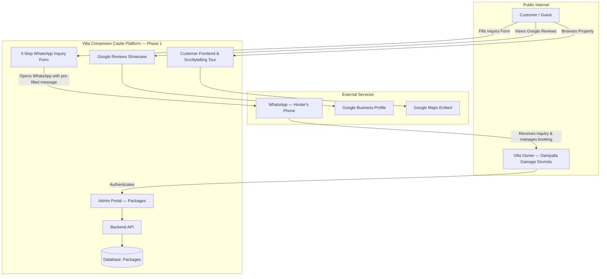
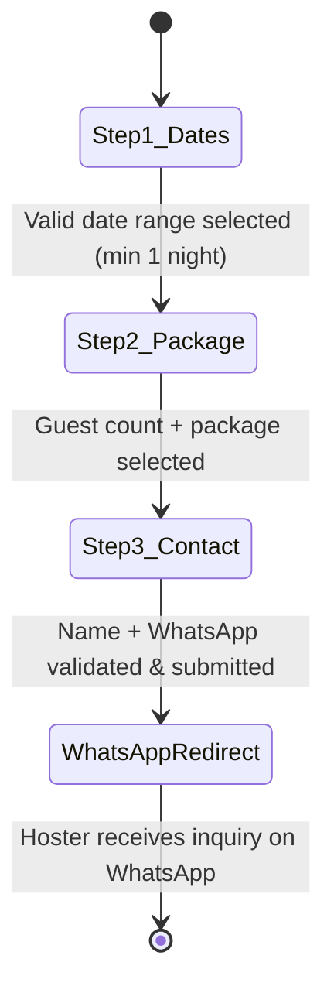

# Software Requirements Specification (SRS)

## Villa Cinnamoon Castle Web Application

**Document Version:** 1.2.1 — Phase 1 Google Reviews Scope Aligned**Status:** Active — Phase 1 Scoped (Post Host Requirements Clarification)**Target Platform:** Web (Desktop, Tablet, Mobile)**Reference Documents:**

* [`Requirements file.md`](file:///D:/Villa%20Cinnamoon%20Castle/Documents/Requirements%20file.md)
* [`property_details.md`](file:///D:/Villa%20Cinnamoon%20Castle/Documents/property_details.md)
* [`package_details.md`](file:///D:/Villa%20Cinnamoon%20Castle/Documents/package_details.md)

> [!NOTE]
> **📋 Phase 1 Scope — Host Requirements Clarification (2026-09-20)**
> Following a direct requirements session with the villa hoster (Dampalla Gamage Devindu), the system scope has been revised:
>
> - **Booking Engine:** Simplified to a **WhatsApp Inquiry Form** only. No backend database, status machine, or date-blocking system in Phase 1. All business workflow (advance payment, confirmation, calendar management) is handled directly by the hoster via WhatsApp.
> - **On-Site Review System:** Deferred to a future phase. Only **Google Reviews showcase** (§ 3.3.4) is active in Phase 1.
> - **Package Pricing:** Current prices and packages used as-is for Phase 1 development.
> - **Admin Package Management (§ 3.4.4):** Full package CRUD (Create, Read, Update, Soft-Deactivate) is **in scope for Phase 1**. The admin must be able to manage all package details from Day 1.
> - **Complex Booking Engine** (§ 3.2 original), **Admin Booking Management** (§ 3.4.2), **Calendar Engine** (§ 3.4.5), **On-Site Review Gate** (§ 3.3.1–3.3.3), and **Direct Review Moderation** (§ 3.4.3) are all **deferred to Phase 2**.

---

## 1. Introduction

### 1.1 Purpose

This Software Requirements Specification (SRS) establishes the complete functional and non-functional requirements for the official web platform of **Villa Cinnamoon Castle**, an authentic luxury 5-bedroom holiday villa located in Arachchikanda, Hikkaduwa, Sri Lanka. This document defines the Phase 1 system architecture: customer scrollytelling journey, WhatsApp-based booking inquiry form, dedicated Google Reviews showcase, and the administrative portal for package management.

### 1.2 Scope

#### Phase 1 (Current Implementation Scope)

The web application encompasses two primary subsystems:

1. **Customer Experience Portal (Public, Zero-Auth):**
   - High-fidelity visual property presentation adhering to luxury villa standards.
   - Narrative **"Scrollytelling Property Elaboration"** covering all rooms, grounds, and amenities.
   - **3-step WhatsApp Inquiry Form:** date range selection (check-in + check-out calendars), guest count & package selection, contact details — culminating in a pre-formatted WhatsApp message directly to the hoster.
   - Dedicated **Google Reviews showcase** displaying authentic Google ratings, guest testimonials, and direct review action.
   - Transparent showcase of package pricing, location, and curated experiences.
2. **Admin Operations Portal (Private, Authenticated):**
   - Secure authentication for property management.
   - Full package management (Create, Read, Update, Delete).

#### Phase 2 (Deferred — Pending Further Requirements)

> [!CAUTION]
> The following features are **explicitly out of scope for Phase 1** and must not be implemented until Phase 2 requirements are confirmed with the hoster:
>
> - Complex booking engine with status lifecycle (`PENDING` / `APPROVED` / `DECLINED` / `CANCELLED`)
> - Admin booking inquiry pipeline (approve/decline/quotation/WhatsApp dispatch)
> - Automated calendar date-blocking system
> - On-site verified guest review submission system (check-in date gated)
> - Direct-review moderation (pin/hide) and its supporting review database
> - Database-driven booking records and availability API

### 1.3 Definitions, Acronyms, and Abbreviations

* **SRS:** Software Requirements Specification
* **PDP:** Property Detail Page
* **CRUD:** Create, Read, Update, Delete
* **LKR / Rs.:** Sri Lankan Rupee
* **WA:** WhatsApp Messenger
* **E.164:** International public telecommunication numbering plan format
* **NFR:** Non-Functional Requirement
* **LCP:** Largest Contentful Paint (Core Web Vital)

---

## 2. Overall Description

### 2.1 Product Perspective

The system is an independent, responsive web application operating in modern desktop and mobile browsers. It connects prospective travelers directly with the villa owner (*Dampalla Gamage Devindu*), bypassing third-party online travel agency (OTA) booking fees while preserving the trust, aesthetics, and clarity of platforms like Airbnb.



### 2.2 User Classes and Characteristics

1. **Public Visitor / Prospective Guest:**
   - No login or registration required.
   - Browses property details, explores rooms via interactive scroll, and submits WhatsApp booking inquiries.
2. **Villa Administrator (Property Owner/Manager):**
   - Authenticated via secure administrative credentials.
   - Manages the package catalog (CRUD).
   - Receives all booking inquiries directly on WhatsApp and manages the full booking workflow independently.

> [!NOTE]
> **Phase 2 Only:** A "Verified Guest" user class (for on-site review submission) will be introduced in Phase 2 once the on-site review system is implemented.

### 2.3 Operating Environment

* **Client Side:** Modern browsers (Chrome, Safari, Firefox, Edge) across iOS, Android, macOS, and Windows devices.
* **Server Side:** Node.js runtime environment (LTS).
* **Database:** SQLite (local persistent) / PostgreSQL (production scalable).

### 2.4 Design & Implementation Constraints

1. **Zero-Friction Customer Access:** No customer accounts or passwords required.
2. **Visual Fidelity:** Must match the warm cinnamon villa design aesthetic. Reference: luxury villa websites (not apartment or large hotel websites) for design inspiration.
3. **Strict Phone Validation:** Customer WhatsApp numbers must be validated via Regex before the inquiry form can be submitted.
4. **WhatsApp-First Inquiry:** All booking inquiries are routed directly to the hoster's WhatsApp. No server-side booking storage in Phase 1.
5. **A/C Room Transparency & Allocation Policy:**
   - The villa has exactly **2 air-conditioned master bedrooms** (Bedroom 1 & Bedroom 2) and **3 bedrooms with stand fans only** (Bedrooms 3, 4 & 5).
   - **A/C Packages:** Customers who select an A/C package are allocated the **2 A/C master bedrooms** with air conditioning switched ON. The remaining bedrooms have stand fans.
   - **Non-A/C Packages:** Customers who select a Non-A/C package have all villa rooms available for use, but the air conditioning in the master bedrooms is **switched OFF**. Stand fans are provided throughout. The specific room allocation for Non-A/C packages is an **internal host operational decision and must NOT be communicated on the website**.
   - This A/C distinction must be clearly communicated in both the property tour and the booking form.
6. **Google Reviews Phase 1 Rule:** Phase 1 only displays curated, authentic Google Reviews and links users to the official Google Business Profile. The administrator cannot edit, pin, hide, or otherwise moderate Google Reviews through this website. Direct-review moderation is deferred to Phase 2.
7. **Check-in / Check-out & Turnaround Window:** Standard check-in is at **1:00 PM** and standard check-out is at **10:00 AM**. A dedicated 3-hour turnaround window (10:00 AM – 1:00 PM) is reserved for deep cleaning, sanitation, linen changes, and villa re-arrangements before incoming guests arrive. If requested by the guest due to personal circumstances, the hoster may flexibly grant an additional 1 hour (until 11:00 AM) or up to 1.5 hours (until 11:30 AM) for check-out, completing the re-arrangements in the remaining buffer before 1:00 PM.

---

## 3. Detailed Functional Requirements

### 3.1 Module 1: Customer Property Elaboration & Scrollytelling Tour

*Requirement Traceability: Requirements file.md § Customer (1, 4, 5)*

#### 3.1.1 Architectural Standards & Flow

The landing experience must lead with an immersive, scroll-driven visual walkthrough that guides the customer through the estate logically from arrival to intimate spaces:

1. **Hero Arrival & Overview:**
   - High-impact exterior visual presentation showcasing the villa architecture, entrance, and lush surroundings.
   - Headline: *"Villa Cinnamoon Castle — Find your own peacefulness"*.
   - Key attributes: 10–15 guests, 5 bedrooms, 5 beds, 2 baths, 3.5 km to Hikkaduwa Beach.
2. **The Living Quarters (Step 1 of Tour):**
   - Ground-Floor Living Room: Hand-carved traditional armchairs, caned seating, TV entertainment, and garden views.
   - Upstairs Mezzanine Lounge: Vaulted timber roof, open-concept breeze corridor, relaxed sofa lounging, and reading nook.
3. **Bedrooms Sanctuary (Step 2 of Tour):**
   - Total 5 bedrooms, presented with clear bed badges and climate specs:
     - **Bedroom 1 (Master):** Super King Bed, Air Conditioning, dedicated desk workspace.
     - **Bedroom 2:** Super King Bed, Air Conditioning, large scenic windows.
     - **Bedroom 3:** King Bed, stand fan, direct garden orientation.
     - **Bedroom 4:** Attic/Timber Roof aesthetic, Super King Bed, stand fan.
     - **Bedroom 5:** Queen Bed, stand fan, peaceful natural light.
4. **Kitchen & Dining Experience (Step 3 of Tour):**
   - Full granite kitchen counter, double-burner gas stove, electric rice cooker, cookware, and full self-catering amenities.
   - Dining hall table with seating for the entire family/group.
5. **Bathrooms & Modern Sanitation (Step 4 of Tour):**
   - 2 full modern bathrooms with instant hot water showers, vanity sinks, and hand bidets.
6. **Courtyard, Tropical Garden & Veranda (Step 5 of Tour):**
   - Gated gravel courtyard, rustic timber perimeter fencing, private BBQ pavilion, and front veranda.
7. **Curated Nearby Experiences:**
   - Hikkaduwa Beach (5 min), coral reef turtle watching, river boat safaris, kayaking, surfing, and Galle Fort heritage tours.

#### 3.1.2 Scrollytelling Interaction Requirements

* **FR-TOUR-01:** As the user scrolls vertically, visual scenes shall transition smoothly using opacity/scale easing with pinned descriptive story cards.
* **FR-TOUR-02:** Quick navigation anchors (*Overview*, *Living*, *Bedrooms*, *Kitchen*, *Outdoors*, *Amenities*, *Location*) shall remain accessible in a sticky floating sub-header.
* **FR-TOUR-03:** A "Full Visual Gallery Modal" with category filtering must allow direct space-by-space visual browsing for users preferring non-scroll exploration.

### 3.2 Module 2: WhatsApp Booking Inquiry Form (Phase 1)

*Requirement Traceability: Requirements file.md § Customer (2)*

> [!NOTE]
> **Phase 1 Simplification:** This section replaces the previously planned complex booking engine. The inquiry form collects all necessary booking details and routes them as a pre-formatted WhatsApp message directly to the hoster. All booking confirmation, advance payment, and date management is handled by the hoster independently.

The inquiry form is a sequential **3-step wizard**. Progression to each next step is disabled until the current step is validated.



#### 3.2.1 Step 1: Date Range Selection

* **FR-INQ-01 (Dual Calendar Pickers):** The system shall display two distinct date pickers (Check-In and Check-Out), allowing independent selection. The check-out date must be at least 1 day after the check-in date (minimum 1-night stay). **1-day bookings (1 night) are explicitly supported** (e.g., check-in Friday → check-out Saturday is valid).
* **FR-INQ-02 (Past Date Blocking):** All dates prior to today must be disabled and visually muted in gray on both calendars. No backend date-blocking in Phase 1.
* **FR-INQ-03 (Date Type Detection):** Upon valid date range selection, the system automatically classifies the stay by day-of-week:


  | Night Falls On                           |  Classification  |
  | :----------------------------------------- | :----------------: |
  | **Friday, Saturday, Sunday**             | 🟡 Weekend Night |
  | **Monday, Tuesday, Wednesday, Thursday** | 🔵 Weekday Night |

  A **Date Type Badge** is displayed beneath the calendars:


  - 🟡 **Weekend Stay** — all selected nights fall on Fri/Sat/Sun.
  - 🔵 **Weekday Stay** — all selected nights fall on Mon–Thu.
  - 🟠 **Mixed Stay** — range contains both Weekend and Weekday nights (e.g., "2 Weekend nights + 3 Weekday nights").
* **FR-INQ-04:** Total nights count and date type badge are displayed immediately after selection. **"Continue to Package →"** button activates upon valid selection.

#### 3.2.2 Step 2: Guest Count & Package Selection

* **FR-INQ-05 (Guest Stepper):** Stepper component allowing selection from **1 to 15 guests** (default: 2).
* **FR-INQ-06 (Auto-Suggestion Engine):** Based on guest count and date type, the system highlights the most suitable package with a ⭐ *"Recommended for your group"* badge:
  - 1–2 guests / Weekday → Couples Package (Rs. 6,500/night)
  - 3–4 guests / Weekday → Family Package (Rs. 8,500/night)
  - 1–4 guests / Weekday → 2-Room Group (Non-A/C Rs. 8,500 / A/C Rs. 10,500)
  - 5–6 guests / Weekday → 3-Room Group (Non-A/C Rs. 12,500 / A/C Rs. 14,500)
  - 7–8 guests / Weekday → 4-Room Group (Non-A/C Rs. 15,500 / A/C Rs. 17,500)
  - 9–10 guests / Weekday → 5-Room Group (Non-A/C Rs. 17,900 / A/C Rs. 19,900)
  - 11–15 guests / Weekday → Full Villa (Non-A/C Rs. 17,900 / A/C Rs. 19,900)
  - Any guest count / Weekend → Weekend Standard Non-A/C (Rs. 21,000) or Weekend Premium A/C (Rs. 23,000)
  - *Auto-suggestion is assistive only — customer retains full freedom to select any package.*
* **FR-INQ-07 (Package Display — Date-Type Driven):**
  - **Weekend stays:** Display only Weekend packages.
  - **Weekday stays:** Display only Weekday packages.
  - **Mixed stays:** Display Weekend packages first (primary) + a sub-selector for the Weekday portion (secondary) with the transparent split calculation:
    $$
    \text{Total Price} = (\text{Weekend Nights} \times \text{Weekend Rate}) + (\text{Weekday Nights} \times \text{Weekday Rate})

    $$
* **FR-INQ-08 (A/C Room Information Note):** All packages offering an A/C option must display the following transparency note:
  > *"This villa features 2 air-conditioned master bedrooms and 3 bedrooms with stand fans. When you select an A/C package, the 2 master bedrooms with air conditioning are included. Stand fans are provided in all other bedrooms."*
  >
* **FR-INQ-09 (Live Price Summary Card):** An interactive summary card displays: check-in & check-out dates, total nights (with split if Mixed), selected package(s) and rate(s), total estimated amount, and per-person estimate.

#### 3.2.3 Step 3: Contact Details & Submission

* **FR-INQ-10 (Contact Fields):**
  - **Full Name:** Mandatory, minimum 3 characters.
  - **WhatsApp Number:** Mandatory, validated against Sri Lankan format `^(?:0|94|\+94)?(7[01245678]\d{7})$` or international E.164 `^\+?[1-9]\d{6,14}$`. Inline error on invalid input.
* **FR-INQ-11 (Optional Special Requests):** Multiline text area for special requests (e.g., BBQ setup, dietary needs, arrival time).
* **FR-INQ-12 (Consent Checkbox):** *"I understand this is a booking inquiry. The hoster will confirm dates and advance payment details via WhatsApp."*
* **FR-INQ-13 (Submit Action):** Primary CTA: **"Send Inquiry on WhatsApp 🌿"** — enters loading state, prevents double-tap.

#### 3.2.4 WhatsApp Redirect & Message Format

* **FR-INQ-14:** Upon submission, the system opens WhatsApp via deep-link (`https://wa.me/94761007686?text=...`) with the following pre-formatted message:

```
🏰 *Villa Cinnamoon Castle — Booking Inquiry*

📅 Check-in:  {check_in_date}  (From 1:00 PM)
📅 Check-out: {check_out_date} (Until 10:00 AM)
🌙 Total Nights: {total_nights} ({date_type_label})

👥 Guests: {guest_count}
📦 Package: {package_name} — Rs. {rate}/night
💰 Estimated Total: Rs. {total_estimate}/=
   {split_breakdown_if_mixed}

👤 Name: {customer_name}
📱 WhatsApp: {whatsapp_number}

📝 Special Requests:
{special_requests_or_"None"}

_(Sent via Villa Cinnamoon Castle website)_
```

* **FR-INQ-15:** After triggering the WhatsApp redirect, a confirmation screen displays a summary and the message: *"Your inquiry has been sent! The hoster will contact you on WhatsApp shortly to confirm your booking and arrange advance payment."* A secondary CTA *"Chat with Host on WhatsApp"* repeats the link for convenience.

---

### 3.3 Module 3: Reviews

*Requirement Traceability: Requirements file.md § Customer (3)*

#### 3.3.1 On-Site Verified Guest Review System — Phase 2 Deferred

> [!CAUTION]
> **🚧 PHASE 2 DEFERRED — Do Not Implement**
> The on-site guest review submission system (check-in date gated, booking-ID-verified reviews) is deferred to Phase 2. The hoster has confirmed he does not want a complex review system in the first version. FR-REV-01 through FR-REV-08 below are preserved for Phase 2 reference only.

<details>
<summary>📄 Phase 2 Reference: On-Site Review Requirements (FR-REV-01 – FR-REV-08)</summary>

**FR-REV-01 (Eligibility Criteria):** A review can only be submitted if: (1) A valid Booking ID is provided; (2) Booking status is `APPROVED`; (3) Today ≥ `check_in_date`; (4) No prior review for this Booking ID.

**FR-REV-02 (Locked State Notice):** If attempted before check-in: *"Your review unlocks on your check-in date. We want you to experience Villa Cinnamoon Castle first!"*

**FR-REV-03 (Declined/Pending Notice):** If booking is not `APPROVED`, submission is rejected.

**FR-REV-04:** Review form inputs: Verified Customer Name, Star Rating (1–5), Review Title (optional), Detailed Comment (mandatory, min 10 chars), Stay Type badge.

**FR-REV-05:** On submission, record saved with `is_visible = true`, `is_pinned = false`.

**FR-REV-06:** All `is_visible = true` reviews rendered publicly.

**FR-REV-07:** `is_pinned = true` reviews shown at top priority.

**FR-REV-08:** Each card displays: Guest Name, Star Rating, Stay Date, Verified Guest Badge, Review Text.

</details>

#### 3.3.4 Google Reviews Integration & Showcase ✅ (Phase 1 — Active)

* **FR-GREV-01 (Google Reviews Section & Aggregate Rating Badge):**
  The website shall feature a dedicated Google Reviews section displaying:
  - Official Google aggregate rating score (e.g., 4.9 ★ / 5.0 ★) and total review count.
  - Authentic Google brand icon / emblem and verified business badge.
  - Direct clickable link to Villa Cinnamoon Castle's live Google Business Profile on Google Maps.
* **FR-GREV-02 (Curated Google Reviews Carousel / Grid):**
  The section shall display authentic Google guest reviews in an interactive card grid or carousel, each card featuring:
  - Reviewer's Google display name and profile avatar/initial.
  - Google verification badge icon.
  - Star rating (1 to 5 stars).
  - Relative publication date (e.g., "3 weeks ago", "2 months ago").
  - Review commentary snippet.
* **FR-GREV-03 (Phase 1 — Google Reviews Only):**
  In Phase 1, the Reviews section displays Google Reviews only. The dual-source tab navigation (*"Google Reviews" / "Verified Direct Guests"*) is deferred to Phase 2 when the on-site review system is implemented.
* **FR-GREV-04 (Direct 'Review Us on Google' CTA):**
  A prominent Call-to-Action button (*"Review Us on Google ⭐"*) directing past guests to leave a review on Google Maps / Google Business Profile.

---

### 3.4 Module 4: Administrator Operations Portal

*Requirement Traceability: Requirements file.md § Admin (1-4)*

#### 3.4.1 Admin Authentication & Session Management

* **FR-ADM-01:** Admin login page located at `/admin/login`.
* **FR-ADM-02:** Authentication requires Username and Password, validated against hashed credentials (bcrypt/argon2).
* **FR-ADM-03:** Protected API routes and admin dashboard views require a valid signed session token/cookie.
* **FR-ADM-04:** Secure logout mechanism invalidating the session.

#### 3.4.2 Booking Request Management, History Archive & WhatsApp Dispatch Engine 🚧

> [!CAUTION]
> **🚧 ON HOLD — Do Not Implement**
> This section (FR-ADM-05 through FR-ADM-CANCEL) is **on hold**. The admin inquiry pipeline, approval/decline workflow, quotation image generation, WhatsApp dispatch engine, date conflict detection, and cancellation workflow all depend on the finalized booking requirements from § 3.2.

* **FR-ADM-05 (Real-Time Inquiries & Queue Management):** Admin dashboard displays all incoming booking requests in an active pipeline with quick-action approvals and declines.
* **FR-ADM-06 (Permanent Database History Storage):**

  - All booking records—including `PENDING`, `APPROVED`, `DECLINED`, `CANCELLED`, and past `COMPLETED` stays—shall be permanently preserved in the relational database.
  - Records must retain: Unique Booking ID (`VCC-YYYY-XXXX`), Customer Full Name, Customer WhatsApp Number, Check-in and Check-out Dates, Total Nights, Guest Count, Selected Package Name and Rate, Total Estimated Amount, Status, Decline Reason (if applicable), Generated Quotation Details, and Creation/Update Timestamps.
* **FR-ADM-06-B (Admin Booking History & Detailed Archive View):**

  - The Admin Portal shall feature a dedicated **"Booking History"** section allowing the admin to inspect all previous and completed bookings.
  - Features real-time search (by Customer Name, WhatsApp number, or Booking ID) and filters (by Year/Month, Package, or Status).
  - Admin can click any historical booking to open a detailed breakdown drawer/modal showing all original details, guest specifications, financial totals, and previous quotation records.
* **FR-ADM-CONFLICT (Concurrent Pending Date Overlap Detection):**

  - The system shall continuously scan all `PENDING` booking requests and identify any two or more requests whose date ranges overlap (i.e., check-in/check-out dates intersect).
  - When an overlap is detected, **both conflicting requests are flagged with a visible `⚠️ Date Conflict` warning badge** in the Admin Bookings queue. The badge tooltip shall display: *"This request overlaps with Booking Request #{Other_ID} (submitted at {Other_Timestamp})"*.
  - The `submitted_at` timestamp of each request is clearly shown so the admin can determine which request was received first (First-Come, First-Served basis).
  - If an admin attempts to approve a request whose dates are already blocked by a previously approved booking, the system **blocks the approval action** and displays an error: *"Cannot approve: Selected dates (SEP 15–17) are already reserved by Booking #{Existing_Booking_ID}. Please decline this request with an appropriate reason."*
  - This guard prevents double-booking at both the application and database levels (DB unique constraint on `blocked_dates.date`).
* **FR-ADM-07 (Approval Workflow & Automated Quotation Image Generation):**

  1. Admin clicks **"Approve"**.
  2. System prompts for confirmation.
  3. Status updates to `APPROVED`.
  4. Booked dates are automatically inserted into `blocked_dates` table to immediately lock them in the public calendar.
  5. **Automated Quotation Image Generation (FR-QUOT-01):**
     - The system dynamically generates a professional, high-resolution **Quotation / Booking Confirmation Image** (PNG format) styled with Villa Cinnamoon Castle luxury branding (Gold / Cinnamon accents).
     - **Required Data Fields on the Quotation Image:**
       - Villa Cinnamoon Castle Logo / Emblem & Tagline (*"Find your own peacefulness"*).
       - Official "APPROVED & CONFIRMED" seal/badge.
       - Unique Booking ID (`VCC-YYYY-XXXX`) and Date of Issue.
       - Customer Information: Customer Name and WhatsApp Number.
       - Stay Itinerary: Check-in Date (from 1:00 PM), Check-out Date (by 10:00 AM), Total Nights, and Guest Count (1–15).
       - Package Breakdown: Selected Package Name(s) (for Mixed stays: both Weekend and Weekday package names, night splits, and individual nightly rates), Inclusions (e.g. 5 bedrooms, A/C rooms, gas kitchen, BBQ facilities, high-speed Wi-Fi), and Nightly Rate(s).
       - Financial Calculation: Total Estimated Amount (Rs. / LKR) with transparent calculation breakdown (for Mixed stays: `[N₁ Weekend nights × Rate₁] + [N₂ Weekday nights × Rate₂]`) and per-person cost breakdown.
       - Host & Property Contact Details: Host *Dampalla Gamage Devindu*, Hotline `+94 76 100 7686`, Arachchikanda, Hikkaduwa.
  6. **Admin Media Hand-off:**
     - The admin interface displays a live preview of the generated Quotation Image with instant **"Download Quotation Image"** and **"Copy Image to Clipboard"** actions.
  7. **WhatsApp Dispatch with Formatted Details:**
     - System formats the detailed text message:
       ```text
       Hello {Customer_Name}! 🌿

       Great news from Villa Cinnamoon Castle! 🏰
       Your booking request #{Booking_ID} has been APPROVED.

       📅 Check-in: {Check_In_Date} (From 1:00 PM)
       📅 Check-out: {Check_Out_Date} (Until 10:00 AM)
       🌙 Total Nights: {Nights} ({Stay_Type_Breakdown})
       👥 Guest Count: {Guest_Count}
       📦 Package: {Package_Details_or_Mixed_Breakdown}
       💰 Total Estimate: Rs. {Total_Estimate}/= {Pricing_Formula_Breakdown}

       Please find your official Booking Quotation Card attached above.

       We look forward to hosting you in our private tropical sanctuary! Please feel free to reply directly here for any special requests or directions.

       Host: Dampalla Gamage Devindu
       Villa Cinnamoon Castle, Arachchikanda, Hikkaduwa
       Hotline: +94 76 100 7686
       ```
     - Admin clicks **"Send WhatsApp Approval"** launching WhatsApp directly (`https://wa.me/{phone}?text={encoded_msg}`) to send the message along with the quotation image to the customer.
* **FR-ADM-08 (Decline Workflow):**

  1. Admin clicks **"Decline"**.
  2. Modal opens requiring the admin to enter the **Reason for Decline** (e.g., *"Villa undergoing scheduled maintenance on these dates"*).
  3. Status updates to `DECLINED` with `decline_reason` stored.
  4. System generates the formatted WhatsApp decline message:
     ```text
     Hello {Customer_Name},

     Thank you for your interest in Villa Cinnamoon Castle, Hikkaduwa.

     Regarding your booking inquiry #{Booking_ID} for {Check_In_Date} to {Check_Out_Date}:
     We regret to inform you that we are unable to accept your reservation at this time due to:

     "{Decline_Reason}"

     We apologize for any inconvenience caused and would be delighted to host you on alternative dates.

     Warm regards,
     Villa Cinnamoon Castle Management
     ```
  5. Admin clicks **"Send WhatsApp Decline"** button to open the pre-filled chat.
* **FR-ADM-CANCEL (Cancellation Workflow — CANCELLED Status):**

  - **Trigger:** Admin cancels an already `APPROVED` booking upon a customer's request or exceptional circumstance (e.g., guest family emergency, force majeure).
  - **Eligibility:** Only bookings with status `APPROVED` and a **future check-in date** (check-in date > today) may be cancelled. Past/completed stays cannot be cancelled.
  - **Admin Action:** Admin clicks **"Cancel Booking"** on any APPROVED booking in the Booking History view. A confirmation modal appears requiring the admin to acknowledge the cancellation.
  - **System Actions upon Cancellation:**
    1. Booking status is updated to `CANCELLED`.
    2. **Automatic Date Release:** All date records associated with this booking in the `blocked_dates` table are **automatically deleted via `ON DELETE CASCADE`**, immediately making those dates available (green / clickable) on the public customer calendar.
    3. A `cancelled_at` timestamp and optional cancellation note are stored on the booking record.
  - **WhatsApp Notification:** Admin is presented with a pre-formatted WhatsApp cancellation message for the customer:
    ```text
    Dear {Customer_Name},

    We sincerely apologize for the inconvenience.
    Your booking #{Booking_ID} for {Check_In_Date} to {Check_Out_Date} has been CANCELLED as per your request.

    Your reserved dates are now released. We warmly welcome you to choose alternative dates at your convenience.

    Villa Cinnamoon Castle Management
    Hotline: +94 76 100 7686
    ```
  - **Review Eligibility:** A cancelled booking permanently disqualifies the customer from submitting a review for that Booking ID.
  - **History Retention:** The cancelled booking record is **permanently retained** in the Admin Booking History with status `CANCELLED` for audit purposes.

#### 3.4.3 Direct Review Moderation System 🚧 (Phase 2 Deferred)

> [!CAUTION]
> **🚧 PHASE 2 DEFERRED — Do Not Implement**
> Phase 1 displays Google Reviews only. Google Reviews are not editable, pinnable, or hideable through the Villa Cinnamoon Castle Admin Portal. The requirements below apply only to the future on-site direct-review system.

* **FR-ADM-10 (Integrity Constraint):** The admin interface **shall not allow editing or altering** customer review text, ratings, or customer names.
* **FR-ADM-11 (Pinning):** Admin can toggle `is_pinned` status to highlight standout reviews on the homepage.
* **FR-ADM-12 (Hiding):** Admin can toggle `is_visible` status to hide inappropriate, irrelevant, or spam reviews from the public website.

#### 3.4.4 Package Management (Full CRUD)

* **FR-ADM-13 (Create):** Admin can add a new package with Title, Package Type (`WEEKEND` / `WEEKDAY`), A/C Configuration (`AC` / `NON_AC` / `NA`), Rate per Night (Rs.), Guest Range (`min_guests` to `max_guests` for auto-suggestion), Room Count (`max_rooms`, or NULL for Full Villa buyout), Subtitle/Badge (e.g., "Full Villa · 15 pax", "Couples · Full Day"), Description, Feature Checklist (JSON), and Display Order.
* **FR-ADM-14 (Read):** Admin can view active and inactive packages categorized by package type (`WEEKEND` vs `WEEKDAY`).
* **FR-ADM-15 (Update):** Admin can adjust prices, package types, A/C classifications, guest/room capacities, descriptions, discount labels, or features anytime.
* **FR-ADM-16 (Soft Deactivate — NOT Hard Delete):** Admin can deactivate a package that is no longer offered. The package record is **never physically deleted** from the database (`is_active = FALSE`) to preserve referential integrity with all past and existing booking records that reference that package. The Admin Panel shall display this action as **"Deactivate"**, not "Delete". Deactivated packages are hidden from the customer-facing booking wizard but remain visible in the Admin Package archive.

#### 3.4.5 Automated Calendar Availability Engine 🚧

> [!CAUTION]
> **🚧 ON HOLD — Do Not Implement**
> This section (FR-ADM-17, FR-ADM-18) is **on hold**. Calendar availability logic is entirely driven by the booking approval workflow in § 3.2 and § 3.4.2, both of which are pending requirements clarification.

* **FR-ADM-17:** When an admin approves a customer booking request, the system automatically marks all dates within the check-in to check-out range as unavailable in the database.
* **FR-ADM-18 (No Manual Date Blocking):** The admin does not manually block dates. Dates become unavailable strictly when booked by customers and approved by the admin. These unavailable dates immediately display in red and become unclickable on the customer-facing calendar. If an approved booking is cancelled, its dates automatically return to available status.

---

## 4. Customer Page Structure & Information Architecture

*Requirement Traceability: Requirements file.md § Customer (4)*

The customer-facing application is organized into the following clear, intuitive sections and pages:


| Section / Route        | Title / Identifier             | Primary Function & Contents                                                                                                                                                                                                                        |
| :----------------------- | :------------------------------- | :--------------------------------------------------------------------------------------------------------------------------------------------------------------------------------------------------------------------------------------------------- |
| **`#home` / `/`**      | **Hero & Overview**            | Visual showcase presentation, headline, Google & direct rating badge, quick reserve sticky card, host badge.                                                                                                                                       |
| **`#story` / `/tour`** | **The Scrollytelling Tour**    | Immersive narrative breakdown: Bedrooms (1-5), Living spaces (Ground + Mezzanine), Kitchen & Dining, Bathrooms, Courtyard.                                                                                                                         |
| **`#packages`**        | **Villa Rates & Packages**     | Transparent pricing matrix: Weekend Full Villa (Non-A/C Rs. 21,000 / A/C Rs. 23,000), Weekday Full Villa (Non-A/C Rs. 17,900 / A/C Rs. 19,900), Group Room Options (2 to 5 rooms from Rs. 8,500), Couples (Rs. 6,500), Family (Rs. 8,500).         |
| **`#reserve`**         | **Interactive Booking Wizard** | 3-step mini-forms (Red-calendar date selector&rarr; Guest count &rarr; Package selection & WhatsApp regex).                                                                                                                                        |
| **`#experiences`**     | **Activities & Neighborhood**  | BBQ courtyard, boat safaris, surfing, Hikkaduwa coral reef, distance matrix, interactive map.                                                                                                                                                      |
| **`#reviews`**         | **Google Reviews**             | Dedicated Google Reviews showcase with aggregate rating badge, curated authentic review cards or carousel, direct Google Business Profile link, and “Review Us on Google” CTA. No direct-review submission or moderation is included in Phase 1. |
| **`#contact`**         | **Host & Directions**          | Dampalla Gamage Devindu contact card, WhatsApp hotline (+94 76 100 7686), address & GPS coordinates.                                                                                                                                               |
| **`/admin`**           | **Admin Portal**               | Authenticated package-management dashboard. Booking management, calendar management, and direct-review moderation are deferred to Phase 2.                                                                                                         |

---

## 5. System Architecture & Data Models

### 5.1 Entity Relationship Diagram (ERD)

```mermaid
erDiagram
    ADMIN {
        string id PK "UUID"
        string username UK
        string password_hash
        string email
        datetime created_at
    }

    BOOKING_REQUEST {
        string id PK "VCC-YYYY-XXXXXX"
        string customer_name
        string whatsapp_number
        date check_in_date
        date check_out_date
        int total_nights
        int weekend_nights
        int weekday_nights
        string date_type "WEEKEND, WEEKDAY, MIXED"
        int guest_count
        string primary_package_id FK "Weekend pkg for mixed, or standard pkg"
        string secondary_package_id FK "Weekday pkg for mixed stays (nullable)"
        decimal total_estimated_price
        string status "PENDING, APPROVED, DECLINED, CANCELLED"
        text special_requests
        text decline_reason
        datetime created_at
        datetime updated_at
    }

    PACKAGE {
        string id PK "UUID"
        string title
        string package_type "WEEKEND or WEEKDAY"
        string ac_type "AC, NON_AC, or NA"
        decimal price_per_night
        int min_guests "minimum guests for this package"
        int max_guests "maximum guests for this package"
        int max_rooms "number of rooms (null = full villa)"
        string badge_label
        string description
        json features
        boolean is_active
        int display_order
        datetime created_at
        datetime updated_at
    }

    BLOCKED_DATE {
        string id PK "UUID"
        date date UK
        string booking_id FK "NOT NULL — always tied to an approved booking"
        string reason "BOOKING only — no manual blocking"
        datetime created_at
    }

    REVIEW_PHASE2 {
        string id PK "UUID"
        string booking_id FK UK
        string customer_name
        int rating "1 to 5"
        string title
        text comment
        string stay_type
        boolean is_pinned
        boolean is_visible
        datetime created_at
    }

    BOOKING_REQUEST ||--o| REVIEW_PHASE2 : "Phase 2: unlocks after check_in"
    BOOKING_REQUEST }|--|| PACKAGE : "primary_package"
    BOOKING_REQUEST }|--o| PACKAGE : "secondary_package"
    BOOKING_REQUEST ||--o{ BLOCKED_DATE : "reserves"
```

### 5.2 Relational Schema Specifications (DDL Equivalent)

#### 1. `admins` Table

```sql
CREATE TABLE admins (
    id VARCHAR(36) PRIMARY KEY,
    username VARCHAR(50) UNIQUE NOT NULL,
    password_hash VARCHAR(255) NOT NULL,
    email VARCHAR(100),
    created_at TIMESTAMP DEFAULT CURRENT_TIMESTAMP
);
```

#### 2. `packages` Table

```sql
CREATE TABLE packages (
    id VARCHAR(36) PRIMARY KEY,
    title VARCHAR(100) NOT NULL,

    -- Date-type classification: drives which packages appear in the booking wizard
    package_type VARCHAR(10) NOT NULL CHECK (package_type IN ('WEEKEND', 'WEEKDAY')),

    -- A/C classification: 'AC', 'NON_AC', or 'NA' (for flat-rate packages like Couples/Family)
    ac_type VARCHAR(10) NOT NULL DEFAULT 'NA' CHECK (ac_type IN ('AC', 'NON_AC', 'NA')),

    price_per_night DECIMAL(10, 2) NOT NULL,

    -- Guest range for auto-suggest in Step 2 (min/max guests this package suits)
    min_guests INT NOT NULL DEFAULT 1,
    max_guests INT NOT NULL DEFAULT 15,

    -- Room count for group packages (NULL = full villa buyout)
    max_rooms INT,

    badge_label VARCHAR(50),
    description TEXT,
    features JSON,
    is_active BOOLEAN DEFAULT TRUE,
    display_order INT DEFAULT 0,
    created_at TIMESTAMP DEFAULT CURRENT_TIMESTAMP,
    updated_at TIMESTAMP DEFAULT CURRENT_TIMESTAMP
);

-- Seed: Default packages (Admin can edit/add more via CRUD)
-- Weekend packages
INSERT INTO packages (id, title, package_type, ac_type, price_per_night, min_guests, max_guests, max_rooms, badge_label, display_order) VALUES
  (uuid(), 'Weekend Standard — Non-A/C', 'WEEKEND', 'NON_AC', 21000.00, 1, 15, NULL, 'Full Villa', 1),
  (uuid(), 'Weekend Premium — A/C',      'WEEKEND', 'AC',     23000.00, 1, 15, NULL, 'Full Villa · A/C', 2);
-- Weekday packages
INSERT INTO packages (id, title, package_type, ac_type, price_per_night, min_guests, max_guests, max_rooms, badge_label, display_order) VALUES
  (uuid(), 'Couples Package',           'WEEKDAY', 'NA',    6500.00,  1,  2, NULL, 'Couples · Full Day', 3),
  (uuid(), 'Family Package',            'WEEKDAY', 'NA',    8500.00,  3,  4, NULL, 'Family · Full Day',  4),
  (uuid(), '2-Room Group — Non-A/C',    'WEEKDAY', 'NON_AC', 8500.00,  1,  4, 2,   '2 Rooms · 4 pax',    5),
  (uuid(), '2-Room Group — A/C',        'WEEKDAY', 'AC',    10500.00,  1,  4, 2,   '2 Rooms · A/C',      6),
  (uuid(), '3-Room Group — Non-A/C',    'WEEKDAY', 'NON_AC',12500.00,  5,  6, 3,   '3 Rooms · 6 pax',    7),
  (uuid(), '3-Room Group — A/C',        'WEEKDAY', 'AC',    14500.00,  5,  6, 3,   '3 Rooms · A/C',      8),
  (uuid(), '4-Room Group — Non-A/C',    'WEEKDAY', 'NON_AC',15500.00,  7,  8, 4,   '4 Rooms · 8 pax',    9),
  (uuid(), '4-Room Group — A/C',        'WEEKDAY', 'AC',    17500.00,  7,  8, 4,   '4 Rooms · A/C',      10),
  (uuid(), '5-Room Group — Non-A/C',    'WEEKDAY', 'NON_AC',17900.00,  9, 10, 5,   '5 Rooms · 10 pax',   11),
  (uuid(), '5-Room Group — A/C',        'WEEKDAY', 'AC',    19900.00,  9, 10, 5,   '5 Rooms · A/C',      12),
  (uuid(), 'Full Villa — Non-A/C',      'WEEKDAY', 'NON_AC',17900.00, 11, 15, NULL,'Full Villa · 15 pax', 13),
  (uuid(), 'Full Villa — A/C',          'WEEKDAY', 'AC',    19900.00, 11, 15, NULL,'Full Villa · A/C',    14);
```

#### 3. `booking_requests` Table 🚧 (Phase 2 Deferred)

> [!CAUTION]
> **🚧 PHASE 2 DEFERRED — Do Not Implement**
> This table is part of the complex booking engine deferred to Phase 2. In Phase 1, no booking records are stored server-side.

<details>
<summary>📄 Phase 2 Reference: booking_requests DDL</summary>

CREATE TABLE booking_requests (
    id VARCHAR(20) PRIMARY KEY, -- e.g. VCC-2026-X7K2P9 (random alphanumeric, NOT sequential)
    customer_name VARCHAR(100) NOT NULL,
    whatsapp_number VARCHAR(30) NOT NULL,
    check_in_date DATE NOT NULL,
    check_out_date DATE NOT NULL,
    total_nights INT NOT NULL,
    weekend_nights INT NOT NULL DEFAULT 0,
    weekday_nights INT NOT NULL DEFAULT 0,
    date_type VARCHAR(10) NOT NULL CHECK (date_type IN ('WEEKEND', 'WEEKDAY', 'MIXED')),
    guest_count INT NOT NULL CHECK (guest_count >= 1 AND guest_count <= 15),

    -- Primary package: Weekend package for Weekend/Mixed stays, or Weekday package for Weekday stays
    primary_package_id VARCHAR(36) NOT NULL REFERENCES packages(id),

    -- Secondary package: Selected Weekday package for Mixed stays (NULL for purely Weekend or purely Weekday stays)
    secondary_package_id VARCHAR(36) REFERENCES packages(id),

    -- Packages use NO ON DELETE CASCADE — packages are soft-deactivated, never hard-deleted.
    total_estimated_price DECIMAL(10, 2) NOT NULL,
    status VARCHAR(20) DEFAULT 'PENDING' CHECK (status IN ('PENDING', 'APPROVED', 'DECLINED', 'CANCELLED')),
    special_requests TEXT,
    decline_reason TEXT,
    cancelled_at TIMESTAMP,           -- populated only when status = CANCELLED
    cancellation_note TEXT,           -- optional admin note on cancellation reason
    created_at TIMESTAMP DEFAULT CURRENT_TIMESTAMP,
    updated_at TIMESTAMP DEFAULT CURRENT_TIMESTAMP
);

```

#### 4. `blocked_dates` Table 🚧 (Phase 2 Deferred)

> [!CAUTION]
> **🚧 PHASE 2 DEFERRED — Do Not Implement**
> This table depends on the booking approval workflow deferred to Phase 2.

<details>
<summary>📄 Phase 2 Reference: blocked_dates DDL</summary>

CREATE TABLE blocked_dates (
    id VARCHAR(36) PRIMARY KEY,
    date DATE UNIQUE NOT NULL,
    -- booking_id is NOT NULL: every blocked date MUST belong to an approved booking.
    -- No manual admin blocking exists. ON DELETE CASCADE auto-releases dates if booking is cancelled.
    booking_id VARCHAR(20) NOT NULL REFERENCES booking_requests(id) ON DELETE CASCADE,
    reason VARCHAR(20) NOT NULL DEFAULT 'BOOKING' CHECK (reason IN ('BOOKING')),
    created_at TIMESTAMP DEFAULT CURRENT_TIMESTAMP
);
```

#### 5. `reviews` Table 🚧 (Phase 2 Deferred)

> [!CAUTION]
> **🚧 PHASE 2 DEFERRED — Do Not Implement**
> Phase 1 uses a presentation-only Google Reviews showcase and does not store or moderate reviews in the application database. This table is retained solely as a future reference for the on-site direct-review system.

<details>
<summary>📄 Phase 2 Reference: reviews DDL</summary>

```sql
CREATE TABLE reviews (
    id VARCHAR(36) PRIMARY KEY,
    booking_id VARCHAR(20) UNIQUE NOT NULL REFERENCES booking_requests(id),
    customer_name VARCHAR(100) NOT NULL,
    rating INT NOT NULL CHECK (rating >= 1 AND rating <= 5),
    title VARCHAR(150),
    comment TEXT NOT NULL,
    stay_type VARCHAR(50),
    is_pinned BOOLEAN DEFAULT FALSE,
    is_visible BOOLEAN DEFAULT TRUE,
    created_at TIMESTAMP DEFAULT CURRENT_TIMESTAMP
);
```

</details>

---

## 6. External Interfaces & Integration Requirements

### 6.1 WhatsApp Messaging Interface

1. **Approval Dispatch Endpoint:**
   - Format: `https://wa.me/{sanitized_e164_phone}?text={url_encoded_message}`
   - Phone sanitization strips spaces, dashes, and leading zeros, replacing with country code `94` for Sri Lanka if omitted.
2. **Decline Dispatch Endpoint:**
   - Pre-fills personalized polite decline message containing the specific `decline_reason` specified by the admin.

### 6.2 Calendar Availability API Endpoint 🚧

> [!CAUTION]
> **🚧 ON HOLD — Do Not Implement**
> This API endpoint depends on the `blocked_dates` table populated by the booking approval workflow. On hold until § 3.2 and § 3.4.2 are finalized.

* **Route:** `GET /api/calendar/blocked-dates`
* **Response Payload:**
  ```json
  {
    "blocked_dates": [
      "2026-09-12",
      "2026-09-13",
      "2026-09-14",
      "2026-10-01"
    ]
  }
  ```
* **Frontend Behavior:** Any date matching this array receives CSS class `.date-blocked` (background: `#FF4D4F`, color: `#FFFFFF`, pointer-events: `none`).

### 6.3 Review Verification API Endpoint 🚧 (Phase 2 Deferred)

> [!CAUTION]
> **🚧 PHASE 2 DEFERRED — Do Not Implement**
> This endpoint depends on the on-site review system and booking database, both deferred to Phase 2.

<details>
<summary>📄 Phase 2 Reference: Review Eligibility API</summary>

* **Route:** `POST /api/reviews/verify-eligibility`
* **Request:** `{ "booking_id": "VCC-2026-1049", "whatsapp_number": "0761007686" }`
* **Response:**
  - If eligible: `{ "eligible": true, "customer_name": "Saman K.", "check_in_date": "2026-09-01" }`
  - If date not arrived: `{ "eligible": false, "reason": "CHECK_IN_NOT_ARRIVED", "unlock_date": "2026-09-20" }`
  - If already reviewed: `{ "eligible": false, "reason": "ALREADY_REVIEWED" }`
  - If not found or not approved: `{ "eligible": false, "reason": "NOT_APPROVED" }`

</details>

---

## 7. Non-Functional Requirements (NFRs)

### 7.1 Usability & Responsive Design

* **NFR-USE-01 (Mobile-First Responsiveness):** Flawless presentation from mobile devices (320px width) through 4K displays.
* **NFR-USE-02 (Touch Targets):** All buttons and interactive elements must have minimum touch targets of $44 \times 44$ pixels on mobile.
* **NFR-USE-03 (Visual Feedback):** Interactive buttons must indicate loading states during submission.

### 7.2 Performance & Core Web Vitals

* **NFR-PERF-01 (LCP):** Largest Contentful Paint must be under 2.0 seconds on standard 4G connections.
* **NFR-PERF-02 (Asset Optimization):** Images must be served with responsive `srcset`, modern formats (WebP/AVIF where supported), and explicit width/height to avoid cumulative layout shift (CLS < 0.1).
* **NFR-PERF-03 (Scrollytelling FPS):** Scroll animations must sustain 60 FPS using hardware-accelerated CSS `transform` and `opacity`.

### 7.3 Security

* **NFR-SEC-01 (Authentication):** Passwords stored using industry-standard salted hashing (`bcrypt` with cost factor $\ge 10$).
* **NFR-SEC-02 (Injection Protection):** Parameterized queries or ORM used exclusively to eliminate SQL injection vulnerabilities.
* **NFR-SEC-03 (XSS Sanitization):** All user-submitted review comments and guest names sanitized against Cross-Site Scripting (XSS).
* **NFR-SEC-04 (Rate Limiting):** Admin login and public form submission endpoints rate-limited to prevent spam and brute-force attacks.

### 7.4 Data Integrity

* **NFR-INT-01 (Phase 1 — No Backend Booking Storage):** In Phase 1, inquiry data is sent directly to the hoster's WhatsApp. No server-side booking storage or transactional date-locking is required. *Phase 2 Note: Transactional date-locking will be required when booking approval workflow is implemented.*

---

## 8. Requirement Traceability Matrix (RTM)


| Req ID             | Requirement Description                                                        | SRS Section    | Phase 1 Implementation                                                |
| :------------------- | :------------------------------------------------------------------------------- | :--------------- | :---------------------------------------------------------------------- |
| **Cust 0**         | No customer authorization required                                             | § 1.2, § 2.2 | Public, session-free form                                             |
| **Cust 1**         | Scrollytelling property elaboration                                            | § 3.1         | Scroll-driven narrative + visual space-by-space walkthrough           |
| **Cust 2**         | WhatsApp booking inquiry with date & package selection                         | § 3.2         | 3-step form → WhatsApp deep-link with pre-formatted message          |
| **Cust 4**         | Single-page luxury architecture                                                | § 4.0         | Single-page with anchored sections & modals                           |
| **Cust 5**         | Fully responsive and mobile-friendly                                           | § 7.1         | CSS Flexbox/Grid, mobile-first layout, touch targets                  |
| **Google Reviews** | Google Reviews showcase with aggregate badge & cards                           | § 3.3.4       | Google Business Profile badge + curated reviews carousel + Review CTA |
| **INQ 1**          | Dual calendar pickers (check-in + check-out), 1-night min, past dates disabled | § 3.2.1       | Two independent date pickers, client-side validation                  |
| **INQ 2**          | Guest count (1–15) + date-type-driven auto-suggestion                         | § 3.2.2       | Stepper + auto-suggest engine (Weekend/Weekday/Mixed)                 |
| **INQ 3**          | Adaptive Package Selection (Weekend/Weekday/Mixed) + A/C note                  | § 3.2.2       | Date-type mode switching, split pricing, A/C transparency note        |
| **INQ 4**          | WhatsApp redirect with structured pre-formatted message                        | § 3.2.4       | `wa.me` deep-link with URL-encoded message template                   |
| **Admin 1**        | Admin authentication required                                                  | § 3.4.1       | Bcrypt hashed login + protected session                               |
| **Admin 4**        | Manage package details (Full CRUD, soft deactivate)                            | § 3.4.4       | Admin CRUD for all packages; soft deactivate (`is_active=FALSE`)      |

> [!NOTE]
> **Phase 2 RTM entries** (Admin booking pipeline, date-blocking, on-site review gate, direct-review moderation, and cancellation) will be added when Phase 2 requirements are confirmed.

---

## 9. Verification & Acceptance Testing Plan

### 9.1 Phase 1 Automated Test Suites

1. **WhatsApp Message Format Test:** Verify that submitted form data correctly encodes into the WhatsApp deep-link message template (dates, nights, package name, price, guest count, name, number, special requests).
2. **Regex Validation Tests:** Unit test customer WhatsApp input against valid Sri Lankan formats (`0761007686`, `+94761007686`), international numbers (`+447911123456`), and invalid patterns (alphabetic, incomplete strings).
3. **Date Validation Tests:** Verify check-out ≥ check-in + 1 day; past dates disabled; 1-night stays accepted.
4. **Date Type Detection Tests:** Verify weekend/weekday/mixed classification across edge cases (Friday only → Weekend; Monday only → Weekday; Friday to Monday → Mixed: 2 Weekend + 1 Weekday).

### 9.2 Phase 1 Manual End-to-End Walkthrough

1. **Visitor Journey (Mixed Stay):** Visitor browses scrollytelling tour → views Google Reviews → selects check-in Friday + check-out Tuesday → system detects 2 Weekend nights + 2 Weekday nights → enters 8 guests → wizard auto-suggests 4-Room package → visitor selects Weekend Premium A/C + Weekday 4-Room A/C → sees live split price → enters name + WhatsApp → submits → WhatsApp opens with pre-filled message.
2. **1-Night Booking:** Visitor selects check-in Saturday + check-out Sunday → system accepts (1 night, Weekend) → Weekend packages shown → visitor selects and submits.
3. **Admin Package Management:** Admin logs in → creates new weekday package → updates pricing → soft-deactivates old package → verifies deactivated package hidden from customer inquiry form.
4. **Google Reviews Section:** Visitor views Google Reviews section → sees aggregate rating badge → browses curated Google review cards → clicks "Review Us on Google" CTA → Google Maps opens to Villa Cinnamoon Castle listing.

> [!CAUTION]
> **Phase 2 walkthroughs** (Admin booking approval, calendar date-blocking, on-site review submission) are deferred pending Phase 2 implementation.
