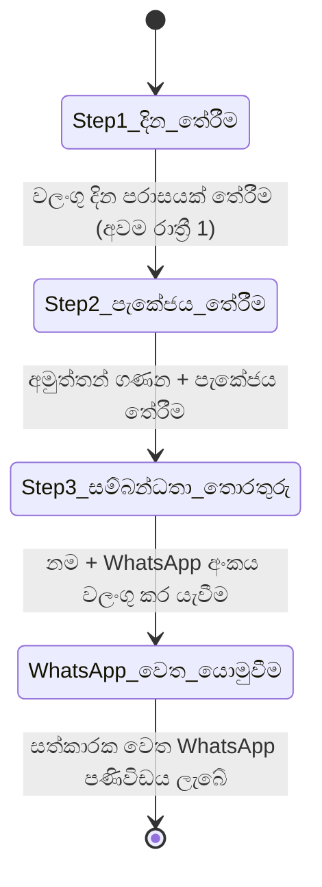

# මෘදුකාංග අවශ්‍යතා පිරිවිතරය (Software Requirements Specification - SRS)
## Villa Cinnamoon Castle වෙබ් යෙදුම (Web Application)

**ලේඛන අනුවාදය:** 1.2.0 — පළමු අදියර සංශෝධිත (Phase 1 Revised)  
**තත්ත්වය:** සක්‍රීයයි — අදියර 1 විෂය පථය (විලා සත්කාරක අවශ්‍යතා පැහැදිලි කර ගැනීමෙන් පසු)  
**ඉලක්කගත වේදිකාව:** Web (Desktop, Tablet, Mobile)  
**ආශ්‍රිත ලේඛන:**
* [`Requirements file.md`](file:///D:/Villa%20Cinnamoon%20Castle/Documents/Requirements%20file.md)
* [`property_details_Sinhala.md`](file:///D:/Villa%20Cinnamoon%20Castle/Documents/property_details_Sinhala.md) / [`property_details.md`](file:///D:/Villa%20Cinnamoon%20Castle/Documents/property_details.md)
* [`package_details.md`](file:///D:/Villa%20Cinnamoon%20Castle/Documents/package_details.md)

> [!NOTE]
> **📋 පළමු අදියරේ විෂය පථය (Phase 1 Scope) — විලා සත්කාරකගේ අවශ්‍යතා පැහැදිලි කර ගැනීම (2026-09-20)**  
> විලා සත්කාරක (දම්පල්ල ගමගේ දෙවිඳු) සමඟ පැවති සෘජු සාකච්ඡාවෙන් පසු, පද්ධතියේ විෂය පථය පහත පරිදි සංශෝධනය කර ඇත:
> - **වෙන්කිරීමේ පද්ධතිය (Booking Engine):** පළමු අදියර සඳහා **WhatsApp විමසුම් පෝරමයක් (WhatsApp Inquiry Form)** පමණක් ක්‍රියාත්මක කෙරේ. Backend database එකක් තුළ booking තැන්පත් කිරීම, status lifecycle කළමනාකරණය හෝ දින අවහිර කිරීමේ (date-blocking) පද්ධතියක් පළමු අදියරට ඇතුළත් නොවේ. සියලුම ව්‍යාපාරික කටයුතු (අත්තිකාරම් මුදල් ලබා ගැනීම, දින තහවුරු කිරීම සහ දින දර්ශනය කළමනාකරණය) සත්කාරක විසින් WhatsApp ඔස්සේ සෘජුවම සිදු කරනු ඇත.
> - **අඩවියේ සෘජු විචාර පද්ධතිය (On-Site Review System):** අනාගත අදියරක් (Phase 2) දක්වා කල් තබා ඇත. පළමු අදියරේදී **Google Reviews සංදර්ශකය (§ 3.3.4)** පමණක් සක්‍රීයව පවතී.
> - **පැකේජ මිල ගණන් (Package Pricing):** පවතින මිල ගණන් සහ පැකේජ එලෙසම පළමු අදියර සංවර්ධනය සඳහා යොදා ගැනේ.
> - **සංකීර්ණ වෙන්කිරීමේ එන්ජිම (§ 3.2), පරිපාලක වෙන්කිරීම් කළමනාකරණය (§ 3.4.2), දින දර්ශන එන්ජිම (§ 3.4.5), සහ සෘජු විචාර පද්ධතිය (§ 3.3.1–3.3.3) දෙවන අදියර (Phase 2) සඳහා කල් දමා ඇත.**

---

## 1. හැඳින්වීම (Introduction)

### 1.1 අරමුණ (Purpose)
මෙම මෘදුකාංග අවශ්‍යතා පිරිවිතරයේ (SRS) අරමුණ වන්නේ ශ්‍රී ලංකාවේ හික්කඩුව, ආරච්චිකන්ද ප්‍රදේශයේ පිහිටි කාමර 5කින් සමන්විත සුඛෝපභෝගී නිවාඩු නිකේතනයක් වන **Villa Cinnamoon Castle** හි නිල වෙබ් වේදිකාව සඳහා වන පළමු අදියරේ (Phase 1) සම්පූර්ණ ක්‍රියාකාරී (Functional) සහ ක්‍රියාකාරී නොවන (Non-Functional) අවශ්‍යතා නිර්වචනය කිරීමයි. මෙම ලේඛනය මගින් පද්ධති ගෘහ නිර්මාණ ශිල්පය (Architecture), පාරිභෝගික Scrollytelling අත්දැකීම, පියවර 3කින් යුත් WhatsApp වෙන්කිරීමේ විමසුම් පෝරමය, කැපවූ Google Reviews සංදර්ශකය, සහ විචාර හා පැකේජ කළමනාකරණය සඳහා වන පරිපාලන පාලක පුවරුව (Admin Portal) විස්තර කෙරේ.

### 1.2 විෂය පථය (Scope)

#### පළමු අදියර (Phase 1 - වත්මන් ක්‍රියාත්මක කිරීමේ විෂය පථය)
මෙම වෙබ් යෙදුම ප්‍රධාන උප පද්ධති දෙකකින් සමන්විත වේ:
1. **පාරිභෝගික අත්දැකීම් ද්වාරය (Customer Experience Portal - පොදු, ගිණුම් අවශ්‍ය නැත):**
   - සුඛෝපභෝගී විලා වෙබ් අඩවි ප්‍රමිතීන්ට අනුව සකස් කළ උසස් තත්ත්වයේ දෘශ්‍ය ඉදිරිපත් කිරීම.
   - සියලුම කාමර, පරිශ්‍රය සහ පහසුකම් ආවරණය වන පරිදි සකස් කළ **"Scrollytelling Property Elaboration"** කතාන්දර චාරිකාව.
   - **පියවර 3කින් යුත් WhatsApp විමසුම් පෝරමය (Inquiry Form):** දින පරාසය තේරීම (Check-in සහ Check-out දින දර්ශන දෙකක් සහිතව), අමුත්තන් ගණන සහ පැකේජය තේරීම, සම්බන්ධතා තොරතුරු ඇතුළත් කිරීම — අවසානයේ සියලු විස්තර සහිතව සත්කාරකගේ WhatsApp වෙත යොමු වන සකස් කළ පණිවිඩයක් ජනනය වීම.
   - සත්‍යාපිත Google ශ්‍රේණිගත කිරීම්, අමුත්තන්ගේ සැබෑ ප්‍රතිචාර සහ සෘජු Google review සබැඳිය ඇතුළත් කැපවූ **Google Reviews සංදර්ශකය**.
   - පැකේජ මිල ගණන්, පිහිටීම සහ විශේෂිත අත්දැකීම් විනිවිදභාවයෙන් යුතුව ප්‍රදර්ශනය කිරීම.
2. **පරිපාලන මෙහෙයුම් ද්වාරය (Admin Operations Portal - පුද්ගලික, මුරපද සහිතයි):**
   - දේපළ කළමනාකරණය සඳහා ආරක්ෂිත පරිපාලක පිවිසුම (Secure Authentication).
   - විචාර පාලන එන්ජිම (Review Moderation - අකුරු වෙනස් නොකර Pin කිරීම, සැඟවීම හෝ ප්‍රකාශයට පත් කිරීම).
   - සම්පූර්ණ පැකේජ කළමනාකරණය (Create, Read, Update, Delete - CRUD).

#### දෙවන අදියර (Phase 2 - කල් දැමූ අංග — වැඩිදුර අවශ්‍යතා තහවුරු වන තෙක්)
> [!CAUTION]
> පහත විශේෂාංග **පළමු අදියරෙන් (Phase 1) පැහැදිලිවම බැහැර කර ඇති අතර**, සත්කාරක සමඟ දෙවන අදියරේ අවශ්‍යතා තහවුරු වන තෙක් ක්‍රියාත්මක නොකළ යුතුය:
> - `PENDING` / `APPROVED` / `DECLINED` / `CANCELLED` තත්ත්වයන් සහිත සංකීර්ණ වෙන්කිරීමේ එන්ජිම (Complex booking lifecycle).
> - පරිපාලක වෙන්කිරීම් කළමනාකරණ කාර්ය ප්‍රවාහය (අනුමත කිරීම / ප්‍රතික්ෂේප කිරීම / Quotation image සෑදීම).
> - ස්වයංක්‍රීය දින අවහිර කිරීමේ දින දර්ශන පද්ධතිය (Automated calendar date-blocking).
> - Check-in දිනය පදනම් කරගත් අඩවියේ සෘජු විචාර ඉදිරිපත් කිරීමේ පද්ධතිය (On-site verified review gate).
> - Database මගින් ක්‍රියාත්මක වන වෙන්කිරීම් වාර්තා සහ availability API.

### 1.3 නිර්වචන, කෙටි යෙදුම් සහ සංක්ෂිප්ත (Definitions, Acronyms, and Abbreviations)
* **SRS:** Software Requirements Specification (මෘදුකාංග අවශ්‍යතා පිරිවිතරය)
* **PDP:** Property Detail Page (දේපළ විස්තර පිටුව)
* **CRUD:** Create, Read, Update, Delete (දත්ත සෑදීම, කියවීම, යාවත්කාලීන කිරීම සහ අක්‍රිය කිරීම)
* **LKR / Rs.:** ශ්‍රී ලංකා රුපියල් (Sri Lankan Rupee)
* **WA:** WhatsApp Messenger
* **E.164:** ජාත්‍යන්තර විදුලි සංදේශ දුරකථන අංක ආකෘතිය
* **NFR:** Non-Functional Requirement (ක්‍රියාකාරී නොවන අවශ්‍යතා)
* **LCP:** Largest Contentful Paint (Core Web Vital කාර්යසාධන මිම්මක්)

---

## 2. සමස්ත විස්තරය (Overall Description)

### 2.1 නිෂ්පාදන ඉදිරිදර්ශනය (Product Perspective)
මෙම පද්ධතිය පරිගණක (Desktop) සහ ජංගම දුරකථන (Mobile) බ්‍රවුසර තුළ ක්‍රියාත්මක වන ස්වාධීන, Responsive වෙබ් යෙදුමකි. එය Airbnb වැනි වේදිකාවල ඇති විශ්වාසය, අලංකාරය සහ පැහැදිලි බව රැකගනිමින්, තෙවන පාර්ශ්ව Online Travel Agency (OTA) කොමිස් ගාස්තු මඟහරිමින්, අනාගත සංචාරකයින් සෘජුවම විලා හිමිකරු (*දම්පල්ල ගමගේ දෙවිඳු*) සමග WhatsApp ඔස්සේ සම්බන්ධ කරයි.

```mermaid
graph TB
    subgraph Public Internet
        Customer[පාරිභෝගිකයා / අමුත්තා]
        AdminUser[විලා හිමිකරු — දම්පල්ල ගමගේ දෙවිඳු]
    end

    subgraph "Villa Cinnamoon Castle Platform — Phase 1"
        WebFront[පාරිභෝගික Frontend සහ Scrollytelling සංචාරය]
        InquiryForm[පියවර 3කින් යුත් WhatsApp විමසුම් පෝරමය]
        GoogleReviews[Google Reviews සංදර්ශකය]
        AdminDashboard[පරිපාලක පුවරුව — Reviews සහ Packages]
        APIServer[Backend API]
        Database[(Database: Reviews, Packages)]
    end

    subgraph External Services
        WhatsAppApp[WhatsApp — සත්කාරකගේ දුරකථනය]
        GoogleBiz[Google Business Profile]
        MapService[Google Maps Embed]
    end

    Customer -->|දේපළ ගවේෂණය කරයි| WebFront
    Customer -->|විමසුම් පෝරමය පුරවයි| InquiryForm
    InquiryForm -->|සකස් කළ පණිවිඩය සමඟ WhatsApp විවෘත වේ| WhatsAppApp
    WhatsAppApp -->|විමසුම ලබාගෙන වෙන්කිරීම කළමනාකරණය කරයි| AdminUser
    Customer -->|Google Reviews බලයි| GoogleReviews
    GoogleReviews --> GoogleBiz
    AdminUser -->|පිවිසෙයි (Authenticates)| AdminDashboard
    AdminDashboard --> APIServer
    APIServer --> Database
    WebFront --> MapService
```

### 2.2 පරිශීලක පන්ති සහ ලක්ෂණ (User Classes and Characteristics)
1. **පොදු නරඹන්නා / අනාගත අමුත්තා (Public Visitor / Prospective Guest):**
   - ලොගින් වීම හෝ ලියාපදිංචි වීම අවශ්‍ය නොවේ (Zero-auth).
   - දේපළ තොරතුරු පරීක්ෂා කිරීම, Scroll හරහා කාමර ගවේෂණය කිරීම සහ WhatsApp වෙන්කිරීමේ විමසුම් යොමු කිරීම සිදු කරයි.
2. **විලා පරිපාලක (Villa Administrator — හිමිකරු/කළමනාකරු):**
   - ආරක්ෂිත පරිපාලක මුරපද මගින් පිවිසේ.
   - පොදු විචාර (Pin / Hide) සහ පැකේජ නාමාවලිය (CRUD) කළමනාකරණය කරයි.
   - සියලුම වෙන්කිරීමේ විමසීම් සෘජුවම WhatsApp හරහා ලබා ගන්නා අතර, සම්පූර්ණ වෙන්කිරීමේ ක්‍රියාවලිය ස්වාධීනව කළමනාකරණය කරයි.

> [!NOTE]
> **දෙවන අදියර පමණි:** අඩවියේ සෘජු විචාර පද්ධතිය ක්‍රියාත්මක වූ පසු "තහවුරු කළ අමුත්තා (Verified Guest)" පරිශීලක පන්තිය දෙවන අදියරේදී හඳුන්වා දෙනු ලැබේ.

### 2.3 මෙහෙයුම් පරිසරය (Operating Environment)
* **පාරිභෝගික පාර්ශ්වය (Client Side):** iOS, Android, macOS, සහ Windows උපාංග හරහා ක්‍රියාත්මක වන නවීන බ්‍රවුසර (Chrome, Safari, Firefox, Edge).
* **සේවාදායක පාර්ශ්වය (Server Side):** Node.js runtime පරිසරය (LTS).
* **දත්ත සමුදාය (Database):** SQLite (දේශීය ගබඩාව) / PostgreSQL (නිෂ්පාදන පරිසරය).

### 2.4 සැලසුම් සහ ක්‍රියාත්මක කිරීමේ සීමාවන් (Design & Implementation Constraints)
1. **බාධාවකින් තොර ප්‍රවේශය (Zero-Friction Customer Access):** පාරිභෝගිකයන්ට ගිණුම් හෝ මුරපද අවශ්‍ය නොවේ.
2. **දෘශ්‍ය ආකර්ෂණය සහ සෞන්දර්යය (Visual Fidelity):** උණුසුම් කුරුඳු පැහැති (warm cinnamon) සුඛෝපභෝගී විලා සැලසුම් සෞන්දර්යයට අනුකූල විය යුතුය. නිර්මාණ ආශ්වාදය සඳහා සුඛෝපභෝගී විලා වෙබ් අඩවි (luxury villa websites) ආශ්‍රය කළ යුතුය (සාමාන්‍ය හෝටල් හෝ මහල් නිවාස අඩවි නොවේ).
3. **දැඩි දුරකථන අංක වලංගුකරණය (Strict Phone Validation):** විමසුම් පෝරමය යැවීමට පෙර පාරිභෝගිකයාගේ WhatsApp අංකය Regex මගින් දැඩි ලෙස වලංගු කළ යුතුය.
4. **WhatsApp මූලික කරගත් විමසුම් ක්‍රමය (WhatsApp-First Inquiry):** සියලුම වෙන්කිරීමේ විමසීම් සෘජුවම සත්කාරකගේ WhatsApp වෙත යොමු කෙරේ. පළමු අදියරේදී සේවාදායකයේ (server-side) booking ගබඩා නොකෙරේ.
5. **වායුසමීකරණ කාමර විනිවිදභාවය (A/C Room Transparency):** විලා නිවසේ ඇත්තේ හරියටම වායුසමනය කළ නිදන කාමර 2ක් සහ Stand Fans සහිත නිදන කාමර 3ක් පමණි. මෙය දේපළ චාරිකාවේදී මෙන්ම වෙන්කිරීමේ පෝරමයේදීද පැහැදිලිව පෙන්විය යුතුය. පාරිභෝගිකයාගේ A/C මනාපය විමසුමේ සටහන් කර WhatsApp පණිවිඩය හරහා සත්කාරක වෙත යවනු ලැබේ.
6. **විචාර ආරක්ෂණ රීතිය (Review Protection Rule):** පරිපාලකවරයාට පාරිභෝගික විචාරවල අකුරු සංස්කරණය කළ නොහැක; ඒවා Pin කිරීමට හෝ සැඟවීමට (Hide) පමණක් හැකිය.
7. **පැමිණීම (Check-in), පිටවීම (Check-out) සහ විලාව නැවත පිළියෙල කිරීමේ කාලය:** සාමාන්‍යයෙන් අමුත්තන් පැමිණීමේ වේලාව (Check-in) පස්වරු **1:00** වන අතර, පිටවීමේ වේලාව (Check-out) පෙරවරු **10:00** වේ. පෙරවරු 10:00 සිට පස්වරු 1:00 දක්වා වන පැය 3ක කාලය, ඊළඟ අමුත්තන් පැමිණීමට පෙර විලාව හොඳින් පිරිසිදු කිරීමට, ඇඳ ඇතිරිලි අලුතින් යෙදීමට සහ සියලු කටයුතු පිළියෙල කිරීමට සත්කාරක විසින් වෙන් කර ඇත. අමුත්තන්ගේ පෞද්ගලික අවශ්‍යතාවයක් මත ඉල්ලා සිටියහොත්, පිටවීමේ වේලාව තවත් පැයක් (පෙරවරු 11:00 දක්වා) හෝ පැය එකහමාරක් (පෙරවරු 11:30 දක්වා) ලබා දීමට සත්කාරක කටයුතු කරයි. ඉන්පසු ඉතිරි වන කාලය තුළ සත්කාරක විසින් විලාව පිරිසිදු කර ඊළඟ අමුත්තන් සඳහා සූදානම් කරනු ලැබේ.

---

## 3. සවිස්තරාත්මක ක්‍රියාකාරී අවශ්‍යතා (Detailed Functional Requirements)

### 3.1 මොඩියුලය 1: පාරිභෝගික දේපළ විස්තරය සහ Scrollytelling චාරිකාව
*අවශ්‍යතා සොයා ගැනීමේ හැකියාව: Requirements file.md § Customer (1, 4, 5)*

#### 3.1.1 ගෘහ නිර්මාණ ප්‍රමිතීන් සහ ගලායාම (Architectural Standards & Flow)
මුල් පිටුවේ අත්දැකීම, පැමිණීමේ සිට අභ්‍යන්තර ඉඩකඩ දක්වා පාරිභෝගිකයා තර්කානුකූලව ගෙන යන අන්තර්ක්‍රියාකාරී visual walkthrough එකකින් සමන්විත විය යුතුය:
1. **පැමිණීම සහ සමස්ත දසුන (Hero Arrival & Overview):**
   - විලා ගෘහ නිර්මාණ ශිල්පය, ප්‍රවේශය සහ සශ්‍රීක වටපිටාව විදහා දක්වන ප්‍රබල දෘශ්‍ය ඉදිරිපත් කිරීම.
   - ප්‍රධාන තේමාව: *"Villa Cinnamoon Castle — Find your own peacefulness"*.
   - ප්‍රධාන ගුණාංග: අමුත්තන් 10–15, නිදන කාමර 5, ඇඳන් 5, නාන කාමර 2, හික්කඩුව වෙරළට කි.මී. 3.5.
2. **විසිත්ත කාමර (The Living Quarters - චාරිකාවේ 1 වන පියවර):**
   - පහත මාලයේ ප්‍රධාන විසිත්ත කාමරය: සාම්ප්‍රදායික කැටයම් කළ ලී පුටු, වේවැල් වැඩ සහිත ආසන, රූපවාහිනිය සහ උද්‍යාන දසුන්.
   - උඩුමහලේ විවෘත විසිත්ත කාමරය (Mezzanine Lounge): උස් ලී වහලය, සිසිල් සුළං ධාරා ගලායන විවෘත කොරිඩෝව, සුවපහසු සෝෆා සැකසුම සහ පොත් කියවීමේ ඉඩකඩ.
3. **නිදන කාමර පාරාදීසය (Bedrooms Sanctuary - චාරිකාවේ 2 වන පියවර):**
   - සම්පූර්ණ නිදන කාමර 5, ඇඳන් වර්ග සහ වාතාශ්‍රය පැහැදිලිව සඳහන් කරමින්:
     - **නිදන කාමරය 1 (ප්‍රධාන නිදන කාමරය):** Super King Bed, වායුසමීකරණය (A/C), වෙන්වූ වැඩ මේසය.
     - **නිදන කාමරය 2:** Super King Bed, වායුසමීකරණය (A/C), උද්‍යානයට මුහුණලා ඇති විශාල ජනේල.
     - **නිදන කාමරය 3:** King Bed, Stand Fan, උද්‍යානය දෙසට සෘජු දිශානතිය.
     - **නිදන කාමරය 4:** උඩුමහල් ලී වහලයේ අලංකාරය (Attic aesthetic), Super King Bed, Stand Fan.
     - **නිදන කාමරය 5:** Queen Bed, Stand Fan, සන්සුන් ස්වභාවික ආලෝකය.
4. **මුළුතැන්ගෙය සහ කෑම කාමරය (Kitchen & Dining - චාරිකාවේ 3 වන පියවර):**
   - සම්පූර්ණ ග්‍රැනයිට් කවුන්ටරය, ද්විත්ව ගෑස් ලිප, විදුලි රයිස් කුකරය, සියලු පිසින උපකරණ.
   - සම්පූර්ණ කණ්ඩායමට එකවර ආහාර ගත හැකි ප්‍රධාන කෑම මේසය.
5. **නාන කාමර සහ නවීන සනීපාරක්ෂාව (Bathrooms - චාරිකාවේ 4 වන පියවර):**
   - ක්ෂණික උණුසුම් ජල ෂවර්, සේදුම් බේසම් සහ අත් බිඩෙට් සහිත සම්පූර්ණ නාන කාමර 2ක්.
6. **මිදුල, නිවර්තන උද්‍යානය සහ වෙරන්ඩාව (Courtyard & Veranda - චාරිකාවේ 5 වන පියවර):**
   - ගේට්ටුව සහිත බොරළු මිදුල, ලී වැට, පෞද්ගලික BBQ පහසුකම සහ ඉදිරිපස සාලය/වෙරන්ඩාව.
7. **අවට විශේෂිත අත්දැකීම් (Curated Nearby Experiences):**
   - හික්කඩුව වෙරළ (මිනිත්තු 5), කොරල් පර සහ කැස්බෑවන් නැරඹීම, ගංගා බෝට්ටු සවාරි, කයාකිං, සර්ෆින් සහ ගාල්ල කොටුව ඓතිහාසික චාරිකා.

#### 3.1.2 Scrollytelling අන්තර්ක්‍රියාකාරී අවශ්‍යතා (Interaction Requirements)
* **FR-TOUR-01:** පරිශීලකයා පහළට scroll කරන විට, දෘශ්‍ය රූපරාමු opacity/scale සුමට සංක්‍රාන්ති (smooth transitions) මගින් විස්තර කාඩ්පත් සමඟ මාරු විය යුතුය.
* **FR-TOUR-02:** ඉහළින් පාවෙන ඉක්මන් සංචාලන තීරුවක් (Sticky floating sub-header) හරහා ප්‍රධාන කොටස් (*සමස්තය, විසිත්ත කාමර, නිදන කාමර, මුළුතැන්ගෙය, එළිමහන, පහසුකම්, පිහිටීම*) වෙත ක්ෂණිකව යාමට ඉඩ සැලසිය යුතුය.
* **FR-TOUR-03:** Scroll කිරීමකින් තොරව ඡායාරූප නැරඹීමට කැමති පරිශීලකයින් සඳහා වර්ගීකරණය කළ "සම්පූර්ණ ඡායාරූප ගැලරියක් (Full Visual Gallery Modal)" තිබිය යුතුය.

---

### 3.2 මොඩියුලය 2: WhatsApp වෙන්කිරීමේ විමසුම් පෝරමය (Phase 1)
*අවශ්‍යතා සොයා ගැනීමේ හැකියාව: Requirements file.md § Customer (2)*

> [!NOTE]
> **පළමු අදියරේ සරල කිරීම:** මෙම කොටස මගින් මීට පෙර සැලසුම් කර තිබූ සංකීර්ණ booking engine එක ප්‍රතිස්ථාපනය කරයි. මෙම විමසුම් පෝරමය මගින් අවශ්‍ය සියලුම තොරතුරු එක්රැස් කර, මනාව සකස් කළ WhatsApp පණිවිඩයක් ලෙස සෘජුවම සත්කාරක වෙත යවනු ලැබේ. වෙන්කිරීම් තහවුරු කිරීම, අත්තිකාරම් ලබා ගැනීම සහ දින කළමනාකරණය සත්කාරක විසින් සිදු කරයි.

විමසුම් පෝරමය අනුක්‍රමික **පියවර 3ක Wizard එකක්** ලෙස ක්‍රියා කරයි. වත්මන් පියවර නිවැරදිව සම්පූර්ණ කරන තෙක් ඊළඟ පියවරට යාම අක්‍රිය කර ඇත.



#### 3.2.1 පියවර 1: දින පරාසය තේරීම (Date Range Selection)
* **FR-INQ-01 (ද්විත්ව දින දර්ශන - Dual Calendar Pickers):** පද්ධතිය Check-In සහ Check-Out සඳහා ස්වාධීන දින දර්ශන දෙකක් පෙන්විය යුතුය. Check-out දිනය, Check-in දිනයට වඩා අවම වශයෙන් දින 1ක් හෝ ඉදිරියෙන් විය යුතුය (අවම වශයෙන් රාත්‍රී 1ක නවාතැනක්). **දින 1ක (රාත්‍රී 1ක) වෙන්කිරීම් සඳහා පූර්ණ සහාය දක්වයි** (උදා: සිකුරාදා Check-in වී සෙනසුරාදා Check-out වීම වලංගු වේ).
* **FR-INQ-02 (පසුගිය දින අවහිර කිරීම):** අද දිනට පෙර සියලු දින දෙදින දර්ශනයෙන්ම අක්‍රිය (disabled) කර අළු පැහැයෙන් පෙන්විය යුතුය. පළමු අදියරේදී backend date-blocking නොමැත.
* **FR-INQ-03 (දින වර්ගය ස්වයංක්‍රීයව හඳුනාගැනීම):** දින පරාසය තෝරාගත් පසු, සතියේ දින අනුව නවාතැන ස්වයංක්‍රීයව වර්ගීකරණය වේ:

  | රාත්‍රිය යෙදෙන දිනය | වර්ගීකරණය |
  | :--- | :---: |
  | **සිකුරාදා, සෙනසුරාදා, ඉරිදා** | 🟡 Weekend Night (සති අන්ත රාත්‍රිය) |
  | **සඳුදා, අඟහරුවාදා, බදාදා, බ්‍රහස්පතින්දා** | 🔵 Weekday Night (සතියේ දින රාත්‍රිය) |

  දින දර්ශනයට පහළින් **Date Type Badge** එකක් දිස්වේ:
  - 🟡 **Weekend Stay** — තෝරාගත් සියලුම රාත්‍රී සිකුරාදා/සෙනසුරාදා/ඉරිදා වේ.
  - 🔵 **Weekday Stay** — තෝරාගත් සියලුම රාත්‍රී සඳුදා සිට බ්‍රහස්පතින්දා දක්වා වේ.
  - 🟠 **Mixed Stay** — සති අන්ත සහ සතියේ දින දෙවර්ගයම ඇතුළත් වේ (උදා: "සති අන්ත රාත්‍රී 2ක් + සතියේ දින රාත්‍රී 3ක්").

* **FR-INQ-04:** මුළු රාත්‍රී ගණන සහ දින වර්ගයේ ලාංඡනය ක්ෂණිකව පෙන්වනු ලැබේ. නිවැරදි තේරීමකින් පසු **"Continue to Package →"** බොත්තම සක්‍රීය වේ.

#### 3.2.2 පියවර 2: අමුත්තන් ගණන සහ පැකේජය තේරීම (Guest Count & Package Selection)
* **FR-INQ-05 (අමුත්තන් ගණක Stepper):** **අමුත්තන් 1 සිට 15 දක්වා** තෝරාගත හැකි Stepper සංරචකයක් (පෙරනිමිය: 2).
* **FR-INQ-06 (ස්වයංක්‍රීය පැකේජ නිර්දේශය - Auto-Suggestion Engine):** අමුත්තන් ගණන සහ දින වර්ගය අනුව වඩාත්ම ගැලපෙන පැකේජය ⭐ *"Recommended for your group"* ලෙස විශේෂණය කර පෙන්වයි:
  - අමුත්තන් 1–2 / සතියේ දින → Couples Package (රු. 6,500/රාත්‍රිය)
  - අමුත්තන් 3–4 / සතියේ දින → Family Package (රු. 8,500/රාත්‍රිය)
  - අමුත්තන් 1–4 / සතියේ දින → 2-Room Group (Non-A/C රු. 8,500 / A/C රු. 10,500)
  - අමුත්තන් 5–6 / සතියේ දින → 3-Room Group (Non-A/C රු. 12,500 / A/C රු. 14,500)
  - අමුත්තන් 7–8 / සතියේ දින → 4-Room Group (Non-A/C රු. 15,500 / A/C රු. 17,500)
  - අමුත්තන් 9–10 / සතියේ දින → 5-Room Group (Non-A/C රු. 17,900 / A/C රු. 19,900)
  - අමුත්තන් 11–15 / සතියේ දින → Full Villa (Non-A/C රු. 17,900 / A/C රු. 19,900)
  - ඕනෑම අමුත්තන් ගණනක් / සති අන්ත → Weekend Standard Non-A/C (රු. 21,000) හෝ Weekend Premium A/C (රු. 23,000)
  - *ස්වයංක්‍රීය නිර්දේශය මඟපෙන්වීමක් පමණි — පාරිභෝගිකයාට කැමති ඕනෑම පැකේජයක් තෝරාගැනීමේ නිදහස ඇත.*
* **FR-INQ-07 (දින වර්ගය අනුව පැකේජ පෙන්වීම):**
  - **Weekend stays:** Weekend පැකේජ පමණක් පෙන්වයි.
  - **Weekday stays:** Weekday පැකේජ පමණක් පෙන්වයි.
  - **Mixed stays:** Weekend පැකේජ ප්‍රධාන තේරීම ලෙසත්, Weekday කොටස සඳහා උප-තේරීමක් ලෙසත් පෙන්වා විනිවිද පෙනෙන බෙදුම් ගණනය කිරීම පෙන්වයි:
    $$\text{Total Price} = (\text{Weekend Nights} \times \text{Weekend Rate}) + (\text{Weekday Nights} \times \text{Weekday Rate})$$
* **FR-INQ-08 (A/C කාමර පිළිබඳ විනිවිද සටහන):** A/C පහසුකම සහිත පැකේජ තෝරාගැනීමේදී පහත සටහන අනිවාර්යයෙන්ම දිස්විය යුතුය:
  > *"මෙම විලා නිවස වායුසමනය කළ නිදන කාමර 2කින් සමන්විත වේ. A/C පැකේජ වෙන්කිරීම් සඳහා, ඔබේ කණ්ඩායමේ කැමැත්ත පරිදි මෙම කාමර භාවිතය බෙදාගත හැක. අනෙකුත් සියලුම නිදන කාමර සඳහා Stand Fans සපයා ඇත."*
* **FR-INQ-09 (සජීවී මිල සාරාංශ කාඩ්පත):** Check-in & Check-out දින, මුළු රාත්‍රී ගණන, තෝරාගත් පැකේජය සහ ගාස්තුව, මුළු ඇස්තමේන්තුගත මුදල සහ කෙනෙකුට වැයවන මුදල පෙන්වන සජීවී සාරාංශයක්.

#### 3.2.3 පියවර 3: සම්බන්ධතා තොරතුරු සහ විමසුම යැවීම (Contact Details & Submission)
* **FR-INQ-10 (සම්බන්ධතා ක්ෂේත්‍ර):**
  - **සම්පූර්ණ නම (Full Name):** අනිවාර්ය වේ, අවම වශයෙන් අකුරු 3ක්.
  - **WhatsApp දුරකථන අංකය:** අනිවාර්ය වේ, ශ්‍රී ලාංකික ආකෘතිය `^(?:0|94|\+94)?(7[01245678]\d{7})$` හෝ ජාත්‍යන්තර E.164 `^\+?[1-9]\d{6,14}$` අනුව වලංගු කෙරේ. වැරදි ඇතුළත් කිරීම් සඳහා පණිවිඩයක් දිස්වේ.
* **FR-INQ-11 (අමතර ඉල්ලීම් - Optional Special Requests):** විශේෂ අවශ්‍යතා සඳහා බහු-පේළි පෙළ කොටුවක් (උදා: BBQ සූදානම් කිරීම, පැමිණෙන වේලාව).
* **FR-INQ-12 (එකඟතා කොටුව - Consent Checkbox):** *"මෙය වෙන්කිරීමේ විමසුමක් පමණක් බවත්, සත්කාරක විසින් WhatsApp හරහා දින තහවුරු කර අත්තිකාරම් ගෙවීම් විස්තර ලබා දෙන බවත් මම තේරුම් ගතිමි."*
* **FR-INQ-13 (යැවීමේ බොත්තම):** ප්‍රධාන ක්‍රියාකාරී බොත්තම: **"Send Inquiry on WhatsApp 🌿"** — ක්ලික් කළ විට Loading තත්ත්වයට පත්වී ද්විත්ව ක්ලික් කිරීම් වළක්වයි.

#### 3.2.4 WhatsApp වෙත යොමුවීම සහ පණිවිඩ ආකෘතිය (Message Format)
* **FR-INQ-14:** පෝරමය Submit කළ විට, පහත දැක්වෙන ආකෘතියෙන් යුත් පණිවිඩයක් සමඟ deep-link එකක් මගින් WhatsApp විවෘත වේ (`https://wa.me/94761007686?text=...`):

```text
🏰 *Villa Cinnamoon Castle — Booking Inquiry*

📅 Check-in:  {check_in_date}  (From 1:00 PM)
📅 Check-out: {check_out_date} (Until 10:00 AM)
🌙 Total Nights: {total_nights} ({date_type_label})

👥 Guests: {guest_count}
📦 Package: {package_name} — Rs. {rate}/night
💰 Estimated Total: Rs. {total_estimate}/=
   {split_breakdown_if_mixed}

👤 Name: {customer_name}
📱 WhatsApp: {whatsapp_number}

📝 Special Requests:
{special_requests_or_"None"}

_(Sent via Villa Cinnamoon Castle website)_
```

* **FR-INQ-15:** WhatsApp වෙත යොමුවීමෙන් පසු, වෙබ් අඩවියේ තහවුරු කිරීමේ තිරයක් දිස්වේ: *"ඔබගේ විමසුම යොමු කරන ලදී! වෙන්කිරීම තහවුරු කිරීමට සහ අත්තිකාරම් මුදල් ලබා ගැනීමට සත්කාරක විසින් කෙටි වේලාවකින් ඔබව WhatsApp හරහා සම්බන්ධ කරගනු ඇත."* පහසුව සඳහා *"Chat with Host on WhatsApp"* සබැඳිය නැවත දිස්වේ.

---

### 3.3 මොඩියුලය 3: පාරිභෝගික විචාර (Reviews)
*අවශ්‍යතා සොයා ගැනීමේ හැකියාව: Requirements file.md § Customer (3)*

#### 3.3.1 අඩවියේ සෘජු විචාර පද්ධතිය — දෙවන අදියරට කල් තබා ඇත (Phase 2 Deferred)

> [!CAUTION]
> **🚧 PHASE 2 DEFERRED — පළමු අදියරේදී ක්‍රියාත්මක නොකරන්න**  
> Check-in දිනය පදනම් කරගත්, Booking ID මගින් තහවුරු වන අඩවියේ සෘජු විචාර පද්ධතිය දෙවන අදියරට කල් දමා ඇත. පළමු සංස්කරණයේදී සංකීර්ණ විචාර පද්ධතියක් අවශ්‍ය නොවන බව සත්කාරක තහවුරු කර ඇත. අනාගත පරිශීලනය සඳහා පමණක් පහත අවශ්‍යතා සුරක්ෂිත කර ඇත.

<details>
<summary>📄 දෙවන අදියරේ පරිශීලනය: අඩවියේ විචාර අවශ්‍යතා (FR-REV-01 – FR-REV-08)</summary>

**FR-REV-01 (සුදුසුකම් නිර්ණායක):** විචාරයක් ඉදිරිපත් කළ හැක්කේ: (1) වලංගු Booking ID එකක් ඇත්නම්; (2) වෙන්කිරීමේ තත්ත්වය `APPROVED` නම්; (3) අද දිනය ≥ `check_in_date` නම්; (4) මෙම Booking ID සඳහා මීට පෙර විචාරයක් ඉදිරිපත් කර නොමැති නම් පමණි.

**FR-REV-02 (අවහිර කර ඇති බවට දැනුම්දීම):** Check-in දිනයට පෙර උත්සාහ කළහොත්: *"ඔබගේ විචාරය ඔබ පැමිණෙන දිනයේදී විවෘත වේ. පළමුව ඔබ Villa Cinnamoon Castle හි සැබෑ අත්දැකීම විඳගනු දැකීම අපගේ බලාපොරොත්තුවයි!"*

**FR-REV-03:** Booking තත්ත්වය `APPROVED` නොවේ නම් විචාරය ප්‍රතික්ෂේප වේ.

**FR-REV-04:** විචාර පෝරමයේ අන්තර්ගතය: සත්‍යාපිත නම, තරු ශ්‍රේණිගත කිරීම (1–5), විචාර මාතෘකාව, සවිස්තරාත්මක අදහස (අවම අකුරු 10), නවාතැන් වර්ගය.

**FR-REV-05:** ඉදිරිපත් කළ පසු `is_visible = true`, `is_pinned = false` ලෙස සුරැකේ.

**FR-REV-06:** `is_visible = true` සියලු විචාර වෙබ් අඩවියේ ප්‍රදර්ශනය වේ.

**FR-REV-07:** `is_pinned = true` විචාර ඉහළින්ම ප්‍රදර්ශනය වේ.

**FR-REV-08:** එක් එක් විචාර කාඩ්පතේ අමුත්තාගේ නම, තරු ගණන, නවාතැන් දිනය, Verified Guest ලාංඡනය සහ විචාර පාඨය අඩංගු වේ.
</details>

#### 3.3.4 Google Reviews ඒකාබද්ධ කිරීම සහ සංදර්ශකය ✅ (Phase 1 — සක්‍රීයයි)
* **FR-GREV-01 (Google Reviews කොටස සහ සමස්ත ශ්‍රේණිගත කිරීමේ ලාංඡනය):**
  වෙබ් අඩවියේ විශේෂිත Google Reviews කොටසක් තිබිය යුතු අතර එහි පහත දෑ ඇතුළත් විය යුතුය:
  - නිල Google සමස්ත ශ්‍රේණිගත කිරීම් ලකුණ (උදා: 4.9 ★ / 5.0 ★) සහ මුළු විචාර සංඛ්‍යාව.
  - නිල Google සන්නාම ලාංඡනය සහ සත්‍යාපිත ව්‍යාපාරික ලාංඡනය (Verified Business Badge).
  - Google Maps හි Villa Cinnamoon Castle හි සජීවී Google Business Profile වෙත සෘජු ක්ලික් කළ හැකි සබැඳිය.
* **FR-GREV-02 (තෝරාගත් Google Reviews Carousel / Grid):**
  මෙම කොටස මගින් සත්‍ය Google අමුත්තන්ගේ ප්‍රතිචාර කාඩ්පත් ආකාරයෙන් හෝ Carousel එකක් ලෙස පෙන්විය යුතුය:
  - විචාරකයාගේ Google නම සහ Profile avatar/initial.
  - Google verification badge icon.
  - තරු ශ්‍රේණිගත කිරීම (තරු 1 සිට 5 දක්වා).
  - පළ කළ කාලය (උදා: "සති 3කට පෙර", "මාස 2කට පෙර").
  - විචාර පාඨය (Review commentary).
* **FR-GREV-03 (පළමු අදියර — Google Reviews පමණි):**
  පළමු අදියරේදී විචාර අංශයේ Google Reviews පමණක් ප්‍රදර්ශනය කෙරේ. Tab දෙකකින් යුත් සංචාලනය (*"Google Reviews" / "Verified Direct Guests"*) දෙවන අදියරේදී සෘජු විචාර පද්ධතිය ක්‍රියාත්මක වන විට එක් කෙරේ.
* **FR-GREV-04 (සෘජු 'Review Us on Google' CTA):**
  පෙර අමුත්තන්ට Google Maps / Google Business Profile වෙත ගොස් විචාරයක් එක් කිරීම සඳහා පැහැදිලි බොත්තමක් (*"Review Us on Google ⭐"*).

---

### 3.4 මොඩියුලය 4: පරිපාලක මෙහෙයුම් ද්වාරය (Administrator Operations Portal)
*අවශ්‍යතා සොයා ගැනීමේ හැකියාව: Requirements file.md § Admin (1-4)*

#### 3.4.1 පරිපාලක සත්‍යාපනය සහ Session කළමනාකරණය
* **FR-ADM-01:** පරිපාලක පිවිසුම් පිටුව `/admin/login` හි පිහිටා ඇත.
* **FR-ADM-02:** පිවිසීම සඳහා පරිශීලක නාමය (Username) සහ මුරපදය (Password) අවශ්‍ය වන අතර, ඒවා hashed credentials (bcrypt/argon2) මගින් සත්‍යාපනය කෙරේ.
* **FR-ADM-03:** ආරක්ෂිත API මාර්ග සහ admin dashboard පිටු සඳහා වලංගු session token/cookie එකක් අවශ්‍ය වේ.
* **FR-ADM-04:** Session එක අවලංගු කරන ආරක්ෂිත Logout යාන්ත්‍රණයක්.

#### 3.4.2 වෙන්කිරීම් ඉල්ලීම් කළමනාකරණය, ඉතිහාසය සහ WhatsApp පණිවිඩ එන්ජිම 🚧

> [!CAUTION]
> **🚧 ON HOLD — පළමු අදියරේදී ක්‍රියාත්මක නොකරන්න**  
> මෙම කොටස (FR-ADM-05 සිට FR-ADM-CANCEL දක්වා) **තාවකාලිකව අත්හිටුවා ඇත**. Admin inquiry pipeline, අනුමත කිරීම/ප්‍රතික්ෂේප කිරීමේ කාර්ය ප්‍රවාහය, quotation image ජනනය, දින ගැටුම් හඳුනාගැනීම සහ අවලංගු කිරීමේ ක්‍රියාවලිය දෙවන අදියර සඳහා වෙන් කර ඇත.

* **FR-ADM-05 (තත්‍ය කාලීන විමසුම් පෝලිම):** ලැබෙන ඉල්ලීම් ක්‍රියාකාරී පෝලිමක පෙන්වීම සහ ඉක්මන් අනුමැතිය/ප්‍රතික්ෂේප කිරීම.
* **FR-ADM-06 (දත්ත සමුදායේ ස්ථිර ඉතිහාසය):** `PENDING`, `APPROVED`, `DECLINED`, `CANCELLED` සහ `COMPLETED` සියලු වාර්තා ස්ථිරව සුරැකීම.
* **FR-ADM-06-B (වෙන්කිරීම් ඉතිහාසය සහ ලේඛනාගාරය):** සියලු අතීත වෙන්කිරීම් සෙවීම (නම, අංකය, ID මගින්) සහ පෙරහන් කිරීම.
* **FR-ADM-CONFLICT (දින අතිච්ඡාදනය හඳුනාගැනීම):** `PENDING` ඉල්ලීම් දෙකක දින එකිනෙක ගැටේ නම් `⚠️ Date Conflict` ලාංඡනයක් පෙන්වීම සහ ද්විත්ව වෙන්කිරීම් වැළැක්වීම.
* **FR-ADM-07 (අනුමත කිරීමේ කාර්ය ප්‍රවාහය සහ Quotation Image ජනනය):** අනුමත කළ විට දින `blocked_dates` වෙත එක්වීම, නිල සන්නාම සහිත Quotation Card (PNG) සෑදීම සහ WhatsApp පණිවිඩයක් සැකසීම.
* **FR-ADM-08 (ප්‍රතික්ෂේප කිරීමේ කාර්ය ප්‍රවාහය):** ප්‍රතික්ෂේප කිරීමට හේතුව ඇතුළත් කර සුහදශීලී WhatsApp පණිවිඩයක් ජනනය කිරීම.
* **FR-ADM-CANCEL (අවලංගු කිරීමේ කාර්ය ප්‍රවාහය):** අනාගත `APPROVED` වෙන්කිරීමක් අවලංගු කළ විට `blocked_dates` ස්වයංක්‍රීයව නිදහස් වීම සහ WhatsApp දැනුම්දීම.

#### 3.4.3 විචාර පාලන පද්ධතිය (Review Moderation System)
* **FR-ADM-10 (අඛණ්ඩතා සීමාව - Integrity Constraint):** පාරිභෝගික විචාරවල පෙළ, තරු ගණන හෝ නම් **සංස්කරණය කිරීමට හෝ වෙනස් කිරීමට පරිපාලක අතුරුමුහුණත කිසිසේත් ඉඩ නොදේ**.
* **FR-ADM-11 (Pin කිරීම):** මුල් පිටුවේ ඉහළින් පෙන්වීම සඳහා විශේෂිත විචාර `is_pinned` තත්ත්වයට පත් කිරීම.
* **FR-ADM-12 (සැඟවීම - Hiding):** නුසුදුසු, අසත්‍ය හෝ අදාළ නොවන විචාර පොදු වෙබ් අඩවියෙන් සැඟවීම සඳහා `is_visible` තත්ත්වය වෙනස් කිරීම.

#### 3.4.4 පැකේජ කළමනාකරණය (Full CRUD)
* **FR-ADM-13 (Create):** මාතෘකාව, පැකේජ වර්ගය (`WEEKEND` / `WEEKDAY`), A/C වර්ගය (`AC` / `NON_AC` / `NA`), රාත්‍රියකට ගාස්තුව (රු.), අමුත්තන් පරාසය (`min_guests` සිට `max_guests`), කාමර ගණන (`max_rooms`), ලාංඡනය, විස්තරය, විශේෂාංග සහ ප්‍රදර්ශන අනුපිළිවෙල සහිතව නව පැකේජයක් එක් කිරීම.
* **FR-ADM-14 (Read):** සක්‍රීය සහ අක්‍රිය පැකේජ වර්ගය අනුව වර්ගීකරණය කර බැලීම.
* **FR-ADM-15 (Update):** ඕනෑම වේලාවක මිල ගණන්, විස්තර සහ පහසුකම් යාවත්කාලීන කිරීම.
* **FR-ADM-16 (අක්‍රිය කිරීම - Soft Deactivate, දත්ත මකා නොදැමීම):** තවදුරටත් ලබා නොදෙන පැකේජයක් අක්‍රිය කිරීම (`is_active = FALSE`). අතීත වාර්තාවල අඛණ්ඩතාව රැකගැනීම සඳහා පැකේජ දත්ත සමුදායෙන් භෞතිකව මකා නොදැමිය යුතුය. අක්‍රිය කළ පැකේජ පාරිභෝගික පෝරමයෙන් සැඟවෙන නමුත් Admin Panel තුළ පවතී.

#### 3.4.5 ස්වයංක්‍රීය දින දර්ශන ලබා ගැනීමේ එන්ජිම 🚧

> [!CAUTION]
> **🚧 ON HOLD — පළමු අදියරේදී ක්‍රියාත්මක නොකරන්න**  
> මෙම කොටස (FR-ADM-17, FR-ADM-18) වෙන්කිරීම් අනුමත කිරීමේ කාර්ය ප්‍රවාහය මත රඳා පවතින බැවින් තාවකාලිකව අත්හිටුවා ඇත.

* **FR-ADM-17:** වෙන්කිරීමක් අනුමත වූ විට අදාළ දින පරාසය ස්වයංක්‍රීයව ලබා ගත නොහැකි (unavailable) ලෙස සටහන් වීම.
* **FR-ADM-18 (අතින් දින අවහිර කිරීමක් නැත):** පරිපාලක විසින් අතින් දින අවහිර කිරීමක් සිදු නොවේ. දින අවහිර වන්නේ අනුමත වෙන්කිරීම් මගින් පමණි.

---

## 4. පාරිභෝගික පිටු ව්‍යුහය සහ තොරතුරු ගෘහ නිර්මාණ ශිල්පය (Information Architecture)
*අවශ්‍යතා සොයා ගැනීමේ හැකියාව: Requirements file.md § Customer (4)*

පාරිභෝගික අතුරුමුහුණත පහත දැක්වෙන පැහැදිලි අංශවලින් සමන්විත වේ:

| අංශය / Route | මාතෘකාව / හඳුනාගැනීම | ප්‍රධාන කාර්යය සහ අන්තර්ගතය |
| :--- | :--- | :--- |
| **`#home` / `/`** | **Hero සහ සමස්ත විස්තරය** | ප්‍රධාන ඡායාරූප ඉදිරිපත් කිරීම, තේමා පාඨය, Google ශ්‍රේණිගත කිරීමේ ලාංඡනය, ක්ෂණික විමසුම් කාඩ්පත, සත්කාරක විස්තර. |
| **`#story` / `/tour`** | **Scrollytelling සංචාරය** | අනුක්‍රමික කතාන්දර චාරිකාව: නිදන කාමර (1-5), විසිත්ත කාමර (පහළ + උඩුමහල), මුළුතැන්ගෙය සහ කෑම කාමරය, නාන කාමර, මිදුල. |
| **`#packages`** | **මිල ගණන් සහ පැකේජ** | විනිවිද පෙනෙන මිල සටහන: Weekend සම්පූර්ණ විලාව (Non-A/C රු. 21,000 / A/C රු. 23,000), Weekday සම්පූර්ණ විලාව (Non-A/C රු. 17,900 / A/C රු. 19,900), කාමර අනුව පැකේජ (රු. 8,500 සිට), Couples (රු. 6,500), Family (රු. 8,500). |
| **`#reserve`** | **අන්තර්ක්‍රියාකාරී විමසුම් පෝරමය** | පියවර 3කින් යුත් Mini-form (ද්විත්ව දින දර්ශන &rarr; අමුත්තන් ගණන සහ පැකේජය &rarr; නම සහ WhatsApp අංකය). |
| **`#experiences`** | **ක්‍රියාකාරකම් සහ වටපිටාව** | BBQ මිදුල, බෝට්ටු සවාරි, සර්ෆින්, හික්කඩුව කොරල් පර, දුර ප්‍රමාණ සටහන, අන්තර්ක්‍රියාකාරී සිතියම. |
| **`#reviews`** | **Google Reviews සංදර්ශකය** | නිල Google Reviews ලාංඡනය, සමස්ත ලකුණු, තෝරාගත් අමුත්තන්ගේ විචාර කාඩ්පත් සහ "Review Us on Google" සබැඳිය. |
| **`#contact`** | **සත්කාරක සහ මාර්ග විස්තර** | දම්පල්ල ගමගේ දෙවිඳු සම්බන්ධතා කාඩ්පත, WhatsApp අංකය (+94 76 100 7686), ලිපිනය සහ GPS සිතියම. |
| **`/admin`** | **පරිපාලක පාලක පුවරුව** | විචාර සහ පැකේජ කළමනාකරණය සඳහා වන ආරක්ෂිත පරිපාලක අතුරුමුහුණත. |

---

## 5. පද්ධති ගෘහ නිර්මාණ ශිල්පය සහ දත්ත ආකෘති (System Architecture & Data Models)

### 5.1 වස්තු සබඳතා රූප සටහන (Entity Relationship Diagram - ERD)

```mermaid
erDiagram
    ADMIN {
        string id PK "UUID"
        string username UK
        string password_hash
        string email
        datetime created_at
    }

    BOOKING_REQUEST {
        string id PK "VCC-YYYY-XXXXXX"
        string customer_name
        string whatsapp_number
        date check_in_date
        date check_out_date
        int total_nights
        int weekend_nights
        int weekday_nights
        string date_type "WEEKEND, WEEKDAY, MIXED"
        int guest_count
        string primary_package_id FK
        string secondary_package_id FK
        decimal total_estimated_price
        string status "PENDING, APPROVED, DECLINED, CANCELLED"
        text special_requests
        text decline_reason
        datetime created_at
        datetime updated_at
    }

    PACKAGE {
        string id PK "UUID"
        string title
        string package_type "WEEKEND or WEEKDAY"
        string ac_type "AC, NON_AC, or NA"
        decimal price_per_night
        int min_guests
        int max_guests
        int max_rooms
        string badge_label
        string description
        json features
        boolean is_active
        int display_order
        datetime created_at
        datetime updated_at
    }

    BLOCKED_DATE {
        string id PK "UUID"
        date date UK
        string booking_id FK
        string reason "BOOKING only"
        datetime created_at
    }

    REVIEW {
        string id PK "UUID"
        string booking_id FK UK
        string customer_name
        int rating "1 to 5"
        string title
        text comment
        string stay_type
        boolean is_pinned
        boolean is_visible
        datetime created_at
    }

    BOOKING_REQUEST ||--o| REVIEW : "unlocks after check_in"
    BOOKING_REQUEST }|--|| PACKAGE : "primary_package"
    BOOKING_REQUEST }|--o| PACKAGE : "secondary_package"
    BOOKING_REQUEST ||--o{ BLOCKED_DATE : "reserves"
```

### 5.2 දත්ත සමුදා වගු පිරිවිතර (Relational Schema Specifications)

#### 1. `admins` වගුව
```sql
CREATE TABLE admins (
    id VARCHAR(36) PRIMARY KEY,
    username VARCHAR(50) UNIQUE NOT NULL,
    password_hash VARCHAR(255) NOT NULL,
    email VARCHAR(100),
    created_at TIMESTAMP DEFAULT CURRENT_TIMESTAMP
);
```

#### 2. `packages` වගුව
```sql
CREATE TABLE packages (
    id VARCHAR(36) PRIMARY KEY,
    title VARCHAR(100) NOT NULL,
    package_type VARCHAR(10) NOT NULL CHECK (package_type IN ('WEEKEND', 'WEEKDAY')),
    ac_type VARCHAR(10) NOT NULL DEFAULT 'NA' CHECK (ac_type IN ('AC', 'NON_AC', 'NA')),
    price_per_night DECIMAL(10, 2) NOT NULL,
    min_guests INT NOT NULL DEFAULT 1,
    max_guests INT NOT NULL DEFAULT 15,
    max_rooms INT,
    badge_label VARCHAR(50),
    description TEXT,
    features JSON,
    is_active BOOLEAN DEFAULT TRUE,
    display_order INT DEFAULT 0,
    created_at TIMESTAMP DEFAULT CURRENT_TIMESTAMP,
    updated_at TIMESTAMP DEFAULT CURRENT_TIMESTAMP
);

-- පෙරනිමි පැකේජ දත්ත (Seed Data)
-- Weekend packages
INSERT INTO packages (id, title, package_type, ac_type, price_per_night, min_guests, max_guests, max_rooms, badge_label, display_order) VALUES
  (uuid(), 'Weekend Standard — Non-A/C', 'WEEKEND', 'NON_AC', 21000.00, 1, 15, NULL, 'Full Villa', 1),
  (uuid(), 'Weekend Premium — A/C',      'WEEKEND', 'AC',     23000.00, 1, 15, NULL, 'Full Villa · A/C', 2);
-- Weekday packages
INSERT INTO packages (id, title, package_type, ac_type, price_per_night, min_guests, max_guests, max_rooms, badge_label, display_order) VALUES
  (uuid(), 'Couples Package',           'WEEKDAY', 'NA',    6500.00,  1,  2, NULL, 'Couples · Full Day', 3),
  (uuid(), 'Family Package',            'WEEKDAY', 'NA',    8500.00,  3,  4, NULL, 'Family · Full Day',  4),
  (uuid(), '2-Room Group — Non-A/C',    'WEEKDAY', 'NON_AC', 8500.00,  1,  4, 2,   '2 Rooms · 4 pax',    5),
  (uuid(), '2-Room Group — A/C',        'WEEKDAY', 'AC',    10500.00,  1,  4, 2,   '2 Rooms · A/C',      6),
  (uuid(), '3-Room Group — Non-A/C',    'WEEKDAY', 'NON_AC',12500.00,  5,  6, 3,   '3 Rooms · 6 pax',    7),
  (uuid(), '3-Room Group — A/C',        'WEEKDAY', 'AC',    14500.00,  5,  6, 3,   '3 Rooms · A/C',      8),
  (uuid(), '4-Room Group — Non-A/C',    'WEEKDAY', 'NON_AC',15500.00,  7,  8, 4,   '4 Rooms · 8 pax',    9),
  (uuid(), '4-Room Group — A/C',        'WEEKDAY', 'AC',    17500.00,  7,  8, 4,   '4 Rooms · A/C',      10),
  (uuid(), '5-Room Group — Non-A/C',    'WEEKDAY', 'NON_AC',17900.00,  9, 10, 5,   '5 Rooms · 10 pax',   11),
  (uuid(), '5-Room Group — A/C',        'WEEKDAY', 'AC',    19900.00,  9, 10, 5,   '5 Rooms · A/C',      12),
  (uuid(), 'Full Villa — Non-A/C',      'WEEKDAY', 'NON_AC',17900.00, 11, 15, NULL,'Full Villa · 15 pax', 13),
  (uuid(), 'Full Villa — A/C',          'WEEKDAY', 'AC',    19900.00, 11, 15, NULL,'Full Villa · A/C',    14);
```

#### 3. `booking_requests` වගුව 🚧 (දෙවන අදියරට කල් තබා ඇත)

> [!CAUTION]
> **🚧 PHASE 2 DEFERRED — පළමු අදියරේදී සෑදීම අවශ්‍ය නොවේ**  
> පළමු අදියරේදී සේවාදායකයේ booking වාර්තා සුරැකීමක් සිදු නොවේ.

<details>
<summary>📄 දෙවන අදියරේ පරිශීලනය: booking_requests DDL</summary>

```sql
CREATE TABLE booking_requests (
    id VARCHAR(20) PRIMARY KEY,
    customer_name VARCHAR(100) NOT NULL,
    whatsapp_number VARCHAR(30) NOT NULL,
    check_in_date DATE NOT NULL,
    check_out_date DATE NOT NULL,
    total_nights INT NOT NULL,
    weekend_nights INT NOT NULL DEFAULT 0,
    weekday_nights INT NOT NULL DEFAULT 0,
    date_type VARCHAR(10) NOT NULL CHECK (date_type IN ('WEEKEND', 'WEEKDAY', 'MIXED')),
    guest_count INT NOT NULL CHECK (guest_count >= 1 AND guest_count <= 15),
    primary_package_id VARCHAR(36) NOT NULL REFERENCES packages(id),
    secondary_package_id VARCHAR(36) REFERENCES packages(id),
    total_estimated_price DECIMAL(10, 2) NOT NULL,
    status VARCHAR(20) DEFAULT 'PENDING' CHECK (status IN ('PENDING', 'APPROVED', 'DECLINED', 'CANCELLED')),
    special_requests TEXT,
    decline_reason TEXT,
    cancelled_at TIMESTAMP,
    cancellation_note TEXT,
    created_at TIMESTAMP DEFAULT CURRENT_TIMESTAMP,
    updated_at TIMESTAMP DEFAULT CURRENT_TIMESTAMP
);
```
</details>

#### 4. `blocked_dates` වගුව 🚧 (දෙවන අදියරට කල් තබා ඇත)

> [!CAUTION]
> **🚧 PHASE 2 DEFERRED — පළමු අදියරේදී සෑදීම අවශ්‍ය නොවේ**

<details>
<summary>📄 දෙවන අදියරේ පරිශීලනය: blocked_dates DDL</summary>

```sql
CREATE TABLE blocked_dates (
    id VARCHAR(36) PRIMARY KEY,
    date DATE UNIQUE NOT NULL,
    booking_id VARCHAR(20) NOT NULL REFERENCES booking_requests(id) ON DELETE CASCADE,
    reason VARCHAR(20) NOT NULL DEFAULT 'BOOKING' CHECK (reason IN ('BOOKING')),
    created_at TIMESTAMP DEFAULT CURRENT_TIMESTAMP
);
```
</details>

#### 5. `reviews` වගුව
```sql
CREATE TABLE reviews (
    id VARCHAR(36) PRIMARY KEY,
    booking_id VARCHAR(20) UNIQUE,
    customer_name VARCHAR(100) NOT NULL,
    rating INT NOT NULL CHECK (rating >= 1 AND rating <= 5),
    title VARCHAR(150),
    comment TEXT NOT NULL,
    stay_type VARCHAR(50),
    is_pinned BOOLEAN DEFAULT FALSE,
    is_visible BOOLEAN DEFAULT TRUE,
    created_at TIMESTAMP DEFAULT CURRENT_TIMESTAMP
);
```

---

## 6. බාහිර අතුරුමුහුණත් සහ ඒකාබද්ධ කිරීමේ අවශ්‍යතා (External Interfaces)

### 6.1 WhatsApp පණිවිඩ අතුරුමුහුණත (WhatsApp Interface)
1. **පාරිභෝගික විමසුම් යොමු කිරීමේ Endpoint:**
   - ආකෘතිය: `https://wa.me/{sanitized_e164_phone}?text={url_encoded_message}`
   - සත්කාරක දුරකථන අංකය: `94761007686`
   - හිස්තැන් සහ ඉරි ඉවත් කර ජාත්‍යන්තර රටේ කේතය (94) සහිතව පිරිසිදු කෙරේ.
2. **පෙර සැකසූ පණිවිඩය (Pre-formatted Text):**
   - දින, රාත්‍රී ගණන, අමුත්තන් ගණන, තෝරාගත් පැකේජය, ඇස්තමේන්තුගත මුදල, පාරිභෝගික නම, දුරකථන අංකය සහ විශේෂ ඉල්ලීම් ඇතුළත් කර URL-encode කරනු ලැබේ.

### 6.2 දින දර්ශන අවහිරතා API Endpoint 🚧 (දෙවන අදියර)

> [!CAUTION]
> **🚧 ON HOLD — පළමු අදියරේදී ක්‍රියාත්මක නොකරන්න**

* **Route:** `GET /api/calendar/blocked-dates`
* **Response:** `{ "blocked_dates": ["2026-09-12", "2026-09-13"] }`

### 6.3 විචාර සුදුසුකම් සත්‍යාපන API Endpoint 🚧 (දෙවන අදියර)

> [!CAUTION]
> **🚧 PHASE 2 DEFERRED — පළමු අදියරේදී ක්‍රියාත්මක නොකරන්න**

<details>
<summary>📄 දෙවන අදියරේ පරිශීලනය: Review Verification API</summary>

* **Route:** `POST /api/reviews/verify-eligibility`
* **Request:** `{ "booking_id": "VCC-2026-1049", "whatsapp_number": "0761007686" }`
* **Response:**
  - සුදුසු නම්: `{ "eligible": true, "customer_name": "Saman K.", "check_in_date": "2026-09-01" }`
  - දිනය පැමිණ නැත්නම්: `{ "eligible": false, "reason": "CHECK_IN_NOT_ARRIVED", "unlock_date": "2026-09-20" }`
  - දැනටමත් විචාරයක් දී ඇත්නම්: `{ "eligible": false, "reason": "ALREADY_REVIEWED" }`
</details>

---

## 7. ක්‍රියාකාරී නොවන අවශ්‍යතා (Non-Functional Requirements - NFRs)

### 7.1 භාවිතයේ පහසුව සහ Responsive නිර්මාණය (Usability & Responsive Design)
* **NFR-USE-01 (ජංගම උපාංග ප්‍රමුඛතාවය - Mobile-First):** කුඩා ජංගම තිර (320px) සිට 4K පරිගණක තිර දක්වා දෝෂ රහිතව අන්තර්ගතය දිස්විය යුතුය.
* **NFR-USE-02 (Touch ඉලක්ක):** ජංගම දුරකථනවල සියලුම බොත්තම් සහ ක්ලික් කළ හැකි අංග අවම වශයෙන් $44 \times 44$ pixels ප්‍රමාණයෙන් යුක්ත විය යුතුය.
* **NFR-USE-03 (දෘශ්‍ය ප්‍රතිචාර):** පෝරමය යැවීමේදී බොත්තම් Loading තත්ත්වයට පත්වී ක්‍රියාවලිය පෙන්විය යුතුය.

### 7.2 කාර්යසාධනය සහ Core Web Vitals (Performance)
* **NFR-PERF-01 (LCP):** සාමාන්‍ය 4G ජාලයකදී Largest Contentful Paint තත්පර 2.0ට අඩු විය යුතුය.
* **NFR-PERF-02 (රූප ප්‍රශස්තකරණය):** පින්තූර නවීන ආකෘතිවලින් (WebP/AVIF) සහ පැහැදිලි width/height සහිතව ලබා දිය යුතුය (CLS < 0.1).
* **NFR-PERF-03 (සුමට Scrollytelling):** Scroll සජීවිකරණ දෘඩාංග-ත්වරණය (Hardware-accelerated CSS `transform`, `opacity`) භාවිතයෙන් 60 FPS මට්ටමේ පැවතිය යුතුය.

### 7.3 ආරක්ෂාව (Security)
* **NFR-SEC-01 (සත්‍යාපනය):** පරිපාලක මුරපද කර්මාන්ත ප්‍රමිතියට අනුව ලුණු දැමූ හෑෂ් (`bcrypt`, cost factor $\ge 10$) ලෙස ගබඩා කෙරේ.
* **NFR-SEC-02 (SQL Injection ආරක්ෂාව):** SQL Injection වැළැක්වීම සඳහා Parameterized queries හෝ ORM පමණක් භාවිතා කළ යුතුය.
* **NFR-SEC-03 (XSS වැළැක්වීම):** පාරිභෝගිකයින් ඇතුළත් කරන සියලුම පෙළ Cross-Site Scripting (XSS) තර්ජනවලින් තොරව පිරිසිදු (sanitize) කළ යුතුය.
* **NFR-SEC-04 (Rate Limiting):** Brute-force සහ spam වැළැක්වීම සඳහා Admin login සහ public form endpoints සීමා කළ යුතුය.

### 7.4 දත්ත අඛණ්ඩතාව (Data Integrity)
* **NFR-INT-01 (පළමු අදියර — Backend Booking ගබඩාවක් නොමැත):** පළමු අදියරේදී, විමසුම් දත්ත සෘජුවම සත්කාරකගේ WhatsApp වෙත යවනු ලැබේ. සේවාදායකයේ booking දත්ත ගබඩා කිරීමක් හෝ transactional date-locking පළමු අදියරට අවශ්‍ය නොවේ. *(දෙවන අදියර සටහන: වෙන්කිරීම් අනුමත කිරීමේ කාර්ය ප්‍රවාහය ක්‍රියාත්මක වන විට දින අගුළු දැමීමේ පද්ධතිය අවශ්‍ය වනු ඇත).*

---

## 8. අවශ්‍යතා සොයා ගැනීමේ න්‍යාසය (Requirement Traceability Matrix - RTM)

| අවශ්‍යතා අංකය | විස්තරය | SRS අංශය | පළමු අදියරේ ක්‍රියාත්මක කිරීම |
| :--- | :--- | :--- | :--- |
| **Cust 0** | පාරිභෝගික ගිණුම් හෝ ලියාපදිංචියක් අවශ්‍ය නොවේ | § 1.2, § 2.2 | පොදු, session-free විමසුම් පෝරමය |
| **Cust 1** | Scrollytelling දේපළ විස්තරය සහ චාරිකාව | § 3.1 | Scroll මත පදනම් වූ කතාන්දරය සහ කාමරෙන් කාමරයට visual walkthrough |
| **Cust 2** | දින සහ පැකේජ තෝරාගැනීම සහිත WhatsApp විමසුම | § 3.2 | පියවර 3ක පෝරමය &rarr; පෙර සැකසූ පණිවිඩය සහිත WhatsApp deep-link |
| **Cust 4** | තනි පිටුවේ සුඛෝපභෝගී ගෘහ නිර්මාණ සැලසුම | § 4.0 | Anchored sections සහ modals සහිත තනි පිටුවේ අත්දැකීම |
| **Cust 5** | පූර්ණ responsive සහ ජංගම හිතකාමී බව | § 7.1 | Flexbox/Grid, mobile-first සැකසුම, නිසි touch targets |
| **Google Reviews** | Google Reviews සංදර්ශකය සහ aggregate badge | § 3.3.4 | Google Business Profile ලාංඡනය + තෝරාගත් reviews carousel + Review CTA |
| **INQ 1** | ද්විත්ව දින දර්ශන, අවම රාත්‍රී 1, පසුගිය දින අවහිරය | § 3.2.1 | ස්වාධීන දින දර්ශන දෙකක්, client-side වලංගුකරණය |
| **INQ 2** | අමුත්තන් ගණන (1–15) සහ දින වර්ගය අනුව ස්වයංක්‍රීය නිර්දේශය | § 3.2.2 | Stepper + ස්වයංක්‍රීය නිර්දේශ එන්ජිම (Weekend/Weekday/Mixed) |
| **INQ 3** | අනුකූල පැකේජ තේරීම + A/C විනිවිද සටහන | § 3.2.2 | දින වර්ගය අනුව මාරුවීම, බෙදුම් මිල ගණනය, A/C සටහන (Stand fans සහිත) |
| **INQ 4** | පෙර සැකසූ පණිවිඩය සමඟ WhatsApp වෙත යොමුවීම | § 3.2.4 | URL-encoded පණිවිඩ ආකෘතිය සහිත `wa.me` deep-link |
| **Admin 1** | ආරක්ෂිත පරිපාලක සත්‍යාපනය | § 3.4.1 | Bcrypt hashed login + ආරක්ෂිත session |
| **Admin 3** | විචාර පාලනය (Hide / Pin පමණි, අකුරු වෙනස් නොවේ) | § 3.4.3 | `is_pinned` / `is_visible` වෙනස් කිරීම; edit අක්‍රියයි |
| **Admin 4** | පැකේජ කළමනාකරණය (Full CRUD, soft deactivate) | § 3.4.4 | සියලු පැකේජ සඳහා Admin CRUD; අක්‍රිය කිරීම (`is_active=FALSE`) |

> [!NOTE]
> **දෙවන අදියර RTM වාර්තා** (පරිපාලක booking pipeline, date-blocking, review gate, cancellation) දෙවන අදියරේ අවශ්‍යතා තහවුරු වූ පසු එක් කරනු ලැබේ.

---

## 9. සත්‍යාපනය සහ පිළිගැනීමේ පරීක්ෂණ සැලැස්ම (Verification & Acceptance Testing Plan)

### 9.1 පළමු අදියරේ ස්වයංක්‍රීය පරීක්ෂණ කට්ටල (Automated Test Suites)
1. **WhatsApp පණිවිඩ ආකෘති පරීක්ෂණය:** පෝරමයේ ඇතුළත් කරන දත්ත (දින, රාත්‍රී ගණන, පැකේජය, මිල, අමුත්තන් ගණන, නම, අංකය, විශේෂ ඉල්ලීම්) නිවැරදිව WhatsApp deep-link පණිවිඩය බවට encode වන්නේදැයි පරීක්ෂා කිරීම.
2. **Regex වලංගුකරණ පරීක්ෂණ:** ශ්‍රී ලාංකික අංක ආකෘති (`0761007686`, `+94761007686`), ජාත්‍යන්තර අංක (`+447911123456`) සහ වැරදි අංක සඳහා ඒකක පරීක්ෂණ (unit tests).
3. **දින වලංගුකරණ පරීක්ෂණ:** Check-out ≥ Check-in + දින 1; පසුගිය දින තෝරාගත නොහැකි බව; රාත්‍රී 1ක වෙන්කිරීම් පිළිගන්නා බව.
4. **දින වර්ගය හඳුනාගැනීමේ පරීක්ෂණ:** Weekend, Weekday, සහ Mixed වර්ගීකරණයන් නිවැරදිව හඳුනාගන්නේදැයි පරීක්ෂා කිරීම (උදා: සිකුරාදා පමණක් &rarr; Weekend; සඳුදා පමණක් &rarr; Weekday; සිකුරාදා සිට සඳුදා දක්වා &rarr; Mixed: Weekend 2ක් + Weekday 1ක්).

### 9.2 පළමු අදියරේ අතින් සිදුකරන පරික්ෂණ චාරිකාව (Manual End-to-End Walkthrough)
1. **පාරිභෝගික ගමන (Mixed Stay):** පාරිභෝගිකයා Scrollytelling චාරිකාව බලයි &rarr; Google Reviews බලයි &rarr; සිකුරාදා Check-in සහ අඟහරුවාදා Check-out තෝරයි &rarr; පද්ධතිය Weekend රාත්‍රී 2ක් සහ Weekday රාත්‍රී 2ක් හඳුනාගනී &rarr; අමුත්තන් 8ක් ඇතුළත් කරයි &rarr; Wizard එක 4-Room පැකේජය නිර්දේශ කරයි &rarr; Weekend Premium A/C සහ Weekday 4-Room A/C තෝරයි &rarr; සජීවී බෙදුම් මිල දකියි &rarr; නම සහ WhatsApp අංකය ඇතුළත් කරයි &rarr; Submit කරයි &rarr; සියලු දත්ත සහිතව WhatsApp විවෘත වේ.
2. **රාත්‍රී 1ක වෙන්කිරීම (1-Night Booking):** පාරිභෝගිකයා සෙනසුරාදා Check-in සහ ඉරිදා Check-out තෝරයි &rarr; පද්ධතිය පිළිගනී (රාත්‍රී 1, Weekend) &rarr; Weekend පැකේජ පෙන්වයි &rarr; තෝරාගෙන submit කරයි.
3. **පරිපාලක පැකේජ කළමනාකරණය:** පරිපාලක පිවිසේ &rarr; නව Weekday පැකේජයක් සාදයි &rarr; මිල යාවත්කාලීන කරයි &rarr; පැරණි පැකේජයක් අක්‍රිය කරයි &rarr; අක්‍රිය කළ පැකේජය පාරිභෝගික පෝරමයෙන් සැඟවී ඇති බව තහවුරු කරයි.
4. **Google Reviews කොටස:** පාරිභෝගිකයා Google Reviews කොටස බලයි &rarr; සමස්ත ලකුණු දකියි &rarr; Reviews කාඩ්පත් පරීක්ෂා කරයි &rarr; "Review Us on Google" ක්ලික් කරයි &rarr; Google Maps හි Villa Cinnamoon Castle පිටුව විවෘත වේ.

> [!CAUTION]
> **දෙවන අදියරේ පරීක්ෂණ** (Admin booking approval, calendar date-blocking, on-site review submission) දෙවන අදියර ක්‍රියාත්මක වන තෙක් කල් තබා ඇත.
