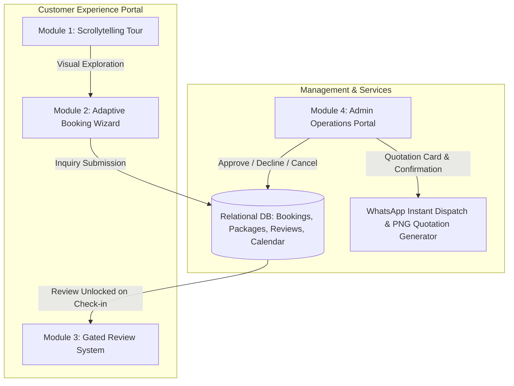

# Villa Cinnamoon Castle — Property Specifications & Master Content Guide

> Comprehensive reference document compiling all property specifications, media assets, pricing structures, amenities, and contact information gathered from **Airbnb**, **Facebook**, and official management records. This document serves as the single source of truth for developing the official web application and luxury marketing collateral.

**Related Project Documentation:**
* [`SRS.md`](file:///D:/Villa%20Cinnamoon%20Castle/SRS.md) — Software Requirements Specification & Technical Architecture
* [`package_details.md`](file:///D:/Villa%20Cinnamoon%20Castle/package_details.md) — Complete Package Catalog, Calculation Engine & Database Seeds
* [`images_catalog.md`](file:///D:/Villa%20Cinnamoon%20Castle/images_catalog.md) — 131-Image Categorized Master Media Library
* [`DESIGN.md`](file:///D:/Villa%20Cinnamoon%20Castle/DESIGN.md) — Luxury Cinnamon Design System & Color Tokens
* [`Requirements file.md`](file:///D:/Villa%20Cinnamoon%20Castle/Requirements%20file.md) — Client Original Specification

---

## 1. Brand Identity & Overview

* **Property Name:** Villa Cinnamoon Castle
* **Property Type:** Entire Private Holiday Villa / Vacation Rental
* **Tagline / Slogan:** *"Find your own peacefulness"*
* **Brand Tone:** Serene, welcoming, family- and group-oriented, nature-embracing, affordable luxury.
* **Logo & Visual Identity:** Golden circular emblem featuring an architected villa icon crowned with cinnamon leaves, tied cinnamon quills, and traditional floral motifs.
* **Establishment Date:** Active since September 2024.

---

## 2. Location & Neighborhood

* **Address:** Arachchikanda, Hikkaduwa, Southern Province, Sri Lanka
* **Postal Code:** 80240
* **GPS Coordinates:** `6.1405° N, 80.1325° E`
* **Geographic Setting:** Located 3.5 km inland from the lively Hikkaduwa coastal strip, surrounded by lush cinnamon groves, coconut palms, and tropical fruit trees. Offers complete peace and privacy away from crowds while remaining minutes from the ocean.

### Distances & Transit
* **Hikkaduwa Town & Commercial Center:** ~5 minutes (approx. 3.5 km)
* **Hikkaduwa Coral Reef & Surfing Beach:** ~5 minutes
* **Galle Fort / Galle City Center:** ~20 minutes via coastal expressway / Galle Road
* **Access:** Easily accessible by car, tuk-tuk, or van; secure gated driveway with ample parking.

---

## 3. Accommodation & Capacity

* **Guest Capacity:**
  * **Standard Airbnb Listing Capacity:** 10 guests
  * **Maximum Group / Event Capacity:** Up to 15 guests (ideal for extended families, reunions, birthdays, wellness retreats)
* **Property Structure:** Two-story detached luxury villa with private gated grounds
* **Bedrooms:** 5 spacious, elegantly appointed bedrooms
  * **Master Bedroom 1:** Super King-sized wooden bed, Air Conditioning (A/C), dedicated work desk and chair, wardrobe, bedside tables, warm pendant lighting ([`images/bedrooms/bedroom_1`](file:///d:/Villa%20Cinnamoon%20Castle/images/bedrooms/bedroom_1)).
  * **Bedroom 2:** Super King-sized wooden bed, Air Conditioning (A/C), expansive garden-facing windows, natural daylight, storage wardrobe ([`images/bedrooms/bedroom_2`](file:///d:/Villa%20Cinnamoon%20Castle/images/bedrooms/bedroom_2)).
  * **Bedroom 3:** King-sized wooden bed, high-efficiency ceiling fan, peaceful garden orientation, breezy natural ventilation ([`images/bedrooms/bedroom_3`](file:///d:/Villa%20Cinnamoon%20Castle/images/bedrooms/bedroom_3)).
  * **Bedroom 4:** Super King-sized wooden bed, distinctive Vaulted Attic/Timber Roof architectural aesthetic, high-efficiency ceiling fan ([`images/bedrooms/bedroom_4`](file:///d:/Villa%20Cinnamoon%20Castle/images/bedrooms/bedroom_4)).
  * **Bedroom 5:** Queen-sized wooden bed, high-efficiency ceiling fan, tranquil ambient light and garden views.
* **Bathrooms:** 2 full modern bathrooms ([`images/bathrooms`](file:///d:/Villa%20Cinnamoon%20Castle/images/bathrooms))
  * Instant hot water shower systems
  * Pedestal washbasins with vanities and vanity mirrors
  * Hand bidet sprayers and modern sanitation fixtures
  * Louvered wooden ventilation windows

---

## 4. Property Description & Copy

### Short Tagline
> *"Your private tropical sanctuary just minutes from Hikkaduwa's golden shores."*

### Full Description
> *"Welcome to Villa Cinnamoon Castle! Situated in peaceful Arachchikanda just 3.5 km (5 minutes) from Hikkaduwa town and beach, our spacious two-story sanctuary comfortably accommodates 10 to 15 guests.*
>
> *The villa features 5 beautifully appointed bedrooms (including Super King and King wooden beds; 2 with Air Conditioning and the rest with high-efficiency ceiling fans) and 2 full bathrooms with hot water. Guests have exclusive, 100% private use of the entire property—including a fully equipped granite kitchen with gas stove and cookware, an airy ground living room with carved wooden armchairs and TV, an expansive upstairs mezzanine lounge overlooking high-vaulted ceilings, high-speed Wi-Fi, and a dedicated workspace.*
>
> *Outside, step into a secluded tropical gravel courtyard enclosed by rustic timber fencing and verdant foliage. Whether you're planning a lively family holiday, a relaxing group retreat, or an unforgettable weekend by the beach with BBQ and boat safaris, Villa Cinnamoon Castle is your home away from home."*

---

## 5. Comprehensive Amenities & Facilities

### Kitchen & Dining
* Fully equipped open-concept kitchen with granite countertop ([`images/kitchen_and_dining/full_kitchen`](file:///d:/Villa%20Cinnamoon%20Castle/images/kitchen_and_dining/full_kitchen))
* Double-burner gas stove with gas supply
* Electric rice cooker & electric kettle
* Cookware, frying pans, pots, and cooking utensils
* Dish drying rack, dinner plates, glassware, and cups
* Large formal dining table with seating for the entire group ([`images/kitchen_and_dining/dining_area`](file:///d:/Villa%20Cinnamoon%20Castle/images/kitchen_and_dining/dining_area))
* Refrigerator and freezer food storage
* In-house private chef service available upon prior arrangement

### Living & Entertainment
* Ground-floor living hall with traditional hand-carved wooden armchairs and caned seating ([`images/living_rooms/living_room_1`](file:///d:/Villa%20Cinnamoon%20Castle/images/living_rooms/living_room_1))
* High-definition television (TV) with satellite entertainment
* Upstairs open-concept mezzanine lounge with high-pitched exposed beam timber roof and breeze corridors ([`images/living_rooms/living_room_2`](file:///d:/Villa%20Cinnamoon%20Castle/images/living_rooms/living_room_2))
* Elegant drapery and warm ambient pendant lighting throughout

### Connectivity & Comfort
* High-speed wireless Internet (Wi-Fi) covering common areas, bedrooms, and courtyard
* Dedicated workstation / desk space for remote work in Master Bedroom 1
* Air conditioning in 2 premier bedrooms
* High-efficiency ceiling fans in all bedrooms and living spaces
* Washing machine on premises for guest laundry
* Iron and laundry drying area

### Grounds, Outdoor & Security
* 100% private detached property with no shared spaces ([`images/outdoor_and_garden`](file:///d:/Villa%20Cinnamoon%20Castle/images/outdoor_and_garden))
* Free secure gated parking on-site (capacity for multiple cars, vans, or tuk-tuks)
* Landscaped gravel courtyard with shade trees and tropical greenery
* Rustic timber perimeter fencing providing privacy and natural charm
* Front porch veranda with columns and sit-out area
* Upstairs viewing balcony overlooking gardens and palm canopy

---

## 6. Curated Activities & Experiences

Guests can book the following curated activities directly through the villa host:
1. **Private BBQ Setup & Grill:** Full barbecue equipment and setup provided for evening garden dinners.
2. **Lagoon & River Boat Safaris:** Scenic guided boat excursions exploring nearby inland lagoons, mangrove forests, and wildlife.
3. **Kayaking:** Calm water paddling adventures along Hikkaduwa's scenic inland waterways.
4. **Beach & Snorkeling Excursions:** 5-minute trip to famous Hikkaduwa coral gardens, sea turtle points, and surf breaks.
5. **Underwater Photography & Photoshoots:** Professional photo session coordination for vacation memories.

---

## 7. Pricing Tiers, Packages & Calendar Rules

*Currency: Sri Lankan Rupees (LKR / Rs.)*

### 7.1 Calendar Classification Rules
* **Weekend Nights (Friday, Saturday, Sunday):** Check-in on Friday, Saturday, or Sunday is charged at official **Weekend Buyout Rates**.
* **Weekday Nights (Monday to Thursday):** Check-in on Monday, Tuesday, Wednesday, or Thursday is charged at promotional **Weekday Rates** (maximum 4 consecutive weekday nights).
* **Mixed Stays (Combined Weekend + Weekday):** Stays spanning both classifications are calculated using the transparent split pricing formula:
  $$\text{Total Estimated Price} = (N_{\text{weekend}} \times \text{Rate}_{\text{weekend}}) + (N_{\text{weekday}} \times \text{Rate}_{\text{weekday}})$$

---

### 7.2 Weekend Rates (Friday, Saturday, Sunday Nights)
Full private 5-bedroom villa buyout with exclusive grounds access:

| Package Name | Rate (Per Night) | A/C Configuration | Inclusions & Value Breakdown |
| :--- | :---: | :---: | :--- |
| **Weekend Standard — Non-A/C** | **Rs. 21,000/=** | Non-A/C | Full private 5-bedroom villa buyout with ceiling fans throughout. (~Rs. 1,400/person for 15 pax). |
| **Weekend Premium — A/C** | **Rs. 23,000/=** | Air Conditioned | Full private 5-bedroom villa buyout with air-conditioned master bedrooms. (~Rs. 1,533/person for 15 pax). |

---

### 7.3 Weekday Rates (Monday to Thursday Nights — Mon–Thu)
Flexible group, room-based, and family packages:

| Package / Room Option | Max Capacity | Bedrooms | Non-A/C Rate | A/C Rate | Notes |
| :--- | :---: | :---: | :---: | :---: | :--- |
| **Couples Package** | 2 pax | 1 Master | **Rs. 6,500/=** | — | Romantic full-day getaway for couples |
| **Family Package** | 4 pax | 1–2 Rooms | **Rs. 8,500/=** | — | Full-day stay for small nuclear families |
| **2-Room Group** | 4 pax | 2 Rooms | **Rs. 8,500/=** | **Rs. 10,500/=** | 2 dedicated bedrooms + villa amenities |
| **3-Room Group** | 6 pax | 3 Rooms | **Rs. 12,500/=** | **Rs. 14,500/=** | 3 dedicated bedrooms + villa amenities |
| **4-Room Group** | 8 pax | 4 Rooms | **Rs. 15,500/=** | **Rs. 17,500/=** | 4 dedicated bedrooms + villa amenities |
| **5-Room Group** | 10 pax | 5 Rooms | **Rs. 17,900/=** | **Rs. 19,900/=** | Full 5 bedrooms for up to 10 guests |
| **Full Villa Buyout** | 15 pax | Full Villa | **Rs. 17,900/=** | **Rs. 19,900/=** | Entire property exclusivity for large groups |

> 📖 **Comprehensive Package Catalog:** For detailed case study calculations, group auto-suggestion decision matrices, database SQL seed scripts, and admin CRUD policies, refer to [`package_details.md`](file:///D:/Villa%20Cinnamoon%20Castle/package_details.md).

---

## 8. House Rules & Policies

* **Check-in Time:** From 3:00 PM onwards
* **Check-out Time:** Until 11:00 AM (flexible upon prior request and availability)
* **Maximum Occupancy:** 10 guests (standard listing), up to 15 guests upon prior arrangement
* **Parties & Events:** Small group gatherings, family birthdays, and private retreats allowed with prior notice
* **Smoking:** Prohibited inside bedrooms; permitted in designated outdoor courtyard areas
* **Pets:** Inquire with host before booking
* **Care & Respect:** Guests are requested to treat the property and furnishings with care and respect

---

## 9. Host & Contact Information

* **Primary Host:** Dampalla Gamage Devindu
* **Email Address:** `gamagedeshandevindu13@gmail.com`
* **Direct Hotline / WhatsApp:** `+94 76 100 7686` (`076 100 7686`)
* **Secondary Reservation Line:** `070 254 6028`

### Official Online Channels
* **Airbnb Listing:** [airbnb.com/rooms/1651346026185294869](https://www.airbnb.com/rooms/1651346026185294869)
* **Facebook Profile / Page:** [Villa Cinnamoon Castle (ID: 61565740212688)](https://web.facebook.com/people/Villa-Cinnamoon-Castle/61565740212688/)
* **Instagram:** [@villa_cinnamoon_castle_596](https://www.instagram.com/villa_cinnamoon_castle_596)
* **TikTok:** [@villa.cinnamoon.ca](https://www.tiktok.com/@villa.cinnamoon.ca)

---

## 10. Master Image Assets Catalog (131 Active Images)

All original high-resolution property assets are curated, deduplicated, and cataloged in the repository at `d:/Villa Cinnamoon Castle/images/`.

| Image Category | Directory Path | Active Count | Key Highlights & Recommended Usage |
| :--- | :--- | :---: | :--- |
| **Website Core (Root)** | [`images`](file:///d:/Villa%20Cinnamoon%20Castle/images) | **7** | Primary hero exterior (`photo_1.jpg`), mezzanine dining (`photo_2.jpg`), bedroom (`photo_3.jpg`), kitchen (`photo_4.jpg`), bathroom (`photo_5.jpg`), ground living (`photo_6.jpg`), courtyard (`photo_7.jpg`). |
| **Outdoor & Garden** | [`images/outdoor_and_garden`](file:///d:/Villa%20Cinnamoon%20Castle/images/outdoor_and_garden) | **25** | Exterior panoramas (8), viewing balconies (10), front yard & driveway (4), backyard (2), front entrance porch (1). |
| **Living Rooms** | [`images/living_rooms`](file:///d:/Villa%20Cinnamoon%20Castle/images/living_rooms) | **19** | Ground-floor reception hall with antique wooden armchairs (6), upstairs mezzanine lounge with vaulted timber ceilings (13). |
| **Kitchen & Dining** | [`images/kitchen_and_dining`](file:///d:/Villa%20Cinnamoon%20Castle/images/kitchen_and_dining) | **8** | Granite cooking counters & gas stove (4), formal dining area table and banquet setup (4). |
| **Bedrooms** | [`images/bedrooms`](file:///d:/Villa%20Cinnamoon%20Castle/images/bedrooms) | **24** | Master Bedroom 1 with desk & A/C (9), Super King Bedroom 2 with A/C (5), King Bedroom 3 garden view (4), Attic / Timber Bedroom 4 (6). |
| **Bathrooms** | [`images/bathrooms`](file:///d:/Villa%20Cinnamoon%20Castle/images/bathrooms) | **3** | Modern tiled bathroom 1 (1), bathroom 2 with hot water shower & pedestal vanity (2). |
| **Guest Experiences** | [`images/guest_experiences`](file:///d:/Villa%20Cinnamoon%20Castle/images/guest_experiences) | **29** | Family gatherings, birthday celebrations, evening dinners, authentic guest memories. |
| **Nearby Attractions** | [`images/nearby_attractions_and_activities`](file:///d:/Villa%20Cinnamoon%20Castle/images/nearby_attractions_and_activities) | **15** | Hikkaduwa beach & surf, coral reef turtle watching, lagoon boat safaris, surfing, Galle Fort. |
| **Promotional Flyers** | [`images/promotional_and_flyers`](file:///d:/Villa%20Cinnamoon%20Castle/images/promotional_and_flyers) | **1** | Official Sinhala New Year and seasonal promotional banners. |
| **Total Active Assets** | — | **131** | *(94 exact/perceptual duplicates safely quarantined in [`images/_duplicates_backup`](file:///d:/Villa%20Cinnamoon%20Castle/images/_duplicates_backup))* |

> 📖 **Full Media Manifest:** For individual file resolutions, byte sizes, and visual descriptions, see [`images_catalog.md`](file:///D:/Villa%20Cinnamoon%20Castle/images_catalog.md).

---

## 11. Web Platform Architecture & Blueprint

The official web application architecture conforms to the finalized specification established in [`SRS.md`](file:///D:/Villa%20Cinnamoon%20Castle/SRS.md):

### Module Breakdown:
1. **Module 1 — Scrollytelling Property Elaboration (§ 3.1):**
   - Immersive narrative scroll walking guests through: *Arrival & Hero &rarr; Living Spaces &rarr; Bedrooms Sanctuary (1–5) &rarr; Kitchen & Dining &rarr; Bathrooms &rarr; Courtyard & BBQ &rarr; Curated Hikkaduwa Experiences*.
   - Floating sticky anchor navigation and Full Categorized Gallery modal querying the 131-image library.
2. **Module 2 — Adaptive Booking Engine (§ 3.2):**
   - **Mini-Form 1 (Calendar):** Real-time availability with red-highlighted unclickable booked dates; automatic date-type detection (Weekend / Weekday / Mixed).
   - **Mini-Form 2 (Guests):** 1–15 guest stepper with automatic package recommendation engine based on group capacity.
   - **Mini-Form 3 (Package & Contact):**
     - Mode A: Strictly Weekend packages.
     - Mode B: Strictly Weekday packages.
     - Mode C: Mixed Stay dual-selector (Weekend package + Weekday sub-form) with transparent split price math.
     - Sri Lankan and E.164 WhatsApp regex validation.
   - **Confirmation:** Cryptographically random Booking ID (`VCC-YYYY-XXXXXX`) and instant concierge access.
3. **Module 3 — Check-in Date Gated Review System (§ 3.3):**
   - Reviews unlock **strictly on/after the customer's check-in date** ($\text{Today} \ge \text{Check-in Date}$) for approved bookings.
   - Public review showcase with star distribution, verified guest badges, and pinned priority display.
4. **Module 4 — Administrator Operations Portal (§ 3.4):**
   - Inquiry pipeline with automated `⚠️ Date Conflict` detection for overlapping pending requests.
   - One-click approval generating a branded luxury Quotation Image (PNG card) and pre-formatted WhatsApp dispatch.
   - Booking cancellation workflow (`FR-ADM-CANCEL`) with automated date release via database `ON DELETE CASCADE`.
   - Full package management CRUD with soft deactivation (`is_active = FALSE`).
